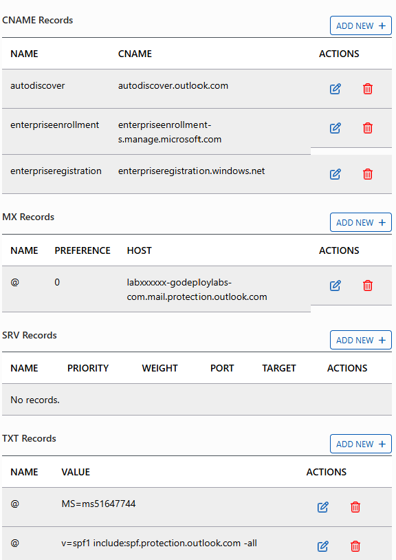

L'entreprise **ib Cegos Workshop (ICW)** héberge actuellement un environnement informatique *classique*, dans ses datacenters, qui comporte diverses applications historiques (comme Microsoft Exchange par exemple). L'entreprise a cependant récemment décidé de tester la migration vers les outils présents dans l'offre Microsoft 365, y voyant une opportunité économique ainsi qu'une opportunité d'améliorer la qualité du service apporté par le SI aux utilisateurs du métier.  

Au fil des ateliers de ce stage, vous allez prendre l'identité de Dominique Skyetson, membre de l'équipe d'administration IT de ICW.  
L'équipe projet de ib Cegos Workshop a donc décidé de mettre en oeuvre Microsoft 365 dans un projet pilote, afin de monter en compétence sur les produits et de voir les besoins métiers qui pourraient être couverts par les outils de l'offre Microsoft 365.  

## Sommaire

- Atelier 1
    - <a class='ibPrintTocLink' href='#a1e1'>Exercice 1 - Appréhension du tenant pilote</a>
    - <a class='ibPrintTocLink' href='#a1e2'>Exercice 2 - Scénario</a>
    - <a class='ibPrintTocLink' href='#a1e3'>Exercice 3 - Scénario</a>
- Atelier 2
    - <a class='ibPrintTocLink' href='#a2e1'>Exercice 1 - Scénario</a>
    - <a class='ibPrintTocLink' href='#a2e2'>Exercice 2 - Scénario</a>
    - <a class='ibPrintTocLink' href='#a2e3'>Exercice 3 - Authentification multifactorielle</a>
- Atelier 3
    - <a class='ibPrintTocLink' href='#a3e1'>Exercice 1 - Préparation de la synchronisation d'identités</a>
    - <a class='ibPrintTocLink' href='#a3e2'>Exercice 2 - Scénario</a>
    - <a class='ibPrintTocLink' href='#a3e3'>Exercice 3 - Scénario</a>
- Atelier 4
    - <a class='ibPrintTocLink' href='#a4e1'>Exercice 1 - Scénario</a>
    - <a class='ibPrintTocLink' href='#a4e2'>Exercice 2 - Scénario</a>
- Atelier 5
    - <a class='ibPrintTocLink' href='#a5e1'>Exercice 1 - Scénario</a>
    - <a class='ibPrintTocLink' href='#a5e2'>Exercice 2 - Scénario</a>
    - <a class='ibPrintTocLink' href='#a5e3'>Exercice 3 - Scénario</a>
- Atelier 6
    - <a class='ibPrintTocLink' href='#a6e1'>Exercice 1 - Scénario</a>
    - <a class='ibPrintTocLink' href='#a6e2'>Exercice 2 - Scénario</a>
    - <a class='ibPrintTocLink' href='#a6e3'>Exercice 3 - Objectifs</a>
    - <a class='ibPrintTocLink' href='#a6e4'>Exercice 4 - Scénario</a>
- Atelier 7
    - <a class='ibPrintTocLink' href='#a7e1'>Exercice 1 - Scénario</a>
    - <a class='ibPrintTocLink' href='#a7e2'>Exercice 2 - Scénario</a>
    - <a class='ibPrintTocLink' href='#a7e3'>Exercice 3 - Scénario</a>
- Atelier 8
    - <a class='ibPrintTocLink' href='#a8e1'>Exercice 1 - Scénario</a>
    - <a class='ibPrintTocLink' href='#a8e2'>Exercice 2 - Scénario</a>
- Atelier 9
    - <a class='ibPrintTocLink' href='#a9e1'>Exercice 1 - Scénario</a>
    - <a class='ibPrintTocLink' href='#a9e2'>Exercice 2 - Scénario</a>

## Conseils génériques
1. Pour réaliser les ateliers de ce stage, vous allez utiliser un environnement de stage fourni par notre partenaire *goDeploy*. Cet environnement, qui inclut un compte de test Microsoft 365, comporte des instructions d'atelier (en anglais) que nous vous invitons à remplacer par les présentes instructions.
1. Si vous constatez des dérives entre les présentes instructions et les interfaces que vous rencontrez pendant votre atelier, n'hésitez pas à prévenir votre formateur/trice pour que les présentes instructions soient mises à jour.  
1. Les ateliers doivent être réalisés dans l'ordre prévu pour éviter les surprises.

<!-- IBCAN_PAGE_BREAK|a1e1 --># Atelier 1 - 

## Exercice 1 - Appréhension du tenant pilote

<div class="ibPrintNotes" data-exercise="a1e1" hidden></div>

A travers les ateliers de ce stage, vous allez prendre l'identité de Dominique Skyetson, administratrice Microsoft 365 de *ib Cegos Workshop (ICW)*. En tant que Dominique, il vous a été demandé de créer un environnement pilote Microsoft 365. Vous allez donc commencer par prendre connaissance du tenant Microsoft 365 qui a été fourni à fins de tests.  
Vous allez ensuite vous assurer que les machines virtuelles de l'environnement de test soient correctement configurées, avant de voir les options de cutomisation applicables sur l'ensemble de l'organisation.  

Vous allez commencer par vous connecter aux machines de l'atelier en utilisant le compte administrateur, pour ensuite vous connecter au tenant Microsoft 365 avec le compte **MOD Administrator**. Vous allez ensuite mettre à jour le profil de l'entreprise *ib Cegos Workshop*.  

#### Avant de commencer
Votre formateur/trice pourra, le cas échéant, vous donner quelques indications complémentaires concernant l'environnement d'atelier que vous utiliserez.  
dans votre environnement d'atelier, goDeploy a déjà créé un tenant Microsoft 365 de test pour vous. Quelques comptes utilisateurs ont déjà été créés dans cet environnement ainsi que deux comptes administrateur :

- Un compte administrateur local pour l'environnement *ib Cegos Workshop* (adatum\administrator).  
- Un compte administrateur du tenant Microsoft 365 (dont le nom affiché est *MOD Administrator*).  

#### Tâche 1 - Identifiants Microsoft 365
Une fois votre atelier démarré, il vous faut prendre note des informations suivantes fournies dans l'environnement d'atelier :

- **Préfixe du tenant**. Ce préfixe, trouvable dans le nom de l'administrateur du tenant, sera utilisé pour identifier et se connecter avec les comptes Entra Id dans votre tenant. Le format de ce préfixe est de la forme **xxxxxxxx.onmicrosoft.com**. Notez donc la valeur **xxxxxxxx** pour utilisation ultérieure dans tous les ateliers, en remplacement de la mention [‎onmicrosoftDomain] ou [[onMicrosoftDomain],[wwlxxxxx]].  
- **Mot de passe du tenant**. Fourni par goDeploy, il s'agit du mot de passe du compte *MOD Administrator*.  
- **Nom DNS d'entreprise**. goDeploy a également créé un nom de domaine DNS pour l'entreprise *ib Cegos Workshop*. Il peut être trouvé sous le nom **Lab Domain** dans l'onglet **DNS** du volet de gauche de votre environnement goDeploy (c'est un nom qui ressemble à *labXXXXX.godeploylabs.com*) et sera à utiliser en remplacement de la mention [‎godeployDomain] ou [[godeployDomain],[labXXXXX]].  
 >**Astuce :** Si votre navigateur le supporte, vous pouvez <a href="#" onclick="document.getElementById('domainInput').style.display = 'block';return false">cliquer sur ce lien</a> pour personnaliser les informations dans ces instructions et vous en faciliter l'utilisation tout au long des ateliers de ce stage. 

#### Tâche 2 - Vérification du démarrage de l'atelier
Dans un environnement de test comme celui qui nous est fourni, qui ne contient qu'un seul contrôleur de domaine, le démarrage des machines peut poser problème. Afin de maximiser les chances que les manipulations des ateliers suivants se passent correctement, vous allez commencer par *corriger* le démarrage des VMs.

1. Lors de l'ouverture de votre environnement d'ateliers, vous devez vous connecter sur la machine virtuelle **LON-DC1**.
1. Selectionnez la machine LON-DC1 et ouvrez une session avec le compte ```Administrator``` et le mot de passe ```Pa55w.rd```.
1. Attendez que l'outil **Server Manager** s'ouvre automatiquement.
1. Sur le menu de navigation de gauche de l'outil **Server Manager**, cliquez sur l'onglet **Local Server**
1. En face de la ligne **Windows Defender Firewall**, si vous voyez tout autre mention que **Domain: On**, cela indique un problème de démarrage que nous allons corriger ici.
1. Cliquez sur le lien mentionnant l'adresse IP de LON-DC1 : **172.16.0.10, IPv6 enabled**, situé en regard de la ligne **Ethernet**.
1. Dans le dossier **Network Connections** qui vient de s'ouvrir, sélectionnez la carte réseau **Ethernet**.
1. Faites un clic-droit sur la carte réseau Ethernet et choisissez **Disable**.
1. Refaites un clic-droit sur la même carte réseau pour choisir **Enable**.
1. Attendez que la mention sous le nom de la carte réseau ait changé de **Identifying** à **Adatum.com**. Cela indique que le contrôleur de domaine a correctement démarré : fermez le dossier **Network Connections**.

    > Le nom de domaine Active Directory n'est ici pas lié à l'identité *ib Cegos Workshop*, mais le changer prendrait trop de temps pour l'intérêt que cela présente dans un contexte d'atelier.

1. De retour dans l'onglet **Local Server** du **Server Manager**, vous pouvez cliquer sur l'icône d'actualisation (en haut à droite) pour vérifier que la ligne **Windows Defender Firewall** mentionne désormais **Domain: On**.
1. Réduisez l'outil **Server Manager** dans la barre des tâches sans le fermer.
1. Maintenant que LON-DC1 est correctement démarré, il vous suffit de redémarrer les autres machines virtuelles pour qu'elles s'*accrochent* correctement au réseau de domaine : Basculez sur la machine **LON-CL1**.
1. Sur l'écran de connexion de LON-CL1, cliquez sur l'icône **Power** (dernière icône en bas à droite) et choisissez **Restart**.
1. Répétez l'opération précédente pour LON-CL2.

    > Vous n'avez pas besoin d'attendre que les machines clientes aient redémarré pour commencer la tâche suivante.  

#### Tâche 3 - Vérification de la création du tenant
Bien que goDeploy ait initié la création du tenant Microsoft 365 pour *ib Cegos Workshop*, en tant que Dominique Skyetson, administratrice de ICW, vous allez vérifier cette création afin de pouvoir poursuivre vos tests pour le projet pilote.

1. A la suite de la tâche précédente, retournez sur **LON-DC1**, vous devriez toujours être connecté avec le compte **Administrator**.
1. Sur la barre des tâches, cliquez sur l'icône de **Microsoft Edge**. Passez les éventuelles pages de bienvenue (vous pouvez choisir **Continue without signing in**).
1. Dans le navigateur, accédez au portail d'administration de Microsoft 365 en utilisant l'url suivante : `https://admin.microsoft.com`

    > Si vous rencontrez des soucis réseau dans les machines virtuelles goDeploy pour vous connecter sur l'environnement Microsoft 365, vous pouvez executer toutes les opérations à faire dans un navigateur Internet sur n'importe qul autre navigateur Internet en dehors des machines virtuelles (local).

1. Dans la fenêtre **Sign in**, saisissez le nom de connexion du compte *MOD Administrator* (`admin@[[onMicrosoftDomain],[wwlxxxxx]].onmicrosoft.com`) et cliquez sur **Next**
1. Dans la fenêtre **Enter password**, saisissez ou collez `[[MODPassword],[MOD Admin Password]]` et cliquez sur **Sign in**
1. Tout au long de vos manipulations, vous pouvez cliquer sur **Got it** sur le pop-up qui vous informe de la sauvegarde de vos mots de passe sur les machines.
1. Sur la fenêtre **Stay signed in?**, cochez la case **Don’t show this again** et cliquez sur **Yes.**
1. Si un popup **Welcome to Microsoft 365** apparaît, cliquez deux fois sur la flèche droite pour pouvoir le fermer.
1. Dans le portail **Microsoft 365 admin center**, dans le menu de navigation, sélectionnez le groupe **Users**, puis le choix **Active users**.

    > Si le menu de navigation n'apparait pas, cliquez sur les trois lignes horizontales en haut à gauche de la fenêtre pour le faire apparaitre.

1. Dans la liste **Active users**, vous voyez la liste des utilisateurs qui ont été pré-créés dans le tenant.

#### Tâche 4 - Vérification du service Microsoft 365
Dans cette tâche, vous allez vérifier l'état de santé du service Microsoft 365 sur votre tenant.

1. Dans le portail **Microsoft admin center**, dans le menu de navigation, ouvrez le groupe **Health** pour choisir l'option **Service health**. Cela fait apparaitre le dashboard **Service health**.

    > Il vous faudra peut-être cliquer sur **... Show all** pour afficher tous les choix disponibles dans le menu de navigation du portail administratif.

1. Sur la page **Service health**, l'onglet **Overview** est affiché par défaut. Cet onglet affiche les problèmes concernant actuellement les services Microsoft 365 disponibles avec vos abonnements.

	> Si aucun problème n'est actuellement listé, vous pouvez toujours cliquer sur l'onglet **Issue history** pour réaliser l'opération suivante.

1. Cliquez sur une ligne représentant un problème pour observer le détail des informations fournies par l'éditeur sur ce problème et son état actuel de prise en charge et/ou de résolution.
1. Après avoir observé les détails d'un problème, cliquez sur le **X** en haut à droite pour le fermer et n'hésitez pas à aller en observer d'autres.

<!-- IBCAN_PAGE_BREAK|a1e2 --># Atelier 1 - 

## Exercice 2 - Scénario

<div class="ibPrintNotes" data-exercise="a1e2" hidden></div>

En tant que Dominique, il vous a été demandé de configurer le profil de l'entreprise sur le tenant pilote. Dans cet exercice, vous allez procéder à cette configuration.
 
#### Tâche 1 - Paramètrage de la distribution d'Office
1. Sur LON-DC1, dans le **Microsoft 365 admin center**, dans le menu de navigation de gauche, cliquez sur **Settings** (il pourra être nécessaire de cliquer sur **Show all**) pour en ouvrir le groupe d'options, puis cliquez sur **Org Settings**.
1. Dans la fenêtre **Org Settings**, c'est l'onglet **Services** qui est affiché par défaut. Puisque vous souhaitez modifier une information pour toute l'entreprise, cliquez sur l'onglet **Organization profile**.
1. Sélectionnez ensuite **Release preferences**.
1. Dans la fenêtre **Release preferences**, sélectionnez **Targeted release for select users** et cliquez sur **Save**.
	> **Note :** Un des avantages de Microsoft 365 est la possibilité de tirer parti des dernières fonctionnalités et mises à jour automatiquement dans votre tenant, ce qui va réduire les couts de maintenance et la surcharge administrative pour une entreprise.
    L'option **Targeted release for select users** vous permet de garder le contrôle des utilisateurs qui auront les mises à jour et nouvelles fonctionnalités en premier, afin de préparer sereinement l'entreprise à l'arrivée de ces nouveautés pour tout le monde.
1. Sous votre choix **Targeted release for select users** S'affichent désormais les possibilités **Select users** et **Upload users** (depuis un fichier CSV). Cliquez sur **Select users**.
1. Dans la fenêtre **Choose users for targeted release**, cliquez dans le champ **Who should receive targeted releases?**. Vous allez ainsi avoir accès à la liste des comptes utilisateurs existant.
1. Dans la liste des utilisateurs, sélectionnez *MOD Administrator* avant de cliquer sur **Save**.
1. Dans la fenêtre **Release preferences** , clique sur le **X** de fermeture en haut à droite.

#### Tâche 3 - Customisation de l'apparence
1. De retour sur l'onglet **Organization profile** de la fenêtre **Org settings**, sélectionnez **Custom themes**.
1. Dans la fenêtre **Customize Microsoft 365 for your organization**, cliquez sur **Default theme**
1. Dans la fenêtre **Default theme**, prenez le temps de parcourir les différentes options d'affichage et de branding qui s'offrent à vous. Pour les besoins de l'atelier, n'hésitez pas à modifier quelques paramètres ici pour voir comment ils seront appliqués aux utilisateurs de ICW.
1. Si vous avez fait des changements dans le thème par défaut, cliquez sur **Save** lorsque vous avez terminé. Cliquez ensuite sur le **X** en haut à droite pour fermer la fénêtre **Default theme**.

<!-- IBCAN_PAGE_BREAK|a1e3 --># Atelier 1 - 

## Exercice 3 - Scénario

<div class="ibPrintNotes" data-exercise="a1e3" hidden></div>

<div class="ibPrintIllustration"></div>

*Ib Cegos Workshop* a donc acheté un nouveau nom de domaine DNS pour son projet pilote (fourni par votre hébergeur d'ateliers) qui soit utilisable sur Internet.
ICW gère directement les enregistrements de ses domaines DNS. Pour que ce domaine soit utilisable sur le tenant, il va vous falloir passer par un assistant de configuration et créer les enregistrements DNS attendus. C'est ce que vous allez réaliser dans ce troisième exercice.

#### Avant de commencer
Votre formateur/trice pourra, le cas échéant, vous donner quelques indications complémentaires concernant l'environnement d'atelier a distance que vous utiliserez.  
dans votre environnement d'atelier, goDeploy vous fournit un nom de domaine DNS d'entreprise pour le projet pilote. Vous pouvez identifier ce nom de domaine en tête de l'onglet **DNS** dans l'environnement d'atelier.
> **Note** : L'onglet **DNS** ne se trouve pas dans la machine virtuelle mais à sa gauche, dans le portail goDeploy.  

#### Tâche 1 - Ajout du DNS d'entreprise
Dans cette tâche vous allez ajouter le domaine DNS d'entreprise à votre tenant Microsoft 365. 
1. Les opérations sont à faire sur **LON-DC1**, connecté avec le compte **Administrator**.
1. Dans votre navigateur Internet, vous devriez toujours être sur le portail **Microsoft 365 admin center**, connecté avec le compte *MOD Administrator*.
1. Dans le portail **Microsoft 365 admin center**, dans le menu de navigation, vous avez déjà ouvert le groupe **Settings** pour l'exercice précédant. Pour ajouter le domaine d'entreprise, cliquez sur **Domains** dans ce groupe. 
1. Sur la page **Domains**, vous devriez voir apparaitre le domaine par défaut, créé avec votre tenant ([[onMicrosoftDomain],[wwlxxxxx]].onmicrosoft.com).
1. Cliquez sur **+ Add domain** pour ouvrir la page **Add a domain**.
1. Sur la page **Add a domain**, saisissez le **nom DNS d'entreprise** (```[[godeployDomain],[labXXXXX]].godeploylabs.com```) dans le champ **Domain name** avant de cliquer sur le bouton **Use this domain**.
1. Sur la page **Verify you own your domain**, sélectionnez l'option **Add a TXT record to the domain's DNS record** et cliquez sur **Continue**.
1. Sur la page **Add a record to verify ownership**, prenez note de la valeur mentionnée après **TXT value**. Elle devrait ressembler à *MS=msXXXXXXXX*.
1. Dans l'environnement d'atelier, ouvrer l'onglet **DNS** et cliquez sur **Add New \+** dans la section **TXT Records**
1. Dans la fenêtre **Add DNS TXT Record**, tapez **@** dans le champ **Name** et la valeur notée au point précédent dans le champ **Value** avant de cliquer sur **Save**.
1. De retour dans la machine virtuelle **LON-DC1**, Sur la page **Add a record to verify ownership**, cliquez sur le bouton **Verify**.
1. Sur la page **How do you want to connect to your domain?**, cliquez sur le bouton **Continue** pour ouvrir la page **Add DNS records**.
1. La page **Add DNS records** identifie les services qu'une entreprise peut implémenter dans le contexte de son déploiement Microsoft 365 et qui ont besoin d'enregistrements DNS. L'option **Exchange and Exchange Online Protection** devrait être sélectionnée par défaut (sinon, sélectionnez là).
	> Trois enregistrements DNS sont nécessaires pour les services Exchange - un enregistrement **MX** , un alias **CNAME**, et un enregistrement **TXT**. Sélectionnez chaque enregistrement pour l'ouvrir et prendre note de son contenu à créer.  
    - MX ( de nom ```@```) pointe vers ```[[godeployDomain],[labXXXXX]]-godeploylabs-com.mail.protection.outlook.com``` avec préférence de **0**  
    - CNAME associe ```autodiscover``` à ```autodiscover.outlook.com```  
    - TXT ( de nom ```@```) contient ```v=spf1 include:spf.protection.outlook.com -all```  

1. Plus bas, dans la page **Add DNS records**, cliquez sur **Advanced Options**.
1. Deux services additionnels sont affichés ici : **Intune and Mobile Device Management for Microsoft 365** et **DomainKeys Identified Mail (DKIM)**.  
	> Sélectionnez la cases à cocher en ragrd du premier, cela va faire apparaître un ensemble d'enregistrements DNS à créer.

1. Notez que deux alias CNAME sont nécessaires au fonctionnement correct de **Intune and Mobile Device Management for Microsoft 365**. Sélectionnez **CNAME Record (2)** pour les afficher et prenez bonne note de leur contenu.  
    - CNAME associe ```enterpriseregistration``` à ```enterpriseregistration.windows.net```  
    - CNAME associe ```enterpriseenrollment``` à ```enterpriseenrollment-s.manage.microsoft.com``` (selon les tenants, peut aussi être associé à ```enterpriseenrollment.manage.microsoft.com```).  

1. Retournez dans l'onglet **DNS** de votre environnement d'atelier et créez-y tous les enregistrements DNS nécessaires pour le tenant du projet pilote.
    > **Note** : Voici un exemple d'onglet DNS contenant les enregistrements nécessaires créés pour vous aider : il vous faudra cependant remplacer la mention labXXXXXX par votre nom DNS d'entreprise :
    
1. De retour dans la machine virtuelle **lon-DC1**, cliquez sur le bouton **Continue**. A ce moment, l'assistant de création du domaine va vérifier que tous les enregistrements DNS nécessaires ont correctement été créés.
1. Si tous les enregistrements DNS attendus ont été correctement crées, la page **Domain setup is complete** devrait apparaître (Dans le cas contraire, merci de vérifier les enregistrement DNS manquant/erronés indiqués sur la page **Add DNS records** qui s'est réaffichée, avant de cliquer de nouveau sur **Continue**).
1. Cliquez sur **Done**.
1. Vous allez être renvoyé vers la page **Domains** dans laquelle la colonne **status** pour votre DNS d'entreprise devrait afficher **Healthy**.  

#### Tâche 2 - Définition du domaine par défaut
Dans un contexte de production, il serait pertinent que le nouveau domaine que nous venons d'ajouter soit le domaine par défaut de l'environnement 365.  
Pour notre pilote, il sera plus simple de repasser le domaine [[onMicrosoftDomain],[wwlxxxxx]].onmicrosoft.com en domaine par défaut.
1. Sur la page **Domains**, cliquez sur les trois points verticaux en regard du domaine **[[onMicrosoftDomain],[wwlxxxxx]].onmicrosoft.com**
1. Cliquez sur le choix **Set as default**
1. Sur le popup **Set this domain as default?** cliquez sur le bouton **Set as default**
1. Assurez-vous que, dans la liste des domaines, c'est bien le domaine **[[onMicrosoftDomain],[wwlxxxxx]].onmicrosoft.com** qui porte désormais la mention *(Default)*.

<!-- IBCAN_PAGE_BREAK|a2e1 --># Atelier 2 - 

## Exercice 1 - Scénario

<div class="ibPrintNotes" data-exercise="a2e1" hidden></div>

Comme Dominique Skyetson n'a pas de compte utilisateur Microsoft 365 déclaré pour elle-même, elle s'est jusqu'à présent connectée à l'administration du tenant avec le compte *Mod Administrator*.  
Dans cet exercice, elle va se créer son compte et y assigner le rôle *Global Administrator* qui lui permettra ensuite de faire toutes les actions administratives sur le tenant de manière nominative.  
Prenant le rôle de Dominique, vous allez ensuite créer plusieurs comptes utilisateurs en utilisant le centre d'administration 365 que vous serez par la suite amené à ajouter à des groupes pour gérer la sécurité. Bien que les administrateurs de plus haut niveau de l'entreprise ne créent pas habituellement des comptes utilisateurs, il vous est nécessaire de le faire en attendant que la configuration complète du tenant pilote soit terminée et que les comptes soient automatiquement synchronisés (synchronisation mise en place ultérieurement).  
> **Important :** Pour votre environnement réel, il est très fortement conseillé de noter le mot de passe du compte *Global Admin* original (*Mod Administrator* dans notre atelier) et de le stocker de manière particulièrement sécurisée. Ce compte est un compte non nominatif sur lequel il vous faudra peut-être compter lorsque tous les autres moyens de vous en sortir ne fonctionneront plus. Il est donc conseillé de ne jamais l'utiliser au quotidien et de toujours préférer l'utilisation de comptes personnalisés et nominatifs (comme celui de Dominique dans notre atelier).  

#### Tâche 1 - Installation du module Windows Powershell pour Entra ID
Dans cette tâche vous allez mettre en place l'environnement permettant la gestion de Microsoft 365 à l'aide de Windows Powershell. Cette installation est longue et la faire immédiatement avant d'en avoir besoin optimisera vos manipulations suivantes.
1. Cette opération se déroule sur la machine **LON-DC1**, connecté avec le compte **Administrator** et le mot de passe **Pa55w.rd**.
1. Dans la zone de recherche en bas à gauche de la barre des tâches, tapez ```powershell```
1. Faites un clic-droit sur **Windows Powershell ISE** et, dans le menu qui apparait, choisissez **Run as administrator**.
	>**Note :** Veillez à bien cliquer sur "**Windows Powershell ISE**" et non "**Windows Powershell ISE (x86)**".  
1. Si une fenêtre **Do you want to allow this app to make changes to your device** apparait, cliquez sur **Yes**.
1. Dans la partie basse (fond bleu) de la fenêtre **Administrator: Windows PowerShell ISE**, tapez ```install-module microsoft.graph -force``` et faites **[Entrée]**.
1. S'il vous est demandé si vous souhaitez faire confiance à **NuGet provider**, tapez **Y** pour répondre oui.
1. S'il vous est demandé de confirmer si vous souhaitez installer les modules depuis la **Powershell Gallery** (PSGallery), tapez **A** pour répondre *Oui à tous*
1. Vous n'avez pas besoin que l'installation des modules soit terminée et que l'ISE vous rende la main pour la tâche suivante, il faudra que cela soit le cas pour la tâche 5 (Vous pouvez vérifier la couleur du bouton **Stop** en haut de l'outil qui doit être repassé au gris, s'il est rouge c'est que le processus d'installation n'est pas encore terminé, il peut se passer quelques minutes pendant lesquelles vous aurez l'impression que plus rien n'évolue... Patience donc...).
1. Vous fermerez la fenêtre **Administrator: Windows Powershell ISE** une fois l'installation terminée.

#### Tâche 2 - Création d'utilisateurs par le portail d'administration
1. Dans le portail **Microsoft 365 admin center**, dans le menu de navigation à gauche, ouvrez le groupe **Users** pour sélectionner l'entrée **Active users**.  
	>Puisque vous prenez le rôle de Dominique Skyetson pour cet exercice, vous allez vous créer un compte utilisateur pour vous-même et lui affecter le rôle *Global Administrator*, donnant ainsi à Dominique l'accès à toutes les prérogatives administratives dans l'environnement Microsoft 365.
1. Dans la fenêtre **Active Users**, cliquez sur **Add a user**.
1. Sur la page **Set up the basics**, saisissez les informations suivantes :
	- First name : ```Dominique```
	- Last name : ```Skyetson``` 
	- Display name : En tabulant dans ce champ, il sera automatiquement rempli avec la valeur ```Dominique Skyetson```.
	- Username : ```dom```  
		>**IMPORTANT :** A droite du champ **Username** se trouve le domaine de l'utilisateur. Il sera rempli avec le domaine DNS configuré comme étant le domaine par défaut. Assurez vous qu'il s'agisse bien du domaine **[[onMicrosoftDomain],[wwlxxxxx]].onmicrosoft.com**.  
		Après avoir configuré ce champ, le nom utilisateur de Dominique devrait apparaitre sous la forme:
		**dom@[[onMicrosoftDomain],[wwlxxxxx]].onmicrosoft.com**  
	- Décochez l'option **Automatically create a password**
	- Password : ```Pa55w.rd``` (Astuce : cliquez sur l'icône d'oeil à droite pour vérifier le mot de passe saisi)
	- Cochez la case **Require this user to change their password when they first sign in** si elle ne l'est pas
1. Cliquez **Next**.
1. Sur la page **Assign product licenses** , saisissez les informations suivantes:
	- Select location : **United States**
	- Licences : Vérifier que l'option **Assign user a product license** est sélectionnée et cochez la case en regard des licences **Microsoft Teams Enterprise** et **Office 365 E5 (no Teams)** 
	>**Note 1:** Si votre tenant de test vous est fourni avec des licences **Microsoft 365 (no Teams)**, il faudra les utiliser en lieu et place des licences **Office 365 (no Teams)** tout au long de ces ateliers.  
	>**Note 2:** Si vous ne pouvez affecter de licence à Dominique car toutes celles de votre tenant de test sont déjà consommées, il vous faudra désassigner les licences **Office 365 (no Teams)** et **Microsoft Teams Enterprise** des utilisateurs "Debra Berger", "Grady Archie", "Irvin Sayers", "Lee Gu" et "Johanna Lorenz" (n'hésitez pas à solliciter votre animateur/animatrice pour vous aider dans cette démarche).  
1. Cliquez sur **Next.**
1. Sur la page **Optional settings**, cliquez sur la ligne **Roles (User : no administration access).**
1. Sélectionnez le bouton radio **Admin center access**. Les rôles les plus souvent affectés vont alors s'afficher.
	>**Note :** Si vous souhaitez affecter un autre rôle qui ne se trouve pas dans cette liste, sélectionnez la ligne **Show all by category** pour afficher l'intégralité des rôles disponibles. Cependant, dans notre cas, Dominique veut s'assigner le rôle Global Administrator. Il peut le faire, étant connecté avec le compte *MOD Administrator*, qui est aussi Global admin. Seul un Global admin peut affecter le rôle Global Administrator à un utilisateur.
1. Sélectionnez **Global Administrator** avant de cliquer sur **Next**.
1. Sur la page **Review and finish** , vérifiez les informations saisies. Si quoi que ce soit nécessite d'être changé, cliquez sur le lien **Edit** correspondant et réalisez les changements nécessaires. Sinon, si tout est correct, cliquez sur **Finish adding**. 
1. Sur la page **Dominique Skyetson added to active users**, cliquez sur **Show** à coté de **Password** pour vérifier que vous avez bien saisi correctement **Pa55w.rd**.
1. En bas de la page, cliquez sur le lien **Add another user** et recommencez les étapes 3 à 12 précédentes, pour ajouter les utilisateurs avec les informations suivantes :
	- **Username domain :** Lors de la saisie du **Username** pour chaque utilisateur, laissez le domaine **[[onMicrosoftDomain],[wwlxxxxx]].onmicrosoft.com** comme nom de domaine par défaut.
	- **Password :** Utilisez le mot de passe ```Pa55w.rd```, et, comme pour le compte de Dominique, exigez le changement de mot de passe à la première connexion.
	- **Licenses :** Affectez les licences **Office 365 E5 (no Teams)** et **Microsoft Teams Enterprise** à l'utilisateur **Alan Yoo**. Pour tous les autres utilisateurs, sélectionner l'option **Create user without product license (not recommended)**.
	- **Roles :** Par défaut chaque utilisateur se verra affecter le rôle **User role (no administration access)**. Ainsi, en arrivant sur la page **Optional settings**, cliquez directement sur **Next**.  

	| **First Name** | **Last Name** | **Display Name** | **username** | **Licence** | **Role** |  
	|----------------|---------------|------------------|--------------|-------------|----------|  
	| ```Alan``` | ```Yoo``` | Alan Yoo | ```alan``` | **Microsoft Teams Enterprise** et **Office 365 E5 (no Teams)** | **User** |  
	| ```Ada``` | ```Russell``` | Ada Russel | ```ada``` | Sans | **User** |  
	| ```Adam``` | ```Hobbs``` | Adam Hobbs | ```adam``` | Sans | **User** |  
	| ```Libby``` | ``` Hayward``` | Libby Haywards | ```libby``` | Sans | **User** |  
	| ```Laura``` | ``` Atkins```| Laura Atkins | ```laura``` | Sans | **User** |  

1. Après avoir ajouté le dernier compte (celui de *Laura Atkins*) cliquez sur le bouton **Close** pour revenir à la liste des **Active users**
1. Vérifiez la liste **Active users**. Vérifiez que chacun des précédents utilisateurs a pour domaine **[[onMicrosoftDomain],[wwlxxxxx]].onmicrosoft.com** et changez-le si ce n'est pas le cas.

#### Tâche 3 : Modification d'utilisateurs Microsoft 365
Dans cette tâche, vous allez réaliser quelques actions d'édition de comptes utilisateurs. Vous allez commencer par mettre à jour les informations de contact d'Alan Yoo, avant de l'empêcher de se connecter.  
>Empêcher la connexion d'un utilisateur est un *best practice* lorsque vous pensez que le compte ou le mot de passe d'un utilisateur a pu être compromis. Ceci évite que l'utilisateur puisse se connecter et, de plus, le déconnectera de tous les services Microsoft 365 dans les 60 minutes.  
Vous affecterez également une licence produit au compte de Ada Russell.  

1. Dans le portail **Microsoft 365 admin center**, la page **Active users** devrait être encore affichée à l'issue de la première tâche de cet exercice. Cliquez sur le nom du compte de **Alan Yoo**.
1. Dans la fenêtre **Alan Yoo**, cliquez sur le lien **Manage contact information**.
1. Dans le panneau **Manage contact information** qui apparait pour Alan Yoo, saisissez ```Accounts Receivable``` dans le champ **Department** avant de cliquer sur **Save changes**. 
1. Une fois que le bandeau vert indiquant **Contact information updated** apparait, cliquez sur le **X** de fermeture en haut à droite du panneau **Manage contact information**.
1. Le compte d'Alan Yoo devrait toujours être sélectionné dans la liste **Active Users**. Dans la barre de menu au-dessus de la liste d'utilisateurs, sélectionnez les **points de suspension** (**More actions**). Dans le menu qui apparait, sélectionnez **Edit sign-in status** (le dernier choix du menu).
1. Sur le panneau **Block sign-in**, cochez la case **Block this user from signing in** avant de cliquer sur le bouton **Save changes**. Notez le bandeau vert indiquant que le compte de Alan est désormais bloqué et qu'il sera déconnecté des services Microsoft dans les 30 minutes. Cliquez sur le **X** de fermeture en haut à droite du panneau **Block sign-in**.
1. Dans la liste **Active users**, désélectionnez la case à gauche de **Alan Yoo**, avant de cliquer sur le nom de **Ada Russell**.
1. Pour Ada, vous souhaitez apprendre à affecter une licence à un utilisateur existant. Basculez sur l'onglet **Licenses and apps**.
1. Sur le panneau **Ada Russell** qui s'affiche, dans la liste des licences, cliquez sur les case **Microsoft Teams Enterprise** et **Office 365 E5 (no Teams)** avant de cliquer sur le bouton **Save changes**.  
1. Sélectionnez le **X** en haut à droite pour fermer le panneau d'informations de **Ada Russell**.
1. Dans la liste **Active users**, vous pouvez voir qu'une licence a été affectée au compte de **Ada Russell**.

#### Tâche 4 - Vérification des paramètres utilisateurs
Dans cette tâche, vous allez vérifier l'impact des changements que vous avez fait aux comptes utilisateurs dans les tâches précédentes. Vous allez ouvrir une session Microsoft 365 en tant que Alan Yoo, afin de valider si son compte est bien empêché de se connecter. 
1. Vous devez vous déconnecter de Microsoft 365 et vous reconnecter avec le compte de Dominique Skyetson. Sélectionnez le cercle en haut à droite avec **MA** (les initiales de *MOD Administrator*) et cliquez sur **Sign out**.
1. Une fois qu'une invite apparait vous indiquant que vous êtes correctement déconnecté, fermez votre navigateur Internet pour éviter qu'une session soit restée ouverte sur un autre onglet.
1. Dans la barre des tâches, cliquez sur l'icône de **Microsoft Edge** pour relancer une session de navigation et connectez-vous sur le portail Microsoft 365 à l'adresse suivante :  
```https://www.microsoft365.com```
1. Dans la page **Welcome to Microsoft 365**, cliquez sur le bouton **Sign in**.
1. Dans le panneau **Pick an account**, cliquez sur **+ Use another account**.
1. Saisissez **Alan@[[onMicrosoftDomain],[wwlxxxxx]].onmicrosoft.com** dans le champ **Email address** avant de cliquer sur **Next**.
1. Dans la fenêtre **Enter password**, saisissez ```Pa55w.rd``` et cliquez sur **Sign in**.
1. Sur la fenêtre **Pick an account**, constatez qu'un message d'erreur apparait, indiquant que le compte de Alan a été bloqué. Vous venez de vérifier que Alan ne peut plus se connecter à Microsoft 365.
1. Vous allez finalement vous connecter avec votre compte admin de Dominique Skyetson, en utilisant le compte nominatif que vous avez créé dans la première tâche de cet exercice. Dans la fenêtre **Pick an account**, resélectionnez donc **+ Use another account**.
1. Dans la fenêtre **Sign in**, saisissez **dom@[[onMicrosoftDomain],[wwlxxxxx]].onmicrosoft.com** et cliquez sur **Next**.
1. Dans la fenêtre suivante, utilisez le mot de passe ```Pa55w.rd``` et cliquez sur **Sign in**.
1. Dans la fenêtre **Update your password**, saisissez ```Pa55w.rd``` dans le champ **Current password** et saisissez ```ibForm@tion``` dans les champs **New password** et **Confirm password**. Cliquez sur **Sign in**.
	>**Note :** Si une fenêtre vous invite à configurer l'authentification mutlifactorielle, il vous est conseillé de le faire de suite, pour ne plus avoir à vous en préocuper par la suite....
1. Si une fenêtre **Welcome to Microsoft 365** apparait, cliquez deux fois sur la flèche de droite pour accèder à la validation vous permettant de la fermer. 
1. Dans la page d'accueil **Welcome to Microsot 365**, cliquez sur la tuile **Admin** à gauche.
1. Dans le portail **Microsoft 365 admin center**, dans le menu de navigation à gauche, ouvrez le groupe **Users** pour y sélectionner **Active users**.
1. Dans la lite **Active users** cliquez sur le nom de **Alan Yoo**.
1. Sur le panneau d'informations de **Alan Yoo** qui apparait, notez qu'il vous est indiqué que le compte de Alan est actuellement bloqué, cliquez sur le bouton **Unblock sign-in**.
1. Dans le panneau **Unblock sign-in** qui apparait, la case à cocher **Block this user from signing in** est cochée. Décochez cette case avant de cliquer sur **Save changes**.
1. Une fois le message vert de confirmation apparu indiquant que le compte de Alan Yoo est désormais débloqué, cliquez sur le **X** en haut à droite afin de fermer le panneau **Unblock sign in**.  

#### Tâche 5 - Création d'utilisateurs avec Windows Powershell
Vous devriez avoir fermé la fenêtre **Windows Powershell ISE** qui vous a servi à installer le module Graph en début d'exerice. Ouvrez une nouvelle fenêtre Windows Powershell ISE en tant qu'administrateur (cette manipulation est nécessaire).
1. Dans la partie basse (fond bleu) de l'outil, tapez la commande suivante avant de taper sur **[Entrée]** pour la valider : ```Connect-MgGraph -scopes User.ReadWrite.All,Group.ReadWrite.All,Domain.ReadWrite.All,Organization.Read.All,UserAuthenticationMethod.ReadWrite.All```.  
1. Dans la fenêtre **Sign in** qui apparaît, connectez-vous avec le compte de Dominique Skyetson : ```dom@[[onMicrosoftDomain],[wwlxxxxx]].onmicrosoft.com``` et son mot de passe (```ibForm@tion```).  
>**Note :** Si vous rencontrez un problème sur cet atelier avec l'éditeur Powershell ISE (problème de version de l'éditeur dans les machine svirtuelles de l'atelier), vous pouvez raliser ces manipulations dans l'outil ligne de commande "**Windows Powershell**".  
1. Dans la fenêtre **Permission requested**, cochez la case **Consent on behalf of your organization** et cliquez sur **Accept**.
1. Pour être sûr que tous les scripts Windows Powershell puissent s'exécuter correctement, il vous faut désactiver le *garde-fou* des stratégies d'exécution. Pour ce faire, utilisez la commande suivante : ```Set-ExecutionPolicy bypass -force```
	>**Note :** Comme pour les commandes précédentes, il vous faudra taper sur la touche **[Entrée]** pour lancer l'exécution de chaque commande. Nous partirons de ce principe et ne le rappellerons donc plus après chaque commande.
1. Utilisez la commande suivante pour stocker dans une variable le nom du domaine initial de votre tenant :  
	```$tenantId = (get-MgDomain | where IsInitial).id```
	>**Note :** Vous pouvez simplement taper la commande ```$tenantId``` pour afficher le résultat de l'opération précédente avant de passer à la suite.
1. Utilisez désormais la commande suivante pour créer le premier compte utilisateur nommé **Catherine Richard** avec un mot de passe **Pa55w.rd** et un emplacement **CH**. 
	>**Note :** La valeur *False* pour *ForceChangePasswordNextSignIn* signifie que Catherine n'aura pas besoin de modifier son mot de passe lors de sa première connexion.  
	```$user1 = New-MGuser –UserPrincipalName catherine@$tenantId –DisplayName "Catherine Richard" -GivenName Catherine -SurName Richard -PasswordProfile @{password='Pa55w.rd';ForceChangePasswordNextSignIn=$false} -UsageLocation CH -AccountEnabled -MailNickname catherine```
	>**Note :** Vous pouvez simplement taper la commande ```$user1``` pour afficher le résultat de l'opération précédente avant de passer à la suite.
1. La commande suivante va créer un second compte utilisateur pour **Tameka Reed** :
	```$user2 = New-MGuser –UserPrincipalName tameka@$tenantId –DisplayName "Tameka Reed" -GivenName Tameka -SurName Reed -PasswordProfile @{password='Pa55w.rd';ForceChangePasswordNextSignIn=$false} -UsageLocation CH -AccountEnabled -MailNickname tameka```
	>**Note :** Vous pouvez simplement taper la commande ```$user2``` pour afficher le résultat de l'opération précédente avant de passer à la suite.
1. Utilisez la commande suivante pour obtenir la liste des comptes qui n'ont pas de licence associée à leur compte :
	```Get-MgUser -Filter "assignedLicenses/`$count eq 0 and userType eq 'Member'" -ConsistencyLevel eventual -CountVariable unlicensedUserCount -All```
1. Utilisez la commande suivante pour obtenir la licence **Office 365 E5** disponible dans le contexte du projet pilote :
	```$license = Get-MgSubscribedSku|where SkuPartNumber -like *365*```
	>**Note :** Vous pouvez simplement taper la commande ```$license``` pour afficher le résultat de l'opération précédente avant de passer à la suite.
1. Utilisez la commande suivante pour affecter la licence au premier compte utilisateur :
	```Set-MgUserLicense -userId $user1.id -AddLicenses @{SkuId=$license.SkuId} -RemoveLicenses @()```
1. Utilisez la commande suivante pour affecter la même licence au second compte utilisateur :
	```Set-MgUserLicense -userId $user2.id -AddLicenses @{SkuId=$license.SkuId} -RemoveLicenses @()```	

#### Tâche 6 - Import d'utilisateurs multiples
Dans cette tâche, vous allez utiliser Windows Powershell pour importer un fichier CSV de nouveaux utilisateurs dans Microsoft 365.  
1. Tapez la commande suivante avant de taper sur **[Entrée]** pour la valider : ```Invoke-WebRequest "https://raw.githubusercontent.com/renaudwangler/ib-labs/master/resources/users.csv" | Select-Object -ExpandProperty Content | Out-File ".\users.csv"```.
1. En utilisant la commande suivante, vous allez pouvoir visualiser le contenu du fichier CSV dans **Notepad** : ```notepad .\users.csv```
1. Dans la fenêtre **users.csv - Notepad** qui s'ouvre, passez en revue les informations présentes pour les utilisateurs.
1. Retournez à **Administrator : Windows Powershell ISE** pour utiliser la commande suivante pour procéder à l'import des utilisateurs contenus dans le fichier :
	```Import-Csv -Path .\users.csv | ForEach-Object {New-MGuser –UserPrincipalName "$($_.FirstName.ToLower())@$tenantId" –DisplayName $_.DisplayName -GivenName $_.LastName -SurName $_.FirstName -PasswordProfile @{password='Pa55w.rd';ForceChangePasswordNextSignIn=$false} -UsageLocation $_.UsageLocation -AccountEnabled -MailNickname $_.FirstName -jobTitle $_.Title -Department $_.department -StreetAddress $_.StreetAddress -City $_.city -PostalCode $_.PostalCode -Country $_.Country}```
1. Constatez le résultat de cette commande : chaque utilisateur est ajouté à l'environnement Microsoft 365 (sans licence affectée cependant).
1. Vous pouvez ensuite utiliser la commande suivante pour obtenir la liste des comptes utilisateurs et constater qu'elle contient désormais les nouveaux utilisateurs importés à l'instant :
	```Get-MgUser```
1. Minimiser l'outil **Administrator : Windows Powershell ISE** et retournez dans votre navigateur Internet.  
	> **Note :** Il est important de ne pas fermer la fenêtre de l'ISE PowerShell pour ne pas perdre la session PowerShell et les variables qu'elle contient.
1. Dans le portail **Microsoft 365 admin center** navigez jusqu'à la liste **Active users**. Jettez un oeil au contenu de cette loste pour vérifier que les utilisateurs importés sont bien présents, ainsir que Catherine Richard et Tameka Reed, que vous avez ajouté précédemment par commandes PowerShell.

<!-- IBCAN_PAGE_BREAK|a2e2 --># Atelier 2 - 

## Exercice 2 - Scénario

<div class="ibPrintNotes" data-exercise="a2e2" hidden></div>

Vous avez déjà ajouté plusieurs compte utilisateurs Microsoft 365. Pour poursuivre dans votre rôle d'administration de Dominique Skyetson, vous souhaitez désormais mettre en place la gestion des groupes dans Microsoft 365. Dans cet exercice, vous allez créer de nouveaux groupes et gérer leur contenu, en leur affectant des utilisateurs.  
Vous testerez aussi l'effet d'une suppression de groupe sur les utilisateurs contenus dans celui-ci.

#### Tâche 1 - Création de groupes avec le portail d'administration
En tant que Dominique Skyetson, vous souhaitez désormais mettre en oeuvre les groupes Microsoft 365 dans le projet pilote. Dans cette tâche, vous allez ajouter deux groupes de Vente et un groupe du service comptabilité.  
1. Dans le portail **Microsoft 365 admin center**, dans le menu de navigation de gauche, ouvrez **Teams & groups** pour sélectionner **Active teams & groups**.
1. Cliquez sur le bouton **+ Add a Microsoft 365 group** dans la barre de menu de l'onglet **Teams & Microsoft 365 groups**.
1. Dans la fenêtre **Set up the basics**, entrez ```Inside Sales``` dans le champ **Name** et ```Collaboration group for the Inside Sales users``` dans le champ **Description** avant de cliquer sur **Next**.
1. Dans la fenêtre **Assign owners**, cliquez sur **+ Assign owners** pour afficher la liste des utilisateurs. Sélectionnez **Alan Yoo**, avant de cliquer sur **Add (1)** puis **Next**. 
1. Dans la fenêtre **Add members**, cliquez sur **Next** (vous ajouterez des membres au groupe plus loin dans cette tâche).
1. Dans la fenêtre **Edit settings**, saisissez ```insidesales``` dans le champ **Group email address**.  
1. Après avoir configuré l'adresse email, sous la section **Privacy**, laissez la valeur par défaut à **Public** et cliquez sur **Next**.
1. Dans la fenêtre **Review and finish adding group** , vérifiez votre saisie et si une option a besoin d'être modifiée, cliquez sur l'option **Edit** en regard de celle-ci; sinon, cliquez sur le bouton **Create group** en bas de la page.
1. Sur la page **Inside Sales group created**, un message s'affiche indiquant que l'apparition du groupe dans la liste pourra prendre jusqu'à 5 minutes. Cliquez sur **Close**
1. De retour sur la liste **Active teams and groups**, cliquez sur l'onglet **Security groups**
1. Dans l'onglet **Security groups**, cliquez sur le bouton **+ Add a security group**
1. Dans la fenêtre **Set up the basics**, entrez ```Sales Department``` dans le champ **Name** et ```Sales Department users``` dans le champ **Description** avant de cliquer sur **Next**.
1. Dans la fenêtre **Edit settings**, cliquez simplement sur **Next**.
1. Dans la fenêtre **Review and finish adding group** , vérifiez votre saisie et si une option a besoin d'être modifiée, cliquez sur l'option **Edit** en regard de celle-ci; sinon, cliquez sur le bouton **Create group** en bas de la page.
1. Sur la page **Sales Department group created**, un message s'affiche indiquant que l'apparition du groupe dans la liste pourra prendre jusqu'à 5 minutes. Cliquez sur **Close**
1. Dans la liste **Active teans and groups**, si les deux nouveaux groupes n'apparaissent pas dans leur onglet respectif, utilisez le bouton **Refresh** de la barre de menu au-dessus de la liste jusqu'à ce que les deux groupes apparaissent (il pourra être nécessaire, à plusieurs reprises, d'attendre un moment avant de cliquer sur **Refresh** de nouveau).
1. Vous êtes maintenant prêt à ajouter des membres au groupe de sécurité. Dans la liste des groupes **Teams & Microsoft 365 groups**, sélectionnez le groupe **Inside Sales**, un panneau d'informations sur ce groupe s'ouvre à droite de l'écran.
1. Sur le panneau **Inside Sales**, l'onglet **General** est affiché par défaut. Sélectionnez l'onglet **Membership** et la section **Members**.
1. Dans la section **Members**, vous pouvez voir qu'aucun membre n'est présent. Cliquez sur **Add members**. 
1. Dans la fenêtre **Add group members to Inside Sales**, Cliquez sur le champ **Search by name or email address** et sélectionnez **Ada Russel** dans la liste des utilisateurs actifs.
1. Cliquez de nouveau sur le champ **Search by name or email address** et sélectionnez **Alan Yoo** dans la liste avant de cliquer sur **Add (2)**. 
1. Une fois les 2 membres ajoutés, cliquez sur le **X** en haut à droite pour fermer le panneau.
1. Dans la liste des groupes, changez pour afficher l'onglet **Security groups**.
1. Dans l'onglet **Security groups**, cliquez sur le bouton **+ Add a security group**
1. Dans la fenêtre **Set up the basics**, entrez ```Accounts receivable``` dans le champ **Name** et ```Accounts Receivable department users``` dans le champ **Description** avant de cliquer sur **Next**.
1. Dans la fenêtre **Edit settings**, cliquez simplement sur **Next**.
1. Dans la fenêtre **Review and finish adding group** , vérifiez votre saisie et si une option a besoin d'être modifiée, cliquez sur l'option **Edit** en regard de celle-ci; sinon, cliquez sur le bouton **Create group** en bas de la page.
1. Sur la page **Account receivable group created**, un message s'affiche indiquant que l'apparition du groupe dans la liste pourra prendre jusqu'à 5 minutes. Cliquez sur **Close**
1. Dans l'onglet **Security groups** de la liste, si le groupe Accounts Receivable ne s'affiche pas dans la liste, utilisez le bouton **Refresh**, comme expliqué précédemment jusqu'à ce que le groupe s'affiche.
1. Sélectionnez le groupe **Accounts Receivable**, ce qui affiche un panneau d'informations concernant ce groupe.
1. Dans le panneau **Account Receivable**, cliquez sur l'onglet **Members**.
1. Sur l'onglet **Members**, il y a actuellement 0 propriétaires (*Owners*) et 0 membres (*members*). Sélectionnez **View all and manage owners** pour ajouter un propriétaire au groupe.
1. Dans la fenêtre **Owners**, cliquez sur **+ Add owners**. La liste des utilisateurs actifs s'affiche.
1. Dans la liste des utilisateurs, sélectionnez **Libby Hayward** et cliquez sur **Add (1)**.
1. Une fois que le message vert **Saved** apparait sur le panneau **Owners**, cliquez sur **<-** en haut à gauche pour revenir à l'affichage des informations sur **Accounts Receivable**.
1. Sous la section **Members** de la fenêtre **Accounts Receivable**, sélectionnez le lien **View all and manage members** pour ajouter des membres au groupe. 
1. Dans la fenêtre **Members**, cliquez sur le bouton **+ Add members** : La liste des utilisateurs actifs s'affiche.
1. Dans la liste des utilisateurs, sélectionnez **Adam Hobbs** et **Libby Hayward** puis cliquez sur **Add (2)**.
1. Une fois que le message vert **Saved** apparait sur le panneau **Owners**, cliquez sur le **X** en haut à droite pour fermer le panneau d'informations sur **Accounts Receivable**.
 
#### Tâche 2 - Suppression de groupe
Vous souhaitez désormais tester les effets de la suppression d'un groupe.  
1. Basculez sur l'onglet **Teams & Microsoft 365 groups**.
1. Cliquez sur les points de suspension verticaux à droite du groupe **Inside Sales** et cliquez sur **Delete team**. 
1. Dasn la fenêtre **Delete Inside Sales?**, cliquez sur le bouton **Delete team**.
1. Sur la fenêtre **Inside Sales was deleted**, cliquez sur **Close**.
1. Vous voilà de retour sur la liste des **Teams & microsoft 365 groups** dans le portail **Microsoft 365 admin center**. Le groupe **Inside Sales** ne devrait plus apparaitre dans cette liste (utilisez le bouton *refresh* le cas échéant).
1. Pour vérifier si la suppression d'un groupe a eu un impact sur ses membres, dans le menu de navigation à gauche, cliquez sur le choix **Active users** dans le groupe d'options **Users**.
1. Dans la liste des **Active users**, vérifiez que les 2 membres du groupe supprimé, **Ada Russel** et **Alan Yoo**, sont toujours présents dans la liste.
1. Vous venez donc de vérifier que la suppression d'un groupe ne supprime pas ses membres.

#### Tâche 3 - Création de groupes avec Windows Powershell
Dans cette tâche, vous allez utiliser Windows Powershell pour créer un groupe et ajouter deux membres à celui-ci.
1. Maximisez l'outil **Windows Powershell ISE** qui devrait être resté ouvert dans la barre des tâches.
1. Dans la partie basse (fond bleu) de l'outil, tapez la commande suivante avant de taper sur **[Entrée]** pour la valider : 
	```$mktGroup = New-MgGroup -DisplayName Marketing -Description 'Marketing department users' -groupTypes unified -MailEnabled -securityEnabled -mailNickName marketing```
1. Utilisez la commande suivante pour ajouter **Catherine** (compte utilisateur créés précédemment et encore référencé par la variable powershell) dans le nouveau groupe **Marketing** :
	```New-MgGroupMember -groupId $mktGroup.Id -DirectoryObjectId $user1.Id```
1. Utilisez la commande suivante pour ajouter le compte de **Tameka** dans le nouveau groupe **Marketing** :
	```New-MgGroupMember -groupId $mktGroup.Id -DirectoryObjectId $user2.Id```
1. Pour vérifier votre mise en oeuvre, vous pouvez utiliser la commande suivante :
	```Get-MgGroupMember -groupId $mktGroup.Id | ForEach-Object {Get-MgUser -UserId $_.Id}```
1. Vérifiez que Catherine Richard et Tameka Reed apparaissent dans la liste des membres du groupe Marketing.

<!-- IBCAN_PAGE_BREAK|a2e3 --># Atelier 2 - 

## Exercice 3 - Authentification multifactorielle

<div class="ibPrintNotes" data-exercise="a2e3" hidden></div>

Depuis Mars 2024, Microsoft, victime de trop d'attaques cyber, impose l'utilisation de la MFA pour tous les contextes professionnels, y-compris pour les tenant de test Microsoft 365 que l'éditeur fournit pour les formations officielles.  
Dominique Skyetson souhaite donc mettre son compte dans le tenant Pilote de *ib Cegos Workshop* en conformité avec ce principe.

#### Tâche 1 - Choix d'une application de MFA

> Il sera plus pertinent, si vous le pouvez, d'utiliser l'application Microsoft Authenticator sur votre smartphone pour sécuriser le compte de Dominique Skyetson sans être captif des machines virtuelles de goDeploy. Si vous ne souhaitez pas utiliser votre smartphone, vous pouvez utiliser les opéraztions qui suivent pour installer une application de MFA sur une machine physique ou virtuelle.  

1. Si vous l'aviez fermée, ouvrez l'outil **Windows PowerShell ISE** en administrteur.
1. Utilisez la commande suivante pour installer l'application automatiquement : 
    ```powershell
	set-ExecutionPolicy bypass -force; iex ([Text.Encoding]::UTF8.GetString((Invoke-WebRequest '[resourcesUrl]/2fast.ps1' -UseBasicParsing).Content))
	```
1. Une fois l'application installée et lançée, si une fenêtre **Tutorial** s'affiche, cliquez sur le bouton **Skip**.
1. Sur la page **Welcome**, cliquez sur le bouton **Create new data file (first start)**.
1. Dans la fenêtre **Create datafile**, cliquez sur le bouton **Choose local path**.
1. Dans la fenêtre **Select folder**, choisissez le dossier **Documents** et cliquez sur le bouton **Select folder**.
1. Dans la fenêtre **New data file**, utilisez les informations suivantes avant de cliquer sur le bouton **Create data file** :
	- Filename : `ms365-MFA`
	- Password : `Pa55w.rd`
	- Repeat password : `Pa55w.rd`
	- Path : laissez la valeur indiquée

#### Tâche 2 - Activer la MFA

1. Retournez sur la page du centre d'administration 365 et cliquez sur l'icône de profil de Dominique Skyetson (le cercle en haut à droite avec les initiales **DS**)
1. Cliquez sur le lien **View account**
1. Sur la tuile **Security info**, cliquez sue le lien **UPDATE INFO**
1. Sur la page **Security info**, cliquez sur le bouton "**+ Add sign-in method**
1. Dans la fenêtre "**Add a sign-in method**", cliquez sur "**Microsoft Authenticator**".
1. Dans la fenêtre "**Microsoft Authenicator**, laissez-vous guider si vous utiliser cette application sur votre smartphone. Sinon, cliquez sur le lien "**I want to use a different authenticator app**" avant de cliquer sur **Next**.
1. Sur la page **Scan QR code** page, cliquez sur le bouton **Can't scan image?**.
1. Copiez le "Account name" dans le presse-papier.
1. Retournez sur la fenêtre de l'application **2fast**.
1. Sur la page **Accounts**, cliquez sur le bouton *Add* (**+** en haut).
1. Sur la page **Input type**, cliquez sur le bouton **Manual input**.
1. Sur la page **Inputs**, saisissez `Dominique Skyetson` dans le champ **Label**.
1. Collez le nom de compte dans le champ **Account name** (enlever tout caractère présent avant le véritable nom de connexion de l'utilisateur - i.e. *ib Cegos Workshop:*).
1. Retournez dans le navigateur Internet et copiez la valeur de la **Secret key** dans le presse-papier.
1. Retournez dans la fenêtre de l'application **2fast** et collez la clef secrète dans le champ **Secret key**.
1. Cliquez sur le bouton **Create account**.
1. Copiez le code à 6 chiffres affiché dans l'application **2fast**.
1. Retournez dans le navigateur Internet et cliquez sur le bouton **Next**.
1. Sur la page **Enter code**, collez le code à 6 chiffres et cliquez sur **next** (si le code/session est périmé, répétez les 2 étapes précédentes).
1. cliquez sur le bouton **Done**.

<!-- IBCAN_PAGE_BREAK|a3e1 --># Atelier 3 - 

## Exercice 1 - Préparation de la synchronisation d'identités

<div class="ibPrintNotes" data-exercise="a3e1" hidden></div>

Comme dans les précédents exercices, vous allez vous glisser dans la peau de Dominique Skyetson, administratrice de ib Cegos Workshop. Dans cet atelier, vous réaliserez les tâches nécessaires pour gérer l'hybridation de la gestion d'identités du projet pilote entre l'Active Directory existant et l'Entra ID utilisé par l'environnement Microsoft 365.  
Pendant cet premier atelier, vous allez préparer l'ADDS pour la mise en oeuvre de Entra Connect qui sera un jalon important pour ICW dans sa décision de déplacer ses données et applications vers le cloud 365.

#### Tâche 1 - Modification des UPN
Dans *Active Directory Domain Service* (ADDS), le suffixe UPN par défaut est le nom DNS du domaine dans lequel le compte utilisateur a été créé. L'assistant d'installation Entra Connect utilise l'attribut *UserPrincipalName* (bien qu'il soit possible d'en sélectionner un autre) comme nom de connexion utilisateur pour Entra Id.  
L'environnement de test du pilote de ib Cegos Workshop que vous utilisez a été créé par votre hébergeur d'ateliers et le nom de domaine de l'ADDS choisi est **adatum.com**. Les utilisateurs ADDS ont donc été créés dans ce domaine qui ne sera pourtant pas celui utilisé pour l'environnement Entra Id de ICW (le nom DNS d'entreprise sera utilisé à la place).  
Dans cette tâche, vous allez vous faciliter la vie en utilisant Windows Powershell pour changer le suffixe UPN de votre environnement ADDS et l'UPN de tous les utilisateurs *on-premises*.

1. Cette manipulation se réalise depuis la machine virtuelle **LON-DC1**.
1. Si vous l'aviez fermée, ouvrez l'outil **Windows PowerShell ISE** en administrteur.
1. Dans la fenêtre **Administrator: Windows PowerShell ISE**, utilisez la commande suivante pour remplacer le suffixe UPN de votre forêt ADDS :
	```Get-ADForest | Set-ADForest -UPNSuffixes @{replace = '[[godeployDomain],[labXXXXX]].godeploylabs.com'}```
1. Utilisez, pour terminer, la commande suivante pour modifier l'UPN de tous les utilisateurs du domaine ADDS :  
	```Get-ADUser -Filter * -Properties SamAccountName | ForEach-Object { Set-ADUser $_  -UserPrincipalName "$($_.SamAccountName.replace(' ',''))@[[godeployDomain],[labXXXXX]].godeploylabs.com" }```

#### Tâche 2 - Activation de TLS 1.2
La machine Windows Server fournie dans le cadre de notre pilote n'a pas le protocole TLS 1.2 actif. l'utilisation de nombreuses fonctionnalités du cloud Microsoft n'est désormais plus supportée sans ce prérequis.

1. Toujours dans la fenêtre **Administrator: Windows PowerShell ISE**, utilisez la commande suivante pour activer le protocole TLS 1.2 : 
```powershell
set-ExecutionPolicy bypass -force;
iex ([Text.Encoding]::UTF8.GetString((Invoke-WebRequest '[resourcesUrl]/enabletls12.ps1' -UseBasicParsing).Content))
```
1. Une fois que LON-DC1 a redémarré, ouvrez la session avec le compte `Adatum\administrator` et le mot de passe `Pa55w.rd`
1. Attendez que l'outil **Server Manager** s'ouvre automatiquement.
1. Sur le menu de navigation de gauche de l'outil **Server Manager**, cliquez sur l'onglet **Local Server**
1. En face de la ligne **Windows Defender Firewall**, si vous voyez tout autre mention que **Domain: On**, cela indique un problème de démarrage que nous allons corriger ici.
1. Cliquez sur le lien mentionnant l'adresse IP de LON-DC1 : **172.16.0.10, IPv6 enabled**, situé en regard de la ligne **Ethernet**.
1. Dans le dossier **Network Connections** qui vient de s'ouvrir, sélectionnez la carte réseau **Ethernet**.
1. Faites un clic-droit sur la carte réseau Ethernet et choisissez **Disable**.
1. Refaites un clic-droit sur la même carte réseau pour choisir **Enable**.
1. Attendez que la mention sous le nom de la carte réseau ait changé de **Identifying** à **Adatum.com**. Cela indique que le contrôleur de domaine a correctement démarré : fermez le dossier **Network Connections**.

<!-- IBCAN_PAGE_BREAK|a3e2 --># Atelier 3 - 

## Exercice 2 - Scénario

<div class="ibPrintNotes" data-exercise="a3e2" hidden></div>

Dans cet exercice, vous allez activer la synchronisation entre l'ADDS de *ib Cegos Workshop* et Entra Id. Entra Connect continuera ensuite à synchroniser les changements toutes les 30 minutes.  
Vous allez ensuite utiliser des objets groupes pour faire quelques modifications sur l'ADDS et vérifier l'effet de la synchronisation sur les objets équivalents dans Entra Id.  
>**Important :** En démarrant cet exercice, préparez-vous à réaliser les 3 premières tâches sans délai entre elles pour éviter que Entra Connect ne synchronise automatiquement les changements que vous souhaitez forcer.

#### Tâche 1 - Installer Entra Connect
Dans cette tâche, vous allez utiliser l'assistant d'installation de Entra Connect pour activer la synchronisation entre l'ADDS de ICW et Entra Id. Une fois la configuration terminée, le processus de synchronisation démarre automatiquement.
1. Cette manipulation se réalise sur **LON-DC1**, connecté avec le compte **Administrator**.
1. Sur la barre des tâches, cliquez sur l'icône de **Microsoft Edge** et rendez-vous à l'adresse suivante : ```https://entra.microsoft.com```
1. Dans la fenêtre **Sign in**, saisissez le nom de connexion du compte *MOD Administrator* (```admin@[[onMicrosoftDomain],[wwlxxxxx]].onmicrosoft.com```) et cliquez sur **Next**
1. Dans la fenêtre **Enter password**, saisissez ou collez ```[[MODPassword],[MOD Admin Password]]``` et cliquez sur **Sign in**
1. Dans le menu de navigation à gauche, sélectionnez **Entra Connect**.
1. Sur la page **Microsoft Entra Connect - Get started**, cliquez sur l'onglet **Manage** et cliquez ensuite sur le bouton bleu **Download Conect Sync Agent**.
1. Sur le panneau **Download Connect Sync Agent** qui apparait, cliquez sur le bouton **Accept terms & download**
1. Dans la notification en haut à droite (si la notification n'apparaît pas, allez chercher le fichier **AzureADConnect.msi** dans le dossier **Downloads** de LON-DC1), cliquez sur **Open File** sous le nom du fichier téléchargé : **AzureADConnect.msi**.
1. Si une boite de dialogue **Do you want to run this file?** s'affiche, cliquez sur **Run**.
1. L'installation de l'outil Entra Connect a démarré, sur la fenêtre **Welcome to Microsoft Entra Connect**, cochez la case  **I agree to the license terms and privacy notice** avant de cliquer sur **Continue**.
	>**Note :** Si la fenêtre **Welcome to Microsoft Entra Connect** n'apparait pas, cherchez son icône dans la barre des tâches (la plus à droite) et cliquez dessus.
1. Sur la page **Express Settings**, lisez les mentions concernant la synchronisation de la forêt **Adatum** et cliquez sur le bouton **Use express settings**.
1. Sur la page **Connect to Microsoft Entra ID**, saisissez ```dom@[[onMicrosoftDomain],[wwlxxxxx]].onmicrosoft.com``` dans le champ **USERNAME** et cliquez sur **Next**.
1. Sur le panneau **Pick an account**, sléectionnez **dom@[[onMicrosoftDomain],[wwlxxxxx]].onmicrosoft.com** et saisissez ```ibForm@tion``` dans le champ **password** pour cliquer sur **Sign in**.
1. Sur la page **Connect to AD DS** saisissez ```ADATUM\Administrator``` dans le champ **USERNAME**, et ```Pa55w.rd``` dans le champ **PASSWORD** avant de cliquer sur **Next**.
1. Dans la page **Microsoft Entra sign-in configuration**, cochez la case **Continue without matching all UPN suffixes to verified domains** et cliquez sur **Next**.
1. Sur la page **Ready to configure**, vérifiez que la case **Start the synchronization process when configuration completes** soit cochée avant de cliquer sur **Install**.
1. Attendez la fin de la mise en oeuvre de la synchronisation (cela prendra quelques minutes) et cliquez sur **Exit**.

#### Tâche 2 - Créer des groupes pour Tester la synchronisation
Vous allez maintenant créer un nouveau groupe de sécurité dans ADDS, le mettre à jour et l'inclure dans un groupe *built-in* de l'ADDS.  
Chaque groupe se verra affecté plusieurs membres. Après la synchronisation forcée, vous vérifierez que le groupe de sécurité est désormais visible dans Entra Id. Vous vérifierez également que le groupe *built-in* n'est PAS visible dans Entra Id, bien qu'il comporte des utilisateurs présents dans l'annuaire.  
> Les groupes *Built-in* sont des groupes prédéfinis dans l'ADDS, situés dans le conteneur système **Builtin**. Ils sont créés nativement lors de l'installation de l'ADDS et n'ont d'utilité que dans la mise ne place de la sécurité de l'ADDDS. N'étant pas utiles dans le cloud, vous vérifierez ici qu'ils n'y sont pas synchronisés.  

1. Si vous aviez fermé l'outil **Server Manager**, réouvrez-le maintenant.
1. Dans l'outil **Server Manager**, cliquez sur le menu **Tools** en haut à droite et lancez le **Active Directory Administrative center**.
1. Vous allez commencer par ajouter des membres dans un groupe *built-in*. Dans la console **Active Directory Administrative Center**, sélectionnez **Adatum (local)**, dans la navigation à gauche.
1. Double-cliquez sur le conteneur **Builtin**. Cela va afficher tous les groupes *built-in* qui ont été créés automatiquement lors de l'installation de l'ADDS.
1. Dans le panneau détail à droite, double-cliquez sur le groupe **Print Operators**.
1. Dans la fenêtre des propriétés de **Print Operators**, choisissez l'onglet **Members**et cliquez sur le bouton **Add**.
1. Dans la boite de dialogue **Select Users, Contacts, Computers, Service Accounts, or Groups**, tapez les noms d'utilisateur suivant dans le champ **Enter the object names to select** :```Ashlee; Juanita; Morgan``` avant de cliquer sur le bouton **OK**.
1. Dans la fenêtre **Print Operators**, cliquez encore sur **OK** pour revenir sur la fenêtre **Active Directory Administrative Center**.
1. Vous allez maintenant créer un groupe de sécurité. Dans l'arborescence de la console, double-cliquez sur **Adatum (local)**.
1. Faites un clic-droit sur l'OU **Research**, choisissez successivement **New >** puis **Group**.
1. Dans la fenêtre **Create Group:** saisissez les informations suivantes :
	- Group name: ```Manufacturing```
	- Group type: **Security**
	- Group scope: **Universal**
1. Basculez sur l'onglet **Members** et répétez les opérations que vous avez faites sur le premier groupe pour ajouter les utilisateurs suivant à ce groupe : ```Bernardo; Charlie; Dawn```.
1. Cliquez sur **OK**.  
 
#### Tâche 3 - Modifier des groupes pour Tester la synchronisation 
1. Dans l'outil **Active Directory Administrative Center**, double-cliquez sur **Adatum (local)** puis sur l'OU **Research** dans l'arborescence de la console.
1. Dans le panneau de droite, parcourez la liste des utilisateurs et des groupes pour double-cliquer sur le groupe de sécurité **Research**.
1. Dans la fenêtre de propriétés du groupe **Research**, sélectionnez l'onglet **Members** pour visualiser les membres du groupe.
1. Vous souhaitez supprimer plusieurs membres du groupe : sélectionnez la ligne de **Cai Chu**
1. En maintenant la touche **[Ctrl]**, cliquez sur les lignes de **Shannon Booth** et **Tia Zecirevic**.
1. Une fois les trois utilisateurs sélectionnés, cliquez sur le bouton **Remove**.
1. Vérifiez que les utilisateurs choisis ne sont plus dans la liste des membres et cliquez sur **OK**.
1. Fermez la console **Active Directory Administrative Center**.

#### Tâche 4 - Forcer la synchronisation
Dans cette tâche, vous allez forcer volontairement la synchronisation entre l'ADDS et Entra Id, plutôt que d'attendre jusqu'à 30 minutes qu'elle ait lieu. Vous allez utiliser Windows PowerShell pour lancer cette synchronisation.
1. Si la console **Administrator: Windows PowerShell ISE** est toujours ouverte, **vous devez la fermer maintenant**.  
	>**Important :** Le module Powershell n'était pas encore installé lorsque vous avez précédemment lancé la console Windows Powershell ISE: il vous faut donc désormais la relancer pour avoir accès aux commandes de ce module que vous allez utiliser dans cette tâche.
1. Ouvrez l'outil **Windows PowerShell ISE** en administrteur.
1. Dans la fenêtre **Administrator: Windows PowerShell ISE**, utilisez la commande suivante pour lancer la synchronisation : ```Start-ADSyncSyncCycle -PolicyType Delta```
	>**Note :** Le paramètre **Delta** est utilisé pour ne synchroniser que les mises à jour.
1. Une fois la synchronisation lancée, minimisez la console PowerShell (ne la fermez pas) et passez à la tâche suivante.

#### Tâche 5 - Résultat de la Synchronisation   
1. Dans votre navigateur, Ouvrez le centre d'administration Microsoft 365 en utilisant l'adresse suivante : ```https://admin.microsoft.com```.
1. Connectez vous avec le compte de Dominique (```dom@[[onMicrosoftDomain],[wwlxxxxx]].onmicrosoft.com``` avec son mot de passe ```ibForm@tion```.
1. Dans le portail **Microsoft 365 admin center**, dans le menu de navigation à gauche, ouvrez le groupe d'options **Teams & groups** pour sélectionner **Active teams & groups**.
1. Dans la liste **Active teams & groups**, vérifiez qu'un groupe **Manufacturing** apparaît sous l'onglet **Security groups**.
1. Vérifiez que, au contraire le groupe **Print Operators** n'est pas présent.
	>**Note :** Il vous faudra peut-être attendre quelques minutes pour que le groupe **Manufacturing** apparaisse, continuez à rafraichir la liste avec le bouton **Refresh** jusqu'à ce qu'il soit présent.
1.	Dans la liste **Active teams & groups**, sur la ligne du groupe **Manufacturing** vérifiez que la colonne **Sync status** contient une icône **Synced from on-premises**.
	Cliquez sur le groupe **Manufacturing** pour ouvrir son panneau de propriétés.
1. Sur le panneau **Manufacturing**, notez le message indiquant que vous ne pouvez gérer cet objet ici car il a été synchronisé depuis votre ADDS.  
	Cliquez sur l'onglet **Members** et vérifiez que trois utilisateurs sont membres de ce groupe : ceux que vous avez ajouté lors d'une précédente tâche de cet exercice (Bernardo Rutter, Charlie Miller et Dawn Williamson).
1. Fermez le panneau **Manufacturing**.

#### Tâche 6 - Résultat de la synchronisation en PowerShell
1. Dans la barre des tâches, cliquez sur l'icône de l'outil **Administrator: Windows PowerSHell ISE** que vous aviez réduit précédemment.
1. Tapez la commande suivante pour vous connecter à Entra Id : ```Connect-MgGraph -scopes User.Read.All,Group.Read.All```.
1. Dans la fenêtre **Pick an Account**, sélectionnez le compte **dom@[[onMicrosoftDomain],[wwlxxxxx]].onmicrosoft.com** et saisissez son mot de passe ```ibForm@tion``` avant de cliquer sur **Sign in**. 
1. Dans la fenêtre **Permission requested**, cochez la case **Consent on behalf of your organization** et cliquez sur **Accept**.
1. Utilisez la commande suivante pour chercher le groupe **Print Operators** :
	```Get-MgGroup -Filter "DisplayName eq 'Print Operators' and MailEnabled eq false"```
1. Vérifiez que la commande ne renvoie pas de réponse, ceci indiquant que le groupe **Print Operators** est introuvable car il n'a pas été synchronisé.
1. Utilisez la commande suivante pour obtenir l'identité du groupe **Manufacturing** :
	```$mktGroup = Get-MgGroup -Filter "DisplayName eq 'Manufacturing' and MailEnabled eq false"```
1. Vous pouvez utiliser la commande suivante pour vérifier si le groupe **Manufacturing** a été trouvé :
	```$mktGroup```
1. Utilisez la commande suivante pour afficher la liste des utilisateurs inclus dans le groupe **Manufacturing** :
	```Get-MgGroupMember -GroupId $mktGroup.Id | ForEach-Object { Get-MgUser -UserId $_.Id} | Out-GridView```
1. Vérifiez que les utilisateurs suivants, que vous aviez ajouté à la tâche précédente sont présents dans la liste affichée avant de la fermer :
	- Bernardo Rutter
	- Charlie Miller
	- Dawn Williamson

1. Utilisez la commande suivante pour obtenir l'identité du groupe **Research** :
	```$resGroup = Get-MgGroup -Filter "DisplayName eq 'Research' and MailEnabled eq false"```
1. Vous pouvez utiliser la commande suivante pour vérifier si le groupe **Research** a été trouvé :
	```$resGroup```
1. Utilisez la commande suivante pour afficher la liste des utilisateurs inclus dans le groupe **Research** :
	```Get-MgGroupMember -GroupId $resGroup.Id | ForEach-Object { Get-MgUser -UserId $_.Id} | Out-GridView```
1. Vérifiez que les utilisateurs suivants, que vous aviez enlevé à la tâche précédente **ne sont pas présents** dans la liste affichée :
	- Cai Chu
	- Shannon Booth
	- Tai Zecirevic

1. Une fois votre vérification effectuée, fermez la fenêtre d'affichage des membres du groupe.

<!-- IBCAN_PAGE_BREAK|a3e3 --># Atelier 3 - 

## Exercice 3 - Scénario

<div class="ibPrintNotes" data-exercise="a3e3" hidden></div>

Dans cet exercice, vous allez configurer Entra Connect pour l'ouverture de session en mode PTA et pour la jonction de domaine Hybride.  
> La jonction de domaine hybride permet aux ordinateurs de l'entreprise qui ont un compte dans ADDS d'être automatiquement inscrits et reconnus dans Entra Id.  

#### Tâche 1 - Configurer la jonction hybride Entra Id et l'authentification PTA
Dans cette tâche, vous allez utiliser l'assistant de configuration de Entra Connect pour activer la jonction hybride des ordinateurs membres de l'ADDS.
1. Basculez sur la machine virtuelle **LON-DC1** sur laquelle vous devriez être resté connecté avec le compte **Administrator**.
1. Sur le bureau, double-cliquez sur l'icône **Azure AD Connect** pour lancer l'outil Entra Connect.
1. Dans la page d'accueil **Welcome to Azure AD Connect**, cliquez sur le bouton **Configure**.
1. Sur la page **Additional tasks**, sélectionnez la ligne **Configure device options** puis cliquez sur **Next**.
1. Sur la page **Overview**, cliquez sur **Next**.
1. Sur la page **Connect to Microsoft Entra ID**, saisissez les informations de connexion de Dominique Skyetson (```dom@[[onMicrosoftDomain],[wwlxxxxx]].onmicrosoft.com``` dans le champ **USERNAME**) puis cliquez sur **Next**.
1. Si une fenêtre **Sign in to your account** surgit, utilisez la pour vous connecter avec le compte de Dominique (```dom@[[onMicrosoftDomain],[wwlxxxxx]].onmicrosoft.com``` dans le champ **Username** et ```ibForm@tion``` dans le champ **Password**).
1. Sur la page **Device options**, sélectionnez **Configure Hybrid Microsoft Entra ID join** et cliquez sur **Next**.
1. Sur la page **Device operating systems**, cochez la case **Windows 10 or later domain-joined devices** et cliquez sur **Next**.
1. Sur la page **SCP configuration**, sélectionnez la case à cocher en regard de **Adatum.com**
	1. Sélectionnez **Microsoft Entra ID** dans le champ **Authentication Service**.
	1. Cliquez sur **Add**.
	1. Dans la boite de dialogue **Enterprise Admin Credentials**, entrez ```ADATUM\Administrator``` dans le champ **Username** et ```Pa55w.rd``` dans le champ **Password**.
	1. Cliquez sur **OK**.
1. De retour sur la fenêtre **SCP configuration**, cliquez sur **Next**.
1. Sur la page **Ready to configure**, cliquez sur le bouton **Configure**.
1. Sur la page **Configuration complete**, cliquez sur **Exit**.
	> **Note :** S'il vous est indiqué que la synchronisation est activée mais n'a pas encore eu lieu, utilisez le bouton **Retry** Pour retenter la configuration. Cet état peut durer un temps important et il est important que la configuration aboutisse complètement pour la suite de vos ateliers.  
1. Sur le bureau, double-cliquez de nouveau sur l'icône **Azure AD Connect** pour lancer l'outil Entra Connect.
1. Dans la page d'accueil **Welcome to Azure AD Connect**, cliquez sur le bouton **Configure**.
1. Sur la page **Additional tasks**, sélectionnez la ligne **Change user sign-in** puis cliquez sur **Next**.
1. Sur la page **Connect to Microsoft Entra ID**, saisissez les informations de connexion de Dominique Skyetson (```dom@[[onMicrosoftDomain],[wwlxxxxx]].onmicrosoft.com``` dans le champ **Username**) puis cliquez sur **Next**.
1. Si une fenêtre **Sign in to your account** surgit, utilisez la pour vous connecter avec le compte de Dominique (```dom@[[onMicrosoftDomain],[wwlxxxxx]].onmicrosoft.com``` dans le champ **Username** et ```ibForm@tion``` dans le champ **Password**).
1. Sur la page **User sign-in**, sélectionnez **Pass-through authentication** , décochez **Ebale single sign-on** et cliquez sur **Next**.
1. Sur la page **Ready to configure**, cliquez sur le bouton **Configure**.
1. Sur la page **Configuration complete**, cliquez sur **Exit**.
1. Basculez sur la machine **LON-CL1**.
1. Sur la mire d'ouverture de session, cliquez sur **Other user** et connectez-vous avec le compte de  ```Beth@[[godeployDomain],[labXXXXX]].godeploylabs.com``` et le mot de passe ```Pa55w.rd```.

#### Tâche 2 - Affecter des licences
1. Basculez de nouveau sur **LON-DC1**, vous devriez encore être connecté en tant que Dominique Skyetson sur le portail **Microsoft 365 admin center** dans **Edge**.
1. Dans le portail **Microsoft 365 admin center**, naviguez vers la liste des **Active Users** si nécessaire.
1. Dans la liste des **Active users**, dans le champ **Search active users list** entrez ```isaiah``` et appuyez sur **[Entrée]**.
1. Cliquez sur le nom de **Isaiah Langer**.
1. Dans le panneau qui apparait concernant les informations de **Isaiah Langer**, cliquez sur l'onglet **Licenses and apps**.
1. Sur l'onglet **Licenses and apps** de Isaiah Langer, décochez toutes les cases et cliquez sur **Save changes**
1. Dans la liste des **Active users**, dans le champ **Search active users list** entrez ```beth``` et appuyez sur **[Entrée]**.
1. Cliquez sur le nom de **Beth Burke**.
1. Dans le panneau qui apparait concernant les informations de **Beth Burke**, cliquez sur l'onglet **Licenses and apps**.
1. Sur l'onglet **Licenses and apps** de Beth Burke, cochez toutes les cases en regard des licences disponibles et cliquez sur **Save changes**
1. Cliquez sur le **X** en haut à droite pour fermer le panneau d'informations de Beth Burke.

#### Tâche 3 - Vérifier la synchronisation des périphériques
1. Sur LON-DC1, dans la fenêtre **Administrator: Windows PowerShell**, Saisissez la commande suivante pour synchroniser l'ADDS :  
   ```Start-AdSyncSyncCycle -PolicyType Delta```
1. Appuyez sur **[Entrée]** pour lancer la commande de synchronisation.
1. De retour dans votre navigateur Internet, dans le portail **Microsoft 365 admin center**, dans le menu de navigation de gauche, cliquez sur **...Show all** pour afficher toutes les options.
1. En bas du menu de navigation, dans la section **Admin centers**, cliquez sur **Identity** pour ouvrir le centre d'administration Entra.
1. Dans le portail **Entra admin center**, dans le menu de navigation à gauche, ouvrez le groupe d'options **Devices** pour sélectionner **All devices**.
1. Dans la fenêtre **Devices - All devices**, vérifiez que **LON-CL1** apparait. Si ce n'est pas le cas, attendez un instant et, au-dessus de la liste des périphériques, cliquez sur le bouton **Refresh** jusqu'à voir apparaitre **LON-CL1**.

#### Tâche 4 - Vérifier l'hybridation Entra Id
1. Basculez de nouveau sur la machine **LON-CL1**.
1. Vous devriez toujours être connecté avec le compte de Beth. Pour vous assurer que la jonction hybride soit effective le plus rapidement possible, il vous faut vous déconnecter : faites un clic-droit sur le bouton **Démarrer** et choisissez **Shut down or sign out >** puis **sign out**.
1. Si une liste d'applications ouvertes empêchant la fermeture de session s'affiche, cliquez sur **Sign out anyway**.
1. Sur la mire d'ouverture de session, connectez vous avec le compte de  ```Beth@[[godeployDomain],[labXXXXX]].godeploylabs.com``` et le mot de passe ```Pa55w.rd```.
1. Sur la barre des tâches, dans le champ de recherche à droite du bouton Démarrer, tapez ```Windows PowerShell ISE``` et cliquez sur **Windows Powershell (ISE)**.
1. Utilisez la commande suivante pour afficher l'état de la jonction de la machine : ```dsregcmd /status```.
1. Au début du résultat, vous devriez voir **YES** en regard de **AzureADJoined**. Si ce n'est pas le cas, attendez quelques instants avant de réessayer.
1. Fermez la fenêtre **Windows Powershell ISE**.
1. Ouvrez le menu **Démarrer** et cliquez sur l'engrenage **Settings** dans son menu de navigation à gauche.
1. Dans la fenêtre **Windows Settings**, cliquez sur **Accounts**.
1. Cliquez sur l'onglet **Email & accounts**. Vous devriez y voir le compte *Work or school* de Beth (ce constat peut prendre quelques longues minutes... Voire nécessiter de se déconnecter/reconnecter sur LON-CL1).
1. Fermez la fenêtre **Settings** et déconnectez-vous de LON-CL1 avec le compte de beth comme déjà réalisé précédemment.

<!-- IBCAN_PAGE_BREAK|a4e1 --># Atelier 4 - 

## Exercice 1 - Scénario

<div class="ibPrintNotes" data-exercise="a4e1" hidden></div>

Vous avez pris l'identité de Dominique Skyetson, Administrateur de l'entreprise ib Cegos Workshop, et vous avez commencé à déployer Microsoft 365 dans un environnement virtuel pilote. Dans cet exercice, vous allez réaliser les tâches nécessaires pour comprendre l'installation de la suite Office par les utilisateurs. Cette installation *user-driven* est un processus à deux étapes : 1) Configurer le compte utilisateur de telle sorte qu'un utilisateur éligible puisse télécharger les fichiers et réaliser l'installation, et 2) réaliser l'installation de la suite Office.  
Dans les deux premières tâches de cet exercice, vous allez vérifier en quoi les conditions suivantes affectent la possibilité pour un utilisateur de télécharger la suite Microsoft 365 Apps for enterprise :  
- L'utilisateur n'a pas de licence pour la suite Office (ce que vous vérifierez en tâche 1). 
- Un administrateur désactive le paramètre global permettant aux utilisateurs le téléchargement des applications pour tous les utilisateurs (testé en tâche 2).  
Dans la dernière tâche de cet exercice, vous installerez la suite Microsoft 365 Apps for enterprise depuis le compte d'un des utilisateurs de ib Cegos Workshop.

### Objectifs
A la fin de cet exercice, vous aurez une meilleure connaissance de :
- L'impact des licences sur la possibilité, pour les utilisateurs, d'installer la suite Office.
- Le paramètre global permettant d'empêcher de télécharger l'assistant d'installation de la suite Office.
- L'installation *user-driven* de Microsoft 365 apps.

#### Tâche 1 – Vérifier l'impact des licences sur l'installation
Dans cette tâche, Dominique va tester si un utilisateur qui ne s'est pas vu affecté de licence peut ou non télécharger Microsoft 365 Apps. Pour ce test, vous pouvez utiliser n'importe quel utilisateur préexistant de la liste **Active Users** dans le portail Microsoft 365 admin center. Ces utilisateurs ont des comptes Entra Id du domaine par défaut ([[onMicrosoftDomain],[wwlxxxxx]].onmicrosoft.com); ils n'ont pas de compte correspondant *on-premises* dans le domaine ADDS (qui a désormais été changé *on-premises* et remplacé par [[godeployDomain],[labXXXXX]].godeploylabs.com). Sans compte *on-premises*, vous ne pouvez vous connecter à une VM Cliente.  
C'est pourquoi vous devez d'abord utiliser un compte ADDS pour vous connecter. Pour ce test, vous utiliserez le compte de **Laura Atkins**. Vous allez créer un compte pour Laura, mais sans lui affecter de licence.  
Vous utiliserez ensuite la VM **LON-CL2** pour installer Microsoft 365 Apps.
1. Basculez vers **LON-CL2** et connectez-vous en ```.\Admin``` avec le mot de passe ```Pa55w.rd```.
1. Vous allez commencer par tester si un utilisateur sans licence Office 365 peut ou non installer Microsoft 365 Apps. Pour ce test, vous allez utiliser le compte de **Laura Atkins**. Vous avez créé un compte pour Laura dans [l'atelier 2,exercice1](a2e1.md), mais ne lui avez pas affecté de licence. Dans LON-CL2, cliquez sur l'icône **Microsoft Edge** sur la barre des tâches.
1. Maximisez votre navigateur Internet puis rendez-vous sur la page d'accueil **Microsoft 365** en utilisant l'adresse suivante : ```https://www.microsoft365.com```
	>**Note :** Si n'importe quel compte est automatiquement connecté, déconnectez-le nom d'utilisateur (en bas à gauche dans le menu) et en sélectionnant **Sign out**, retapez ensuite ```https://www.microsoft365.com``` dans la barre d'adresse.
1. Cliquez sur **Sign in**.
1. Dans la fenêtre **Sign in**, tapez ```Laura@[[onMicrosoftDomain],[wwlxxxxx]].onmicrosoft.com``` avant de cliquer sur **Next**.
1. Dans la fenêtre **Enter password**, saisissez ```Pa55w.rd``` et cliquez sur **Sign in**.
1. Dans la boite de dialogue **Update your password**, entrez ```Pa55w.rd``` dans le champ **Current password**, puis entrez ```ibForm@tion``` dans les champs **New password** et **Confirm password**. Cliquez sur **Sign in**.
1. Si une fenêtre **Stay signed in?** apparait, cochez la case **Don't show this again** et cliquez sur **Yes.**
1. Si la boite de dialogue **Welcome to Microsoft 365** apparait, fermez-la.
1. Dans la page **What can I help you find?", ouvrez le menu de gauche is nécessaire pour cliquer sur **Apps**.
1. Sur la page **Apps**, cliquez sur le bouton **Install apps** en haut à droite et sélectionnez **Microsoft 365 apps**.
1. La fenêtre **My account** de Laura s'affiche.
1. Cliquez sur le bouton **View apps & devices**.
1. Dans la section **Office**, vous ne devriez rien trouver...  
	>**Important :** Vous venez de vérifier qu'un utilisateur ne peut télécharger Microsoft 365 Apps for enterprise s'il ne s'est pas vu affecter de licence idoine.
1. Fermez la page **My account** de Laura, mais laissez votre navigateur Internet ouvert pour réaliser la tâche suivante.

#### Tâche 2 – Paramètre de téléchargement global
Dominique va désormais tester si les utilisateurs avec licence peuvent être empêché de télécharger Microsoft 365 Apps si un administrateur comme elle désactive le paramètre global contrôlant ce téléchargement pour tous les utilisateurs.
1. Basculez vers **LON-DC1**, ou vous devriez encore être connecté avec le compte **Administrator**. Vous devriez également avoir votre navigateur Internet ouvert, et y être connecté avec le compte de Dominique Skyetson. Vous devirez avoir un onglet ouvert sur le portail **Microsoft 365 admin center**.
1. Pour désactiver le paramètre de téléchargement global, ouvrez l'onglet de votre navigateur qui affiche le portail **Microsoft 365 admin center**, Si nécessaire, cliquez sur **...Show all** dans le menu de navigation afin de pouvoir ouvrir le groupe d'options **Settings**, et sélectionnez pour finir **Org Settings**.
1. Sur la page **Org settings**, l'onglet **Services** est affiché par défaut. Défilez la liste des services afin de pouvoir cliquer sur **Microsoft 365 installation options**.
1. Dans le panneau **Microsoft 365 installation options** qui s'affiche, cliquez sur l'onglet **Installation** puis, dans la section **Apps for Windows and mobile devices**, décochez la case **Office (includes Skype for Business)**, ce qui va désactiver cette fonctionnalité.
1. Cliquez sur **Save**.
	>**Important :** Laissez le panneau **Microsoft 365 installation options** ouvert car vous allez y revenir dans la tâche suivante.

1. Vous souhaitez tester si, en désactivant ce paramètre, cela empêche un utilisateur **licencié** d'installer Microsoft 365 Apps for enterprise. Dans ce cas vous allez utiliser le compte de **Alan Yoo**, qui a aussi été créé lors de [l'atelier 2,exercice1](a2e1.md); cependant, contrairement à Laura Atkins, vous aviez affecté une licence Office 365 E5 à Alan.
1. Basculez vers **LON-CL2**.
1. Sur LON-CL2, vous devriez encore être connecté à l'environnement Microsoft 365 avec le compte de Laura Atkins suite à la tâche précédente. Vous devez d'abord vous déconnecter du compte de Laura, cliquez donc sur son nom (en bas à gauche) pour cliquer sur **Sign out**.
	>**Important :** Suite à une déconnexion, il est très fortement conseillé de fermer tous les onglets de votre navigateur sauf celui qui s'appelle **Login**.
1. Dans l'onglet **Login**, cliquez sur **Switch to a different account**.
1. Dans le champ **Email address**, saisissez ```alan@[[onMicrosoftDomain],[wwlxxxxx]].onmicrosoft.com``` et cliquez sur **Sign in**
1. Dans la fenêtre **Enter password**, saisissez ```Pa55w.rd``` et cliquez sur **Sign in.**
1. Dans la boite de dialogue **Update your password**, tapez ```Pa55w.rd``` dans le champ **Current password**, tapez ensuite ```ibForm@tion``` dans les champs **New password** et **Confirm password** avant de cliquer sur **Sign in**.
1. Dans la page **What can I help you find?**, ouvrez le menu de gauche si nécessaire pour cliquer sur **Apps**.
1. Sur la page **Apps**, cliquez sur le bouton **Install apps** en haut à droite et sélectionnez **Microsoft 365 apps**.
1. La fenêtre **My account** de Alan s'affiche. Sous la section **Office apps &amp; devices**, vous ne devriez pas pouvoir installer Office...  
	>**Important :** Vous venez de vérifier qu'un utilisateur licencié ne peut télécharger Microsoft 365 Apps for enterprise si le paramètre global l'en empêche.
1. Dominique souhaite désormais réactiver le paramètre d'installation global pour que Alan puisse réaliser l'installation de Microsoft 365 Apps for enterprise.  
	Pour ce faire, basculez de nouveau sur **LON-DC1**. La fenêtre **Microsoft 365 installation options** devrait toujours être ouverte suite à la tâche précédente.  
	Cliquez sur l'onglet **Installation** si nécessaire et dans la section **Apps for Windows and mobile devices**, cochez la case **Office (includes Skype for Business)** pour réactiver cette fonctionnalité.
1. Cliquez sur **Save**.
1. Une fois vos modifications sauvegardées, cliquez sur le **X** de fermeture en haut à droite du panneau **Microsoft 365 installation options** pour le fermer. 
1. Pour vérifier comment ce changement de paramètre affecte le compte d'Alan dans sa possibilité de télécharger Microsoft 365 Apps, basculez de nouveau sur **LON-CL2**.
1. Sur LON-CL2, le navigateur Internet devrait être resté ouvert sur la page du compte de Alan contenant la section **Office apps and devices**.  
	Cliquez sur l'icône **Refresh** du navigateur pour recharger complètement la page.
	>**Note :** IL pourra être nécessaire d'attendre quelques instants et de recharger de nouveau la page...
1. Sous la section **Office apps &amp; devices**, un bouton **Install Office** est apparu.  
	>**Important :** Vous venez de vérifier qu'un utilisateur avec une licence Office affectée est capable de lancer le téléchargement et l'installation de la suite Office depuis son portail si le paramètre global est actif.
1. Restez sur cette page sur LON-CL2 pour réaliser l'installation *user-driven* dans la tâche suivante.

#### Tâche 3 – Installation *user-driven*
Dans la tâche précédente, vous vous êtes connecté avec le compte de Alan Yoo et avez vérifié qu'un utilisateur correctement licencié peut télécharger Microsoft 365 Apps for enterprise. Dans cette tâche, vous allez poursuivre vos tests en procédant à l'installation de la suite office à l'aide du compte de Alan Yoo.  
1. Vous devriez encore être connecté à LON-CL2, avec votre navigateur Internet ouvert sur la page **My Account** de Alan Yoo. 
1. Dans la section **Office apps &amp; devices**, vous avez constaté qu'un bouton **Install Office** est apparu.  
	>**Important :** En cliquant sur ce bouton  **Install Office** c'est la version anglaise 64 bit de Microsoft 365 Apps qui sera installée. Cependant, si vous souhaitez installer une autre version et/ou une autre langue, il vous faut cliquer sur l'onglet **Apps &amp; devices**.  

	Puisque Alan veut installer une version 32-bits anglaise de Microsoft 365 Apps for enterprise, cliquez sur l'onglet  **View Apps &amp; devices** et modifiez le champ **Version** à **32-bit** avant de cliquer sur le bouton orange **Install Office**.
1.  Dans la barre de notification qui apparait en haut à droite de votre navigateur, cliquez sur le lien **Open file** sous le fichier **OfficeSetup.exe** une fois ce dernier téléchargé. Vous allez ainsi lancer l'assistant d'installation d'Office.
1. Si une boite de dialogue **Do you want to allow this app to make changes to your device?** apparait, cliquez sur **Yes**.
1. L'installation va prendre quelques minutes à se terminer. Une fois l'installation réalisée, cliquez sur le bouton **Close** dans la fenêtre **You're all set!**.
1. Pour vérifier l'installation de Microsoft 365 Apps for enterprise par Alan Yoo, cliquez sur le bouton **Démarrer** en bas à gauche de la barre des tâches. La section **Recently added** (en haut du menu **Démarrer**) affiche Microsoft 365 Apps for enterprise qui vient juste d'être installée. Cela pourra inclure Word, PowerPoint, OneNote, Outlook, Publisher, Access, Teams et Excel.
1. Dans le menu **Démarrer**, cliquez sur **Word**.
1. Dans la fenêtre **Hello Alan, welcome to Word**, cliquez sur **Continue**.
1. Dans la fenêtre **Activate Office**, saisissez l'adresse de Alan : ```alan@[[onMicrosoftDomain],[wwlxxxxx]].onmicrosoft.com``` avant de cliquer sur **Next**.
1. Dans la fenêtre **Enter password**, tapez ```ibForm@tion``` et cliquez sur **Sign in.**
1. Sur la fenêtre **Stay signed in to all your apps**, cliquez sur le lien **No, sign in to this app only**.
1. Sur la fenêtre **Accept the license agreement**, cliquez sur le bouton **Accept**.
1. Dans la fenêtre **Your privacy matters** window, cliquez sur **Close**.
1. Vérifiez que Word fonctionne correctement en créant un nouveau document vierge (**Blank document**) et en tapant un peu de texte avant de le sauvegarder dans le dossier **Documents**.
1. Fermez Word.
1. Laissez votre navigateur ouvert en vue de l'exercice suivant.

<!-- IBCAN_PAGE_BREAK|a4e2 --># Atelier 4 - 

## Exercice 2 - Scénario

<div class="ibPrintNotes" data-exercise="a4e2" hidden></div>

Vous avez pris l'identité de Dominique Skyetson, Administrateur de l'entreprise ib Cegos Workshop, et vous avez commencé à déployer Microsoft 365 dans un environnement virtuel pilote. Dans cet exercice, vous allez réaliser les tâches nécessaires à l'installation de Microsoft 365 Apps en utilisant le MDM.  
Depuis la version 1709 de Windows 10, vous pouvez utiliser un paramètre GPO pour déclencher l'enregistrement automatique des postes du domaine dans un MDM.  
L'intégration dans Intune est déclenchée par une GPO créée par l'administrateur de l'AD local et survient sans interaction utilisateur. Ce qui signifie que vous pouvez intégrer massivement un grand nombre de périphériques du domaine dans Intune. Le processus d'intégration démarre en tâche de fond une fois connecté au périphérique avec un compte Entra Id.  
Dans la première tâche, Dominique ajoute Microsoft 365 apps comme application gérée par Intune.
Dans les tâches 2 et 3 de cet exercice, Dominique étend l'hybridation entre Entra Id et ADDS pour enregistrer les périphériques dans la gestion cloud (MDM et MAM).  
Dans la tâche finale, vous allez vérifier l'installation automatisée et centralisée de 365 apps for enterprise.

### Objectifs
A la fin de cet exercice, vous aurez une meilleure connaissance de :
- L'*auto-enrolment* dans Intune
- L'installation automatique de la suite Office par le MDM Intune.


#### Tâche 1 - Ajout de 365 apps dans Intune
Dominique souhaite désormais ajouter Microsoft 365 apps automatiquement aux périphériques qu'elle gère. Pour gérer les périphériques en utilisant Microsoft 365, ib Cegos Workshop a acquis des abonnements Enterprise Mobility + Security E5 (EMS E5). Dans cette tâche, Dominique va affecter une de ces licences à un utilisateur. Ensuite, il ajoutera Mircosoft 365 apps aux périphériques gérés et en vérifie l'installation.
1. Basculez vers la VM cliente **LON-CL1**
1. Fermez la session de Beth en faisant un clic droit sur le menu démarrer et en choisissant **Shut down or sign out** puis **Sign out**.
1. Connectez vous avec le compte ```Adatum\Administrator``` et le mot de passe ```Pa55w.rd```.
1. Cliquez sur l'icône **Microsoft Edge** sur la barre des tâches.
1. Rendez-vous sur le **Centre d'administration Microsoft 365** en utilisant l'adresse suivante : ```https://admin.microsoft.com```.
1. Dans la fenêtre **Sign in**, saisissez le nom de connexion de Dominique (```dom@[[onMicrosoftDomain],[wwlxxxxx]].onmicrosoft.com```) et cliquez sur **Next**
1. Dans la fenêtre **Enter password**, saisissez ```ibForm@tion``` et cliquez sur **Sign in**.
1. Si une fenêtre **Stay signed in?** apparait, cochez la case **Don't show this again** et cliquez sur **Yes.**
1. Dans le menu de navigation du portail **Microsoft 365 admin center**, cliquez sur **Show all...** si nécessaire pour pouvoir cliquer sur **Microsoft Intune**.
1. Dans le portail **Microsoft Intune admin center**, dans le menu de navigation de gauche, sélectionnez **Apps**.
1. Dans la fenêtre **Apps - Overview**, cliquez sur **All apps**.
1. Dans la fenêtre **Apps - All apps**, cliquez sur le bouton **+ Add**.
1. Dans le panneau **Select app type**, sous **App type**, cliquez sur le menu déroulant. Sous **Microsoft 365 Apps**, sélectionnez **Windows 10 and later** avant de cliquer sur **Select**.
1. Dans la page **App suite information**, conservez les valeurs par défaut et cliquez sur **Next**.
1. Dans l'onglet **Configure app suite**, sélectionnez **Office Open Document Format** pour le champ **Default file format**.
1. En face de **Select Office apps**, cliquez sur le panneau déroulant. Confirmez que toutes les applications, sauf **Skype for business** sont sélectionnez. Cliquez de nouveau sur l'en-tête de menu pour le fermer.
1. En face de **Select other Office apps (license required)**, cliquez sur le panneau déroulant. Sélectionnez **Project Online Desktop client** et **Visio Online Plan 2**. Cliquez de nouveau sur l'en-tête de menu pour le fermer.
1. En face de **Update channel**, sélectionnez **Monthly enterprise channel"**.
1. En face de **Accept the Microsoft Software License Terms on behalf of users**, sélectionnez **Yes**.
1. Cliquez sur **Next**.
1. Sur l'onglet **Assignments**, sous **Required**, cliquez sur le lien **+ Add all users** avant de cliquer sur **Next**.
1. Sur l'onglet **Review + create**, cliquez sur le bouton **Create**.

#### Tâche 2 - Prérequis d'auto-enrollment
Pour que l'*auto-enrollment* fonctionne comme prévu, vous devez vérifier que que le paramétrage en a été fait correctement. Les étapes suivantes montrent les principaux prérequis dans l'utilisation d'Intune :  
1. Dans le menu de navigation à gauche du portail **Microsoft Intune admin center**, cliquez sur **Devices**.
1. Dans la section **Devices**, sous **Device onboarding**, cliquez sur **Enrollment**.
1. Dans la page **Enrollment options**, sélectionnez **Automatic Enrollment**.
1. Dans la page **Configure**, en regard de **MDM user scope**, sélectionnez **All**. En regard de **Windows Information Protection (WIP) user scope**, sélectionnez **All**.
1. Cliquez sur **Save**.

#### Tâche 3 - GPO locale pour *auto-enrollment*
Dominique souhaite désormais vérifier comment fonctionne la stratégie d'*auto-enrollment*. En production, vous feriez la même manipulation sur les stratégies de groupe (GPO) de l'ADDS. Mais ici, pour son test, Dominique va utiliser la GPO locale de la machine **LON-CL1**
1. Cliquez dans la barre de recherche à droite du bouton démarrer sur la barre des tâches et tapez ```gpedit```.
1. Dans la section **Best match** du menu **Démarrer**, cliquez sur **Edit group policy**.
1. Dans l'outil qui s'ouvre, ouvrez séquentiellement les sections **Computer Configuration** > **Administrative Templates** > **Windows Components** > **MDM**.
1. Double-cliquez ensuite, dans le panneau de détails à droite, sur **Enable automatic MDM enrollment using default Azure AD credentials**. 
1. Dans le panneau **Enable automatic MDM enrollment using default Azure AD credentials**, cliquez sur **Enabled**.
1. Dans le menu **Select Credential Type to Use**, choisissez **User Credential**.
1. Cliquez sur **OK**
1. Fermez l'outil **Local Group Policy Editor** et redémarrez LON-CL1.

#### Tâche 4 - Vérification du déploiement par MDM
Dans cette tâche, Beth Burke va vérifier que l'ordinateur est enrôlé pour le MDM et que Microsoft 365 apps est installée.
>**Note :** Il peut facilement se passer plus de 5 minutes avant que l'enrôlement du poste ne soit effectif.

1. Connectez-vous à  **LON-CL1** en cliquant sur **Other user** pour utiliser le compte ```Beth@[[godeployDomain],[labXXXXX]].godeploylabs.com``` avec le mot de passe ```Pa55w.rd```.
1. Cliquez sur le bouton **Démarrer** et cliquez sur **Settings**.
1. Cliquez sur la section **Accounts** et choisissez l'onglet **Access work or school**.
1. Ouvrer la section **Connected to ADATUM AD domain**
1. Cliquez sur **Info** pour voir les informations d'enrôlement MDM (Si le bouton n'est pas présent, redémarrer **LON-CL1** pourra accélérer la manoeuvre).
1. Patientez quelques (longues...) minutes, pour vérifier que la suite Microsoft 365 apps a été installée sur LON-CL1.
1. Fermez la session de Beth sur LON-CL1

<!-- IBCAN_PAGE_BREAK|a5e1 --># Atelier 5 - 

## Exercice 1 - Scénario

<div class="ibPrintNotes" data-exercise="a5e1" hidden></div>

Vous avez pris l'identité de Dominique Skyetson, Administratrice de l'entreprise Adatib Cegos Workshop, et vous avez commencé à déployer Microsoft 365 dans un environnement virtuel pilote. Dans cet exercice, Dominique veut créer des boites aux lettres dans Exchange Online en utilisant le portail Exchange admin center. Même si les boites aux lettres utilisateurs sont créées par l'affectation de license aux utilisateur, il est pertinent de savoir comment créer des boityes aux lettres de resources et des boites aux lettres partagées.  

### Objectifs
A la fin de cet exercice, vous aurez une meilleure connaissance des :
- Boites aux lettres de resources
- Boites aux lettres partagées

#### Tâche 1 - Changement du domaine de messagerie
Microsoft ayant eu de nombreux problèmes d'utilisation des domaines *onmicrosoft.com* pour des attaques cyber, ces domaines sont désormais marqués comme étant illégitimes (spam) par défaut. Dans cette première tâche, vous allez ajouter une adresse email basée sur le domaine [[godeployDomain],[labXXXXX]].godeploylabs.com à toutes les boites qui seront utilisées pour test par la suite.
1. Ouvrez une session sur LON-CL1 en utilisant le compte ```adatum\administrator``` et le mot de passe ```Pa55w.rd```.
1. Cliquez sur l'icône de **Microsoft Edge** dans la barre des tâches pour lancer votre navigateur Internet. Maximisez sa fenêtre.
1. Dans votre navigateur internet, utilisez l'adresse ```https://admin.microsoft.com``` pour ouvrir le portail **Microsoft 365 admin center**.
1. Connectez-vous au centre d'administration avec le compte de Dominique (```dom@[[onMicrosoftDomain],[wwlxxxxx]].onmicrosoft.com``` et mot de passe ```ibForm@tion```)
1. Dans le menu de navigation du portail **Microsoft 365 Admin center**, sous la section **Admin Centers** cliquez sur **Exchange**. Cela va ouvrir le portail administratif de Exchange Online dans un nouvel onglet.
1. Si nécessaire, dans le portail **Exchange admin center**, dans le menu de navigation à gauche, ouvrez le groupe d'options **Recipients** pour sélectionner **Mailboxes**.
1. Cliquez sur le nom de *Dominique Skyetson** puis, dans le panneau d'informations qui apparait, cliquez sur le lien **Manage email address types** dans la section **Email addresses**.
1. Sur le panneau **Manage email address types**, cliquez sur **+ Add email address type**
1. Sur le panneau **New email address**, saisissez ```dom``` dans le champ **Email address**, avant de sélectionner le domaine **[[godeployDomain],[labXXXXX]].godeploylabs.com** après le sigle @.
1. cliquez sur la case **Set as primary email address** afin de la sélectionner et valider en utilisant le bouton **OK** en bas de page.
1. De retour sur le panneau **Manage email adress types**, cliquez sur **Save** puis fermez le panneau d'informations de Dominique avec la croix de fermeture en haut à droite.  
>**Important :** Répétez ensuite les étapes précedentes pour les comptes utilisateurs qui vont nous servir pour les test dans nos ateliers :
>- Alan Yoo : ```alan```@[[godeployDomain],[labXXXXX]].godeploylabs.com
>- Megan Bowen  : ```meganB```@[[godeployDomain],[labXXXXX]].godeploylabs.com

#### Tâche 1 - Création d'une Boite aux lettres de resources.
1. Dans votre navigateur internet, retournez sur l'onglet ou le portail **Microsoft 365 admin center** est ouvert.
1. Dans la section **Resources** cliquez sur **Rooms & equipment**.
1. Dans la page **Rooms & equipment**, cliquez sur **+ Add resource**.
1. Dans le panneau **Add resource** qui apparait, saisissez les informations suivantes avant de cliquer sur **Save** :  
	- **Resource type** : Room 
	- **Name** : ```Salle de réunion 1``` 
	- **Email** : ```reunion1```@[[godeployDomain],[labXXXXX]].godeploylabs.com 
	- **Capacity** : ```12``` 
	- **Location** : ```Batiment 1``` 
	- **Phone number** : Laisser ce champ vide 
1. Une fois que le message **Salle de réunion 1 is ready** apparaît, cliquer sur la croix de fermeture en haut à droite pour la fermer.
1. Sur la page **Rooms & equipement**, vous devriez désormais voir la boîte de resource *Salle de réunion 1* que vous venez de créer.  
1. Laissez votre navigateur ouvert pour réaliser la tâche suivante.

#### Tâche 2 - Création d'une boite aux lettres partagée
1. Dans votre navigateur internet, retournez sur l'onglet ou le portail **Exchange admin center** est ouvert.
1. Dans le portail **Exchange admin center**, dans le menu de navigation à gauche, ouvrez le groupe d'options **Recipients** si nécessaire pour y sélectionner **Mailboxes**.
1. Cliquez sur **+ Add a shared mailbox** sur la barre de menu.
1. Dans le panneau **Add resource** qui apparait, saisissez les informations suivantes avant de cliquer sur **Create** : 
	- **Display name** : ```hotline``` 
	- **Email address** : ```hotline```@[[godeployDomain],[labXXXXX]].godeploylabs.com 
	- **Alias** : ```hotline``` 
1. Une fois que la boite est créée, cliquez sur le lien **Add users to this mailbox**.
1. Dans la panneau **Manage shared mailbox members**, cliquez sur le bouton **+ Add members**.
1. Sélectionnez le compte de **Alan Yoo** (alan@[[godeployDomain],[labXXXXX]].godeploylabs.com) avant de cliquer sur **Save**.
1. Sur le panneau **Add delegate permissions?**, cliquez sur le bouton **Confirm**.
1. Attendez que le bandeau vert indiquant que l'opération a réussi avant de cliquzer sur la croix de fermeture en haut à droite.
1. Laissez votre navigateur ouvert pour réaliser la tâche suivante.  

#### Tâche 3 - Visualisation des boites créées
1. Basculez vers la machine virtuelle **LON-CL2**. Vous devriez être resté connecté avec le compte **Admin**, le navigateur Internet étant resté ouvert et connecté avec le compte de **Alan Yoo**. Sur l'onglet **Home - Microsoft 365**, cliquez sur l'icône de **Outlook** dans le menu des applications à gauche.
1. Sur la page **Mail - Alan Yoo - Outlook**, cliquez sur la flêche à droite du bouton **New mail** pour sélectionner **Event**.
1. Dans le formulaire *event*, cliquez sur le champ **Add a title** et saisissez ```Réunion de préparation```.
1. Dans le formulaire *event*, cliquez sur le champ **Invite attendees** et saisissez ```Salle de réunion 1``` pour sélectionner la salle de réunion.
1. Ajoutez Dominique Skyetson (```dom@[[godeployDomain],[labXXXXX]].godeploylabs.com```) comme invitée à la réunion.
1. Fermez la fenêtre **Réunion de préparation - Meeting** (cliquez sur **Leave** pour confirmer).
1. Sur la page **Mail - Alan Yoo - Outlook**, cliquez sur l'engrenage de paramètrage de la messagerie, en haut à droite.
1. Sur le panneau **Settings** qui apparait, sélectionnez le premier onglet **Account** et le sous onglet **Shared with me**.
1. Dans le popup **Add shared email account**, saisissez l'adresse ```hotline@[[godeployDomain],[labXXXXX]].godeploylabs.com```.
1. Cliquez sur le bouton **Continue** puis **Close**.
1. Constatez que la boite partagée **hotline** apparaît en dessous des autres dossiers de Outlook.

<!-- IBCAN_PAGE_BREAK|a5e2 --># Atelier 5 - 

## Exercice 2 - Scénario

<div class="ibPrintNotes" data-exercise="a5e2" hidden></div>

Vous avez pris l'identité de Dominique Skyetson, Administrateur de l'entreprise ib Cegos Workshop, et vous avez commencé à déployer Microsoft 365 dans un environnement virtuel pilote. Dans cet exercice, Dominique veut créer des connecteurs Exchange Online d'émission et de réception en utilisant le portail Exchange admin center. Exchange utilise ces connecteurs pour gérer les flux de messages entrant et sortant vers et depuis les serveurs Exchange Online.  
Vous allez ensuite créer une série de règles de transport pour modifier le flux de messages dans l'environnement ib Cegos Workshop. Une première règle ajoutera un disclaimer à chaque message reçu, tandis qu'une seconde fera suivre les messages à destination de Megan Bowen vers la boite de Dominique Skyetson pour approbation avant livraison.

### Objectifs
A la fin de cet exercice, vous aurez une meilleure connaissance de :
- Les connecteurs Exchange Online
- Les règles de transport Exchange online
- La modération des messages

#### Tâche 1 - Création de connecteurs pour TLS
Dans cette tâche, vous allez créer deux connecteurs pour forcer l'utilisation de TLS avec Trey Research, qui est une entreprise partenaire de ib Cegos Workshop avec laquelle des échanges de données sensibles doivent être sécurisés lors de leur transmission par email. Un connecteur servira pour la gestion des messages sortant vers Trey Research et un autre permettra d'accepter les messages entrant depuis l'entreprise partenaire.  
1. Basculez sur LON-CL1, vous devirez être connecté au portail d'administration Exchange Online avec le compte de Dominique (```dom@[[onMicrosoftDomain],[wwlxxxxx]].onmicrosoft.com``` et mot de passe ```ibForm@ion```)
1. Dans le portail **Exchange admin center**, dans le menu de navigation à gauche, ouvrez le groupe d'options **Mail flow** pour sélectionner **Connectors**.
1. Sur la page **Connectors**, vous souhaitez ajouter un nouveau connecteur. Cliquez sur le bouton **+ Add a connector** sur la barre de menu au-dessus de la liste des connecteurs.
1. Sur le panneau **New connector**, sélectionnez **Office 365** sous **Connection from**.
1. Sous **Connection to**, sélectionnez **Partner organization** avant de cliquer sur **Next**.
1. Sur la page **Connector name**, entrez ```Trey Research Outgoing``` dans le champ **Name** et cliquez sur **Next**.
1. Sur la page **Use of connector**, sélectionnez l'option **Only when email messages are sent to these domains**.
	Dans la boite de texte en-dessous, saisissez ```treyresearch.net``` et cliquez sur le bouton **+** avant de cliquer sur **Next**.
1. Sur la page **Routing**, sélectionnez l'option **Use the MX record associated with the partner’s domain** et cliquez sur **Next**.
1. Sur la page **Security restrictions**, cochez la case **Always use Transport Layer Security (TLS) to secure the connection**, sélectionnez l'option **Issued by a trusted certificate authority (CA)** et cliquez sur **Next.**
1. Sur la page **Validation email**, dans le champ texte, entrez ```postmaster@treyresearch.net``` et cliquez sur le bouton **+**.
1. Cliquez sur le bouton **Validate** et attendez le résultat de la validation.
1. Notez que le statut de la tâche **Send test email** est **Failed**.
1. Sur la page **Validation email**, cliquez sur **Next** avant de cliquer sur **Yes proceed** pour sauvegarder le connecteur bien que la validation ait échoué.  
	>**Note :** La validation du flux de message n'aboutit pas car vous avez ici utilisé une entreprise fictionnelle qui n'existe pas. C'est le comportement attendu pour cet atelier.
1. Sur la page *Review Connector**, cliquez sur **Create connector** puis sur **Done**.
1. Vous venez d'ajouter un connecteur d'émission (*outbound*) de ib Cegos Workshop vers Trey Research. Vous allez maintenant créer un connecteur de réception (*inbound*) de Trey Research vers ib Cegos Wrokshop. Dans le centre d'admin Exchange Online, sur la page **Connectors**, cliquez de nouveau sur le bouton **+ Add a connector**.
1. Sur le panneau **New connector**, sélectionnez **Partner organization** sous la section **Connection from**.
1. Notez que **Office 365** est présélectionné automatiquement sous la section **Connection to**. Cliquez sur **Next**.
1. Sur la page **Connector name**, saisissez ```Trey Research Incoming``` dans le champ **Name** avant de cliquer sur **Next**.
1. Sur la page **Authenticating sent email**, sélectionnez l'option **By verifying that the sender domain matches one of the following domains**.
1. Dans le champ texte, saisissez ```treyresearch.net```, cliquez sur le bouton **+** et cliquez sur **Next**.
1. Sur la page **Security restrictions**, cochez la case **Reject email messages if they aren’t sent over TLS** et cliquez sur **Next**.
1. Sur la page **Review connector**, cliquez sur **Create connector**, puis cliquez sur **Done** une fois les informations sauvegardées.
1. Sur la page **Connectors**, vous devriez désormais voir le connecteur d'envoi (*outbound*) et de réception (*inbound*) que vous venez de créer.  
1. Laissez votre navigateur ouvert pour réaliser la tâche suivante.

#### Tâche 2 - Créer des règles de transport
1. Dans le portail **Exchange admin center**, le groupe d'options **Mail flow** devrait être resté ouvert suite à la tâche précédente, cliquez sur **Rules** dans ce groupe d'options.
1. Vous allez commencer par créer une règle qui ajoute un message d'avertissement à chaque email reçu. Sur la page **Rules**, cliquez sur **+ Add a rule** sur la barre de menu. Dans le menu qui apparaît, sélectionnez **Apply disclaimers**.
1. Dans le panneau **Set rule conditions** qui s'affiche, entrez les informations suivantes :  
	- Dans le champ **Name**, saisissez ```Message émis par ib Cegos Workshop.```
	- Dans la section **Apply this rule if**, sélectionnez **The recipient** et **is external/internal**. Une fenêtre **Select recipient location** apparaît. Sélectionnez **Inside the organization** avant de cliquer sur **Save**.
	- Sous la section **Do the following**, cliquez sur le lien hypertexte **Enter text**. Dans la fenêtre **specify disclaimer text**, saisissez le message suivant dans le champ de texte avant de cliquer sur **Save** : ```Si vous n'êtes pas le destinataire de ce message, merci de ne pas tenir compte de son contenu et de le supprimer.```
	- Sous la section **Do the following** et sous le texte que vous venez de saisir, cliquez sur le lien hypertexte **Select one**. Dans la fenêtre **specity fallback action**, vous devez sélectionner une action à réaliser si le serveur ne peut ajouter le message d'avertissement. Dans notre cas, sélectionnez **Wrap** et cliquez sur **Save**.
1. Cliquez sur **Next**.
1. Sur la page **Set rule settings** choisissez **Enforce** et un niveau de sévérité de **Medium** avant de cliquer sur **Next**.
1. Sur la page **Review and finish**, cliquez sur **Finish**.
1. Une fois la règle créée, cliquez sur le bouton **Done** pour quitter l'assistant de création de règle.
1. Cliquez sur la règle que vous venez de créer et basculez le choix **Enable or disable rule** sur **Enabled** avant de fermer le panneau de la règle.
1. Vous allez désormais créer une seconde règle qui fait suivre automatiquement à la boite aux lettres de Dominique Skyetson pour modération les messages envoyés à Megan Bowen.
	Sur la page **rules** cliquez sur **+ Add a rule**. Dans le menu qui apapraît, sélectionnez **Send messages to a moderator**.
1. Dans le panneau **Set rule conditions** qui s'affiche, entrez les informations suivantes :  
	- Dans le champ **Name**, saisissez ```Messages nécessitant modération``
	- Dans la section **Apply this rule if**, sélectionnez **The recipient** et **is this person**. Une fenêtre **Select members** apparaît. Sélectionnez **Megan Bowen** dans la liste des boites aux lettres et cliquez sur **Save**.
	- Sous la section **Do the following**, sélectionnez **Forward the message for approval** et **to these people**. Une fenêtre **Select members** apparaît. Sélectionnez **Dominique Skyetson** (dom@[[godeployDomain],[labXXXXX]].godeploylabs.com) dans la liste des boites aux lettres et cliquez sur **Save**.
1. Cliquez sur **Next**.
1. Sur la page **Set rule settings** choisissez **Enforce** et un niveau de sévérité de **Low** avant de cliquer sur **Next**.
1. Sur la page **Review and finish**, cliquez sur **Finish**.
1. Une fois la règle créée, cliquez sur le bouton **Done** pour quitter l'assistant de création de règle.
1. Cliquez sur la règle que vous venez de créer et basculez le choix **Enable or disable rule** sur **Enabled** avant de fermer le panneau de la règle.
1. Laissez votre navigateur ouvert pour réaliser la tâche suivante.

#### Tâche 3 - Validation des règles de transport
Dans cette tâche, vous allez tester les nouvelles règles de transport que vous venez de créer. Vous allez envoyer un email de Alan Yoo à Megan Bowen, ce qui devrait déclencher la règle de transport de modération. Vous vérifierez ensuite que le message d'avertissement a été ajouté, respectant la première règle.
1. Basculez vers la machine virtuelle **LON-CL2**.
1. Sur la page **Mail - Alan Yoo - Outlook**, cliquez sur le bouton **New mail**.
1. Dans le formulaire de nouveau message, saisissez ```Megan``` dans le champ **To**. Sélectionnez **Megan Bowen** une fois que son compte a été trouvé.
1. Dans le champ **Subject**, entrez ```Message de test du transport Exchange```.
1. Dans le corps du message, saisissez **Message de test de l'avertissement et de la modération par règles de transport Exchange**.
1. Cliquez sur le bouton **Send**.
1. Vous allez maintenant vous connecter sur la boite aux lettres de Dominique Skyetson. Basculez vers la machine virtuelle **LON-CL1**. Dans votre navigateur Internet, utilisez le menu des application 365 (la grille de 3x3 en haut à gauche des pages 365) pour lancer l'application web Outlook.
1. Dans l'onglet **Mail - Dominique Skyetson - Outlook**, Vérifiez la boite de réception **Inbox** de Dominique. Si vous voyez le message de Alan Yoo, ouvrez le message et vérifiez que le message d'avertissement (**Si vous n'êtes pas le destinataire \[...] et de le supprimer.**) a été ajouté à la suite du corps du message.  
	Si jamais le message ne se trouve pas dans la boite de réception de Dominique, vérifiez le dossier **Junk Email**. Si le message attendu n'est toujours pas visible, attendez un peu et/ou rafraichissez votre onglet de navigateur Internet.
1. Basculez sur l'onglet de votre navigateur contenant le **Microsoft 365 admin center**.
1. Dans le menu de navigation du portail **Microsoft 365 Admin center**, sous la section **Users** cliquez sur **Active users**.
1. Dans la liste des utilisateurs actifs, passez la souris sur la ligne de **Megan Bowen** (meganB@[[onMicrosoftDomain],[wwlxxxxx]].onmicrosoft.com) et cliquez sur l'icône de clef à gauche de son nom.
1. Dans le panneau **Reset password** qui apparaît, décochez les cases **Automatically create a password** et **Require this user to change[...]**.
1. Dans le champ **Pasword**, saisissez ```ibForm@tion``` et cliquez sur le bouton **Reset password**.
1. Cliquez sur le bouton **Close** du panneau **Password has been reset**.
1. Ouvrez le menu de votre navigateur Internet (en haut à droite) et lancez-en une nouvelle instance en choisissant **New Inprivate Window**.
1. Dans votre nouvelle fenêtre de navigation privée, utilisez l'adresse suivante pour ouvrir la boite aux lettres de Megan Bowen : ```https://outlook.office.com```.
1. Sur la page **Sign in**, connectez-vous avec le compte ```meganB@[[onMicrosoftDomain],[wwlxxxxx]].onmicrosoft.com```.
1. Sur la page **Enter password**, utilisez le mot de passe ```ibForm@tion``` avant de cliquer sur **Sign in**.
1. Sur la page **Stay sign in?** cochez la case **Don't show this again** et cliquez sur **Yes**.
1. Sur la page **outlook** de Megan Bowen, jetez un oeil à la boite de réception **Inbox** :
	- Si votre message de test est arrivé, c'est probablement que la règle que vous avez créée ne s'est pas encore propagée sur la globalité de l'environnement Exchange Online : vous pouvez retenter l'envoi d'un nouveau message si vous souhaiter pousser le test plus loin.
	- Si votre message de test n'est pas arrivé, vous pouvez basculez entre vos sessions Outlook pour valider l'envoi du message depuis la boite de Dominique et vérifier sa réception après modération dans la boite de Megan Bowen.
1. Sur LON-CL1, fermez la page de navigation privée de votre navigateur Internet.

<!-- IBCAN_PAGE_BREAK|a5e3 --># Atelier 5 - 

## Exercice 3 - Scénario

<div class="ibPrintNotes" data-exercise="a5e3" hidden></div>

Dans cet exercice, vous allez continuer, sous l'identité de Dominique Skyetson, Administratrice de l'entreprise ib Cegos Workshop à déployer Microsoft 365 dans un environnement virtuel pilote. ib Cegos Workshop a récemment constaté une recrudescence des attaques virales. Le CTO de l'entreprise a demandé à Dominique de rechercher les différentes options disponibles dans Exchange Online pour fortifier l'environnement de messagerie.  
Vous allez accéder au centre d'administration de Exchange Online depuis votre machine cliente et voir comment créer une série de règles de filtrage d'hygiène pensées pour protéger l'environnement de messagerie de ib Cegos Workshop. Vous allez créer un filtre antiviral, un filtre de connexion et un filtre de spam.  

### Objectifs
A la fin de cet exercice, vous aurez une meilleure connaissance de :
- Les stratégies antivirales de Microsoft 365
- Les stratégies antispam de Microsoft 365


#### Tâche 1 - Créer un filtre antiviral
1. Vous devriez encore être connecté sur **LON-CL1** à l'issue de l'atelier précédent. Les portails **Microsoft 365 admin center** et **Exchange admin center** devraient encore être resté ouverts dans votre navigateur (et vous devriez y être connecté avec le compte de *Dominique Skyetson*).
1. Dans le portail **Microsoft 365 Admin center**, sous la section **Admin Centers** du menu de navigation à gauche, cliquez sur **Security**.
1. Dans le portail **Microsoft Defender**, cliquez (à gauche) sur la flêche **Show navigation**.
1. Dans le portail **Microsoft 365 Defender**, dans le groupe d'options **Email &amp; collaboration** du menu de navigation, cliquez sur **Policies &amp; rules**.
1. Sur la page **Policies &amp; rules**, cliquez sur **Threat policies**.
1. Sur la page **Threat policies**, cliquez sur **Anti-malware** dans la section **Policies**.
1. Sur la barre de menu, cliquez sur **+ Create** pour ajouter un nouveau filtre antiviral.
1. Sur la page **Name your policy**, entrez ```Strategie antivirus``` dans le champ **Name**.
1. Dans le champ **Description**, saisissez ```Cette stratégie a été créée pour protéger l'environement de messagerie de ib Cegos Workshop.``` avant de cliquer sur **Next**.
1. Sur la page **Users and Domains**, cliquez dans le champ **Domains** et tapez ```onmicrosoft```pour sélectionner votre domaine original (**[[onMicrosoftDomain],[wwlxxxxx]].onmicrosoft.com** et pas [[onMicrosoftDomain],[wwlxxxxx]].mail.onmicrosoft.com) avant de cliquer sur **Next**.
1. Sur la page **Protection settings**, constatez les valeurs par défaut et les options disponibles et cliquez sur **Next**.
1. Sur la page **Review**, cliquez sur le bouton **Submit** (vous pouvez aussi choisir d'annuler l'assistant car vous ne testerez pas cette stratégie antivirale).
1. Sur la page **Created new anti-malware policy**, cliquez sur **Done**.
1. Dans le menu de navigation séquentielle en haut de page, cliquez sur **Threat policies** pour remonter d'un niveau.

#### Tâche 2 - Créer un filtre de connexion
Dans cette tâche, vous allez modifier le filtre de connexion par défaut pour y inclure une IP bloquée et une IP de confiance. Tout message venant d'une IP de confiance sera accepté, tandis que tout message venant d'une IP bloquée sera bloqué.
1. Dans le portail **Microsoft 365 Defender**, sur la page **Threat policies**, cliquez sur **Anti-spam**.
1. Dans la liste des stratégies, sélectionnez **Connection filter policy (Default)**.
1. Une fois le panneau des détails de la stratégie affiché, cliquez sur le lien **Edit connection filter policy**.
1. Dans le contexte de l'atelier, vous **N'ALLEZ PAS** ajouter d'adresse IP bloquée. Vous pourriez le faire si vous aviez connaissance d'une adresse que vous souhaitez tester et/ou marquer comme problématique. Cependant, il faudra à peu près une heure pour que ce changement se propage sur la globalité de l'environnement. Pour votre atelier, il est suffisant de constater que vous êtes à même d'ajouter une adresse IP dans cette interface.
1. Cochez la case **Turn on safe list** plus bas dans la page. C'est un conseil d'activer cette fonction pour votre *tenant* pour souscrire à la gestion par Microsoft des adresses à problèmes les plus connues. Cocher cette case supprimera automatiquement les messages de spam émis par ces émetteurs.
1. Cliquez sur les boutons **Save** puis **Close** une fois les changements sauvegardés.
1. Laissez votre navigateur Internet ouvert sur l'onglet **Anti-spam policies** pour la tâche suivante.

#### Tâche 3 - Créer un filtre antispam
Pour les clients Microsoft 365 dont les boites aux lettres sont hébergées sur Exchange Online, leurs messages sont automatiquement protégés contre les spams et les virus. Microsoft 365 a des fonctionnalités natives de filtrage antispam et antivirales qui protègent les flux de messages entrants et sortants.  
En tant qu'administratrice de ib Cegos Workshop, Dominique souhaite activer et maintenir les technologies de filtrage utilisées, qui sont activées par défaut. Ceci étant, il peut customiser l'utilisation de ces technologies dans le contexte de l'entreprise.
1. Vous devriez encore être connecté sur **LON-CL1** à l'issue de l'atelier précédent. Les portails **Microsoft 365 admin center**, **Exchange admin center** et **Mircosoft 365 Defender** devraient encore être resté ouverts dans votre navigateur (et vous devriez y être connecté avec le compte de *Dominique Skyetson*).
1. Dans le portail **Microsoft 365 Defender**, sur la page **Anti-spam policies**, cliquez sur **Anti-spam inbound policy (Default)**.
1. Dans le panneau **Anti-spam inbound policy (Default)** qui s'affiche, descendez pour cliquer sur le lien **Edit actions**.  
	>**Note :** Dans cette section vous sont présentées une sélection d'options sur la manière dont seront repérés les spam et la manière dont ils seront traités en fonction de leur niveau de gravité.
1. Dans la fenêtre **Actions**, réalisez les sélections suivantes :
	- Spam : **Move message to Junk Email folder**
	- High Confident Spam : **Prepend subject line with text**
	- Bulk complaint level (BCL) met or exceeded : **Move message to Junk Email folder**
	- Retain spam in quarantine for this many days: **10**
	- Prepend subject line with this text: saisissez ```SPAM: This message contains potential spam```
1. Cliquez sur le bouton **Save**.
1. Une fois les modifications sauvegardées, cliquez sur **Close**.
1. Laissez votre navigateur Internet ouvert sur l'onglet **Anti-spam policies** pour la tâche suivante.

<!-- IBCAN_PAGE_BREAK|a6e1 --># Atelier 6 - 

## Exercice 1 - Scénario

<div class="ibPrintNotes" data-exercise="a6e1" hidden></div>

Dans cet exercice, Dominique Skyetson veut commencer à explorer les sites *SharePoint Online*. Pour en comparer le fonctionnement, Dominique va créer un site en utilisant le portail *SharePoint Online admin center*, avant d'en créer un second en utilisant Windows PowerShell.

#### Tâche 1 - Créer un site dans le SharePoint admin center
Dans cette tâche, vous allez utiliser le portail Sharepoint admin center pour créer un site pour le service formation de ib Cegos Workshop.
1. Basculez sur la machine virtuelle **LON-CL1**, sur laquelle vous devriez encore être connecté avec le compte **adatum\Administrator** et le mot de passe **Pa55w.rd**.
1. Les portails **Microsoft 365 admin center**, **Microsoft Defender admin Center** et **Exchange admin center** (Vous pouvez désormais fermer les deux derniers) devraient encore être resté ouverts dans votre navigateur (et vous devriez y être connecté avec le compte de *Dominique Skyetson*).
1. Dans le portail **Microsoft 365 admin center**, dans le menu de navigation, cliquez sur **Show all** (si nécessaire) puis cliquez sur **Sharepoint** sous la section **Admin centers**. Ceci va ouvrir le portail **SharePoint admin center** dans un nouvel onglet.
1. Si une boite de dialogue **Take tour** apparaît, cliquez en dehors pour la fermer.
1. Dans le menu de navigation du **Sharepoint admin center**, cliquez sur le choix **Active sites** dans le groupe d'options **Sites**.
1. Sur la barre de menu au-dessus de la liste de sites, cliquez sur le bouton **+ Create**.
1. Sur la page **Create a site: Select the site type**, cliquez sur la tuile **Communication Site**.
1. Sur la page **Select a template**, choisissez le modèle de site "**Standard communication**". Validez votre choix en cliquant sur **use template**.
1. Sur la page **Give your site a name**, saisissez ```Formation``` dans le champ **Site name**.
1. Dans le champ **Site description**, saisissez ```ib Cegos Workshop - Formations```.
1. Dans le champ **Site owner**, tapez ```dominique``` et cliquez sur le compte de Dominique Skyetson.
1. Sur la page **Give your site a name**, cliquez sur le bouton **Next**.
1. Sur la page **Set language and other options**, cliquez sur le bouton **Create site**. Vous allez retourner sur la page **Active sites**.
	>**Note :** La création d'un site Sharepoint Online peut prendre quelques minutes. Ne passez pas à la suite des opérations tant que vous ne voyez pas apparaître le site **Formation** dans la liste.
1. Sur la page **Active sites**, passez votre souris sur la ligne du site **Formation**. Sélectionnez la case à cocher qui s'affiche à gauche du nom du site.
1. Sélectionner la ligne du site **Formation** devrait faire apparaître le bouton **Sharing** dans la barre de menu au-dessus de la liste de sites. Si ce bouton n'apparaît pas, vous pouvez tenter de rafraichir la page de votre navigateur.
1. Cliquez sur le bouton **Sharing** une fois qu'il est apparu sur la barre de menu.
1. Dans le panneau **Sharing**, sélectionnez **Anyone** avant de cliquer sur **Save** et de fermer le panneau.
	>**Note :** Les paramètres de site changent pour permettre le partage d'éléments de ce site de la manière la plus ouverte possible.
1. Conservez votre navigateur Internet ouvert pour les tâches ultérieures.

#### Tâche 2 - Créer un site avec Windows Powershell
Après avoir créé un site avec le portail d'administration de Sharepoint Online, vous allez désormais utiliser Windows Powershell pour créer un site pour le service comptabilité de ib Cegos Workshop.
1. Sur **LON-CL1**, tapez ```Powershell ISE``` dans la recherche à droite du bouton **Démarrer** sur la barre des tâches.
1. Sur le menu **Démarrer**, dans le panneau de détail sur l'application **Windows PowerShell ISE**, cliquez sur **Run as administrator**.
1. Si une fenêtre **User Account Control** apparaît, connectez-vous avec le compte **adatum\administrator** et le mot de passe ```Pa55w.rd```.
1. Dans la partie basse (bleue) de la fenêtre **Administrator: Windows Powershell ISE**, utilisez la commande suivante pour installer le module Powershell de gestion de Sharepoint Online :  
	```Install-Module Microsoft.Online.SharePoint.PowerShell -Force```
1. Dans l'invite de commande de l'ISE, utilisez la commande suivante pour vous connecter à votre environnement Sharepoint Online :  
	```Connect-SPOService –Url https://[[onMicrosoftDomain],[wwlxxxxx]]-admin.sharepoint.com```
1. Dans la boite de dialogue **Sign in**, saisissez le nom de connexion de Dominique Skyetson (```dom@[[onMicrosoftDomain],[wwlxxxxx]].onmicrosoft.com```) et cliquez sur **Next**.
1. Dans la boite de dialogue **Enter password**, saisissez ```ibForm@tion``` et cliquez sur **Sign in**.
1. Dans l'invite Powershell, utilisez la commande suivante pour créer un nouveau site nommé **Comptabilité** :  
	```New-SPOSite -Url https://[[onMicrosoftDomain],[wwlxxxxx]].sharepoint.com/sites/Accounting -Owner dom@[[onMicrosoftDomain],[wwlxxxxx]].onmicrosoft.com -StorageQuota 500 -NoWait -Template PROJECTSITE#0 –Title Comptabilité```
1. Minimisez la fenêtre **Administrator: Windows Powershell ISE**.
1. Dans votre navigateur Internet, la page **Active sites** devrait toujours être affichée à l'issue de la tâche précédente. Si le site **Comptabilité** ne s'affiche pas, rafraichissez la page du navigateur. (Il vous faudra peut-être attendre quelques instants et répéter l'opération). Ne passez pas à la tâche suivante tant que vous n'avez pas constaté l'affichage du site **Comptabilité** dans la liste des sites actifs.

<!-- IBCAN_PAGE_BREAK|a6e2 --># Atelier 6 - 

## Exercice 2 - Scénario

<div class="ibPrintNotes" data-exercise="a6e2" hidden></div>

Dans cet exercice, Dominique Skyetson veut commencer à explorer les bibliothèques de documents *SharePoint Online*. Pour en comprendre le fonctionnement, Dominique va créer une bibliothèque en utilisant le portail *SharePoint Online admin center*.

#### Tâche 1 - Créer une bibliothèque de documents dans le SharePoint admin center
Dans cette tâche, vous allez utiliser le portail Sharepoint admin center pour créer une bibliothèque de documents sur le site du service formation de ib Cegos Workshop.
1. Sur la machine LON-CL1, les portails **Microsoft 365 admin center** et **Sharepoint admin center** devraient être resté ouverts dans votre navigateur (et vous devriez y être connecté avec le compte de *Dominique Skyetson*).
1. Dans le menu de navigation du **Sharepoint admin center**, cliquez sur le choix **Active sites** dans le groupe d'options **Sites**.
1. Cliquez sur l'url **../sites/Formation** du site Formation de ib Cegos Workshop. Le site **Formation** va s'ouvrir dans un nouvel onglet de votre navigateur.
1. sur la barre de menu du site, cliquez sur **Create** puis **Document library**.
1. Cliquez sur la tuile **Learning** de la section **From Microsoft**.
1. Sur la page **Learning**, cliquez sur le bouton **Use template**.
1. sur le panneau suivant, saisissez les informations suivantes avant de cliquer sur **Create**.
	- **Name** : ```Stages```
	- **Description** : ```Ici seront conservés les documents nécessaires aux stages ib Cegos Workshop```.
1. La nouvelle bibliothèque est affichée et elles est accessible depuis le menu de navigation du site **Formation**.

#### Tâche 2 - Chargement de documents dans la bibliothèque
1. Cliquez sur le bouton **+ Create or upload** et sélectionnez **Folder**.
1. Dans le panneau **Create a folder**, saisissez ```CVs``` dans le champ **Name** et choisissez une couleur avant de cliquer sur **Create**
1. Une fois le dossier créé, cliquez sur son nom pour accéder à son contenu.
1. Ouvrez un autre onglet dans votre navigateur Internet et saisissez l'adresse suivante pour télécharger les exemples de cet atelier :
```https://raw.githubusercontent.com/renaudwangler/ib-labs/master/resources/sharepointDocs.zip```
1. Après avoir appuyé sur [entrée], ouvrez le dossier **Downloads** sur LON-CL1 (vous pouvez le faire simplement en cliquant sur l'icône de dossier dans la notification qui apparait en haut à droite de votre navigateur).
1. Faites un clic-droit sur le fichier **SharepointDocs.zip** et cliquez sur **Extract all**.
1. Dans la fenêtre **Extract Compressed (Zipped) Folders, désectionnez la case **Show extracted files when complete** et cliquez sur le bouton **Extract**.
1. Vous pouvez fermer la fenêtre **Extract** de l'explorateur de fichier et revenir sur l'onglet **Formation - CVs** de votre navigateur.
1. Cliquez sur **Create or upload** pour choisir **Files upload**
1. Dans la fenêtre **Open**, ouvrez le dossier **sharepointDocs** dans **Downloads** de LON-CL1 (à l'adresse ```C:\Users\Administrator.ADATUM\Downloads\sharepointDocs```)
1. Sélectionnez tous les (6) fichiers du dossier (en utilisant, par exemple [Ctrl]+Clic) et cliquez sur **Open**
1. attendez que les six fichiers apparaissent dans le dossier **Cvs**.

#### Tâche 3 - Ajout de colonnes
1. Dans le menu du dossier **CVs** du site **Formation**, cliquez sur le titre de colonne **Name** et sélectionnez **Column settings** puis **Add a column**.
1. Dans le popup **Create a column**, sélectionnez le type **Text** avant de cliquer sur **Next**.
1. dans le panneau **Create a column** saisissez les informations suivantes avant de cliquer sur le bouton **Save**.
	- **Name** : ```Formateur/trice```
	- **Description** : ```Nom du postulant```
	- **Type** : Single line of text
	- **Default value** : [vide]
	- **Use calculated value** : décochée
1. cliquez de nouveau sur le titre de colonne **Name** et sélectionnez **Column settings** puis **Add a column**.
1. Dans le popup **Create a column**, sélectionnez le type **Choice** avant de cliquer sur **Next**.
1. dans le panneau **Create a column** saisissez les informations suivantes avant de cliquer sur le bouton **Save**.
	- **Name** : ```Validé(e)```
	- **Description** : ```Intervenant validé par ib Cegos Workshop```
	- **Type** : Choice
	- **Choices** :
		- cliquez sur **Choice 1** et saisissez ```Non```. Cliquez sur la palette en bout de ligne et sélectionnez la seconde couleur (**Red**).
		- Cliquez sur **Choice 2** et saisissez ```Oui```
		- Cliquez sur la croix en fin de la ligne **CHoice 3** pour supprimer ce choix.
	- **Can add values manually** : Décochée
	- **Default value** : Non
	- **Use calculated value** : décochée

#### Tâche 4 - Edition des informations de la bibliothèque
1. Cliquez sur la case au début de la ligne des titres (avant **Name**) pour sélectionner tous les documents.
1. Cliquez sur l'icone **Details** en fin de la ligne de menu du dossier pour ouvrir le panneau de détails.
1. Sur le panneau **Edit 6 items** qui s'affiche, cliquez sur le dernier champ **Validé(e)** pour sélectionner **Non** avant de cliquer sur **Save**.
1. Cliquez ensuite sur la croix de fermeture en haut à droite du panneau **Edit 6 items** pour le fermer.
1. Déselectionnez l'ensemble des fichiers (à l'aide de la case à cocher de sélection dans la ligne de titres)
1. Cliquez sur les points de suspension en regard du second nom de fichier **Bold food service[...]** pour sélectionner **Details**
1. Sur le panneau de détails qui apparait, Cliquez sur le champ **Formateur/trice** pour y saisir ```Victoria Burke```
1. cliquez sur la valeur **Non** en dessous de **Validé(e)** pour sélectionner **Oui**.
1. Cliquez sur les points de suspension en regard du quatrième nom de fichier **Modern nursing[...]** pour sélectionner **Details**
1. Sur le panneau de détails qui apparait, Cliquez sur le champ **Formateur/trice** pour y saisir ```Kristi Laar```
1. cliquez sur la valeur **Non** en dessous de **Validé(e)** pour sélectionner **Oui**.

#### Tâche 5 - Création d'une nouvelle vue
1. Cliquez sur **+ Add view** en fin de la ligne de menu du dossier.
1. Sur la fenêtre **Create view** qui apparaît, saisissez les informations suivantes avant de cliquer sur le bouton **Create** :
	- **Add a view name here** : ```Intervenants validés```
	- **Show as** : List
	- **Make this a public view** : Sélectionnée.
1. Dans cette nouvelle vue, cliquez sur le titre de colonne **Name** pour sélectionner **Column settings** et **Show/Hide columnd**.
1. Dans le panneau **Edit view columns** qui s'affiche, sélectionnez uniquement les colonnes suivantes pour être affichées avant de cliquer sur **Apply**:
	- Type
	- Name
	- Validé(e)
	- Formateur/trice
1. Cliquez sur l'icone **More filters** à la fin du menu de la vue.
1. Dans le panneau **Filters** qui s'affiche, cliquez sur la case **Oui** dans la section **Validé(e)**.
1. Vous pouvez fermer le panneau des filtres.
1. Sur l'affichage des documents, vous ne devriez plus voir que les deux documents marqués *validé*.

<!-- IBCAN_PAGE_BREAK|a6e3 --># Atelier 6 - 

## Exercice 3 - Objectifs

<div class="ibPrintNotes" data-exercise="a6e3" hidden></div>

Dans les deux précédents exercices, Dominique Skyetson a configuré les services et les sites *SharePoint Online*. Elle est donc désormais prête à gérer les autorisations et le partage externe dans Sharepoint Online, dans le contexte d'ouverture d'ib Cegos Workshop vers Microsoft 365.  
Les fonctionnalités de partage externe de Sharepoint Online permettent aux utilisateurs d'un organisme de partager du contenu avec des utilisateurs externes à cet organisme (comme des partenaires, vendeurs ou des clients). Le partage externe peut également être utilisé pour faciliter le travail de collaborateurs dont les comptes sont situés dans des *tenant Entra Id* distinct, si votre organisation en regroupe plusieurs.  
Dans cet exercice, Dominique va travailler sur les autorisations du site Formation avant d'autoriser le partage externe au niveau de l'organisation et pour un site spécifique.

A la fin de cet exercice, vous aurez une meilleure connaissance de :
- La gestion des autorisations dans Sharepoint Online
- La fonctionnalité de partage externe

#### Tâche 1 - Configurer des permissions sur les sites
Après avoir ajouté les sites de la formation et de la comptabilité d'ib Cegos Workshop, vous allez configurer des permissions pour le site de la formation. Vous allez affecter le rôle d'administrateur sur le site Formation à Alan Yoo.

1. Sur la machine LON-CL1, les portails **Microsoft 365 admin center** et **Sharepoint admin center** devraient être resté ouverts dans votre navigateur (et vous devriez y être connecté avec le compte de *Dominique Skyetson*), vous pouvez fermer l'onglet ouvert sur le site **Formation - CVs** pour le moment.
1. Dans le menu de navigation du portail **SharePoint admin center**, cliquez sur **Active sites** dans le groupe d'options **Sites**.
1. Sur la page **Active sites**, constatez que les sites **Comptabilité** et **Formation** apparaissent dans la liste des sites actifs. Cliquez sur le nom du site **Formation**.
	>**Note :** Cliquez sur le nom du site et non sur son adresse *../sites/Formation*.

1. A la création du site **Formation**, Dominique Skyetson a été affecté comme seule administratrice. Vous souhaitez désormais ajouter **Alan Yoo** comme administrateur secondaire.  
	Sur le panneau **Formateur** qui s'affiche à droite de l'écran, sélectionnez l'onglet **Membership**.
1. Sur l'onglet **Membership**, sous la section **Site admins** cliquez sur **+ Add site admins**.
1. Sur la page **Add site admins to training**, tapez ```Alan``` dans le champ **Search by name or email address**. Sélectionnez le compte de **Alan Yoo** lorsqu'il apparaît puis cliquez sur **Add (1)**.
1. Fermez le panneau **Add site admins to Training**.
1. Basculez sur la machine virtuelle **LON-CL2** ou vous devriez encore être connecté avec le compte **.\admin**.
1. Dans le navigateur Edge, le Webmail **Outlook** est resté ouvert (et vous devriez y être connecté avec le compte ```alan@[[onMicrosoftDomain],[wwlxxxxx]].onmicrosoft.com``` et le mot de passe ```ibForm@tion```).
1. Dans la barre d'adresse du navigateur, utilisez l'adresse suivante : ```https://[[onMicrosoftDomain],[wwlxxxxx]].sharepoint.com/sites/Formation``` pour ouvrir le site Sharepoint du service formation de ib Cegos Workshop.
1. Une fois que le site **Formation** s'ouvre, attendez que l'icône d'engrenage s'affiche en haut à droite (à gauche des initiales de Alan Yoo). Cliquez sur cette icône d'engrenage.
1. Sur le panneau **Settings**, cliquez sur **Site permissions**.
1. Sur le panneau **Permissions**, cliquez sur **Advanced permissions settings**.
1. Sur l'onglet **Permissions: Formation**, cliquez sur **Site Collection Administrators** dans la section **Manage** du ruban.
1. Vérifiez que **Alan Yoo** apparaît dans le champ. Vous venez de vérifier que Alan est administrateur du site du service Formation, car il peut accéder aux paramètres administratifs de celui-ci.
1. Fermez l'affichage **Site collection Administrators** mais Conservez votre navigateur Internet ouvert pour la tâche suivante. 

#### Tâche 2 - Vérification de l'accès aux sites
Dans cette tâche, Alan Yoo, en tant qu'administrateur du site Sharepoint de la formation va donner l'accès au site du service Formation à deux utilisateurs qui en ont besoin : Libby Hayward et Elvis Cress. Tandis que Libby va demander l'accès au site, Alan sait déjà que Elvis a besoin de l'accès et va lui assigner directement.
1. Sur **LON-CL2**, faites un clic-droit sur l'icône de **Edge** sur la barre des tâches, et dans le menu qui apparaît, choisissez **New InPrivate window**.
1. Dans la nouvelle session **InPrivate Browsing** de votre navigateur Internet, entrez l'adresse suivante pour ouvrir le site Sharepoint du service formation : ```https://[[onMicrosoftDomain],[wwlxxxxx]].sharepoint.com/sites/Formation```.
1. Dans la boite de dialogue **Sign in**, entrez **libby@[[onMicrosoftDomain],[wwlxxxxx]].onmicrosoft.com** et cliquez sur **Next**.
1. Sur la page **Enter password**, saisissez ```Pa55w.rd``` et cliquez sur **Sign in**.
1. SUr la page **Update your password**, saisissez ```Pa55w.rd``` dans le champ **Current password** et ```ibForm@tion``` dans les champs **New password** et **Confirm password** avant de cliquer sur **Sign in**.
1. Sur la page **Stay signed in?**, cliquez sur **Yes**.
1. Une page s'affiche **Access required** qui indique **You need permission to access this site.** Un champ de message est prérempli avec la valeur : **I'd like access, please**.  
	Puisque ce message peut être personnalisé, Libby souhaite saisir un message justifiant pourquoi elle a besoin d'accéder à ce site. Remplacez le message existant par le suivant : ```Bonjour. Je m'appelle Libby Hayward. Je m'occupe du suivi post-formation de nos stagiaires internes et externes en France. J'aurai donc besoin d'accéder à ce site pour pouvoir participer à la vie du service Formation d'ib Cegos Workshop.```
1. Cliquez sur le bouton **Request Access**.
1. Minimisez la fenêtre de navigation privée dans la barre des tâches (sans la fermer) et retournez sur le navigateur Edge ou Alan Yoo est resté connecté.
1. Sur la page du site Sharepoint **Formation**, Cliquez sur l'icône d'engrenage.
1. Sur le panneau **Settings**, cliquez sur **Site contents**.
1. en haut à droite de la page, cliquez sur le bouton **Access requests**.
1. Sur la page **Access Requests**, vérifiez que la demande de Libby Hayward apparaît sous la section **Pending Requests** et cliquez sur les points de suspension à droite de son nom.
1. Cliquez sur le menu **Permission** pour sélectionner **Training Visitors** avant de cliquer sur le bouton **Approve** en regard de la demande de Libby Hayward.
1. Sur la page du site Sharepoint **Formation**, Cliquez sur l'icône d'engrenage pour sélectionner le lien **Site settings**
1. Sur la page **Site Settings**, dans la section **Users and Permissions**, cliquez sur **Site permissions**.
1. Sur l'onglet **Permissions: Formation**, dans la liste des groupes ayant accès au site, sélectionnez **Formation Visitors**.
1. Dans la page **People and Groups - Formation Visitors**, vérifiez que Libby Hayward est bien dans la liste.
1. Vous souhaitez désormais inviter Elvis Cress à devenir membre du site Formation. Dans la barre de menu au-dessus de la liste des utilisateurs, cliquez sur le bouton **New** et choisissez **Add Users**.
1. Sur la boite de dialogue **Share 'Formation'**, l'onglet **Invite People** est affiché par défaut. Dans le champ **Enter names or email addresses**, entrez ```Elvis```. Cliquez sur le compte de **Elvis Cress** lorsqu'il apparaît avant de cliquer sur **Share**.  
	Le nom de Elvis Cress apparaît désormais dans la page **People and Groups - Formation Visitors** au côté de Libby Hayward.
1. Vous allez maintenant vérifier que Libby peut accéder au site Sharepoint du service Formation. Basculez sur la session de navigation privée que vous aviez minimisée.
1. Rafraichissez la page de demande d'accès au site **Formation** (Il sera probablement nécessaire de retaper l'adresse ```https://[[onMicrosoftDomain],[wwlxxxxx]].sharepoint.com/sites/Formation``` pour accéder au site)
1. Le site **Formation** s'ouvre : vous venez de confirmer que Libby peut accéder au site formation d'ib Cegos Workshop suite à l'acceptation de sa demande.
1. Fermez la fenêtre de navigation privée de Libby.
1. Faites de nouveau un clic-droit sur l'icône de **Edge** sur la barre des tâches, et dans le menu qui apparaît, choisissez **New InPrivate window**.
1. Dans la nouvelle sesssion **InPrivate Browsing** de votre navigateur Internet, entrez l'adresse suivante pour ouvrir le site Sharepoint du service formation : ```https://[[onMicrosoftDomain],[wwlxxxxx]].sharepoint.com/sites/Formation```.
1. Dans la boite de dialogue **Sign in**, entrez ```elvis@[[onMicrosoftDomain],[wwlxxxxx]].onmicrosoft.com``` et cliquez sur **Next**.
1. Sur la page **Enter password**, saisissez ```Pa55w.rd``` et cliquez sur **Sign in**.
1. Sur la page **Stay signed in?**, cliquez sur **Yes**.
1. Le site **Formation** s'ouvre, confirmant que Elvis Cress y a accès après qu'Alan, administrateur du site, lui ait donné accès.
1. Fermez la session de navigation privée de Elvis Cress.

#### Tâche 3 - Configurer le paramètre de partage global de Sharepoint
1. Basculez vers la machine virtuelle **LON-CL1** ou votre session devrait déjà ouverte, avec le compte **ADATUM\Administrator** et le mot de passe **Pa55w.rd**.
1. Les portails **Microsoft 365 admin center** et **Sharepoint admin center** devraient encore être resté ouverts dans votre navigateur Internet (et vous devriez y être connecté avec le compte de *Dominique Skyetson*).
1. Dans le menu de navigation du portail **SharePoint admin center**, sélectionnez **Sharing** dans le groupe d'options **Policies**.
1. Sur la page **Sharing**, cliquez sur la section **More external sharing settings** pour l'ouvrir et vérifiez que la case **Allow only users in specific security groups to share externally** est décochée. Si elle était cochée, décochez-la avant de cliquer sur le bouton **Save** en bas de page.
1. Conservez votre navigateur Internet ouvert pour la tâche suivante.

#### Tâche 4 (optionnelle) - Partage externe d'un site Sharepoint Online
1. Dans le menu de navigation du portail **SharePoint admin center**, cliquez sur **Active sites** dans le groupe d'options **Sites**.
1. Sur la liste des sites Sharepoint, cliquez sur le nom du site **Formation** (pas sur son adresse *../sites/Formation*).
1. Sur le panneau **Formation** qui apparaît à droite de l'écran, cliquez sur le dernier onglet **Settings**.
1. Sur l'onglet **Settings**, l'option **Anyone** devrait être sélectionnée par défaut pour le champ **External file sharing**. Si ce n'est pas le cas, changez-la avant de sauvegarder (avec le bouton *Save*) ce changement.
1. Fermez ensuite le panneau **Formation** avec la croix de fermeture en haut à droite.
1. Dans la liste des sites Sharepoint, cliquez désormais sur l'adresse **../sites/Formation** du site du service formation.
1. Un nouvel onglet s'ouvre, affichant le contenu du site **Formation**. En haut de ce nouvel onglet (à droite sous le bandeau *Sharepoint*), cliquez sur **Site access**.
1. dans le panneau **Site access** qui s'affiche, vous pouvez afficher les propriétaires, membres et visiteurs du site. En ouvrant la section **Site visitors - no control**, vous devriez pouvoir vérifier la présence de **Elvis Cress* et **Libby Hayward** ajoutés précédemment.
1. Dans le champ situé au-dessus de ces groupes (sous la mention **Add users, Microsoft 365 groups or \[...]**), entrez une adresse email personnelle (qui n'a pas besoin d'être un compte Microsoft 365). Votre adresse email apparaît ensuite sous le champ en question, vous pouvez cliquer dessus.  
	Votre adresse personnelle apparaît désormais sous le champ, accompagnée d'un message indiquant que cette adresse est en dehors de l'organisation ib cegos Workshop.
1. Dans le champ **Add a message**, saisissez le message suivant : ```Comme convenu, vous pouvez désormais accéder au site Formation de ib Cegos Workshop.```.
1. Cliquez ensuite sur le bouton **Share**.
1. Dans la barre de menu de la page **Formation**, cliquez sur **Stages**.
1. Dans la page **Stages**, cliquez sur le nom du dossier **CVs** pour l'ouvrir.
1. Sélectionnez le bouton **Share this item with other people** qui s'affiche en regard du premier document de la liste.
1. Dans la boite de dialogue **Share "ATS office ...letter.docx"** qui s'affiche, entrez l'adresse de messagerie personnelle que vous avez déjà utilisée au point précédent dans le champ **Add a name, group or email** et saisissez ```Voici le CV que nous avions convenu d'étudier avant validation. Il vous est possible de l'éditer.``` dans le champ **Add a message**.
1. Cliquez sur le bouton **Send**.
1. Fermez la boite de dialogue **Link shared with you** qui s'affiche.

#### Tâche 5 (optionnelle) - Vérification du partage externe
1. Ouvrez la boite aux lettres personnelle que vous avez utilisée dans la tâche précédente.
1. Votre boite de réception devrait contenir deux messages d'invitation. Si vous ne les y trouvez pas, vérifiez votre dossier de courrier indésirable.
1. Ouvrez le message qui a pour sujet : **Dominique Skyetson wants to share Formation**.
1. Cliquez sur le lien **Formation** dans le message.
1. Connectez-vous avec les indications qui vous sont fournies (qui vont différer selon que vous ayiez un compte *Entra Id*, un compte personnel Microsoft ou ni l'un ni l'autre) et vérifiez que vous pouvez accéder au site **Formation**
1. Fermez le site **Formation** et retournez dans votre boite aux lettres personnelle pour ouvrir le second message qui devrait avoir pour sujet **Dominique Skyetson shared "ATT office manager cover letter" with you**.
1. Une fois le second message ouvert, vous pouvez cliquer sur le bouton **Open**
	>**Note :** Vous êtes automatiquement redirigé vers Word Online ou s'ouvre le document partagé.
1. Vérifiez que vous pouvez modifier le contenu du document, en surveillant la marque de sauvegarde à droite de son nom après avoir fait quelques modifications dedans.

<!-- IBCAN_PAGE_BREAK|a6e4 --># Atelier 6 - 

## Exercice 4 - Scénario

<div class="ibPrintNotes" data-exercise="a6e4" hidden></div>

Maintenant que Dominique a configuré *Exchange Online* et *Teams*, il s'apprette à implémenter *Sharepoint Online* dans le projet pilote d'ib Cegos Workshop.  
Dans cet exercice, Dominique va commencer par modifier les paramètres génériques de Sharepoint Online pour les mettre en conformité avec les besoins business d'ib Cegos Workshop.

### Objectifs
A la fin de cet exercice, vous aurez une meilleure connaissance de :
- L'utilisation des profils utilisateurs dans Sharepoint Online
- L'utilisation des applications dans Sharepoint Online

#### Tâche 1 - Configuration des profils utilisateurs
1. Les portails **Microsoft 365 admin center** et **Sharepoint admin center** devraient être resté ouverts dans votre navigateur (et vous devriez y être connecté avec le compte de *Dominique Skyetson*).
1. Dans le menu de navigation du portail **SharePoint admin center** cliquez sur **More features**.
1. Sur la page **More features**, cliquez sur le bouton **Open** sur la tuile **User profiles**.
1. Sur la page **User Profiles**, sous l'en-tête **People** cliquez sur **Manage User Profiles** (et non **Manage User properties**).
1. Sur la page **User Profiles**, tapez ````Alan`` dans le champ **Find profiles** avant de cliquer surt **Find**.
1. Le profil de Alan yoo s'affiche dans la liste. Cliquez sur la première colonne de la ligne du profil de Alan pour sélectionner **Edit My Profile**.
1. Dans la page **User Profiles**, Saisissez ```dominique``` dans le champ **Manager** et cliquez sur l'icône **check names** à droite du champ et vérifiez que le compte de Dominique Skyetson est affiché.
1. Dans le coin haut à droite de la page **User Profiles**, cliquez sur le bouton **Save and close**.
1. Fermez l'onglet **Manage User Profiles** de votre navigateur internet, afin de retourner sur l'onglet contenant le **SharePoint admin center**.
1. Sur la page **More features**, cliquez sur le bouton **Open** sur la tuile **User profiles**.
1. Sur la page **User Profiles**, sous l'en-tête **My Site Settings** cliquez sur **Setup My Sites**.
1. Sur l'onglet **My Site Settings**, faites défiler la page jusqu'à la section **My Site Cleanup** ; tapez ```dominique``` dans le champ **Secondary Owner** et cliquez sur l'icône **check names** à droite du champ et vérifiez que le compte de Dominique Skyetson est affiché.
1. Défilez jusqu'en bas de la page pour cliquer sur **OK**.
1. Fermez l'onglet **Manage Profile Service** de votre navigateur internet.

#### Tâche 2 - Configuration des applications
1. Les portails **Microsoft 365 admin center** et **Sharepoint admin center** devraient être resté ouverts dans votre navigateur (et vous devriez y être connecté avec le compte de *Dominique Skyetson*).
1. Dans le menu de navigation du portail **SharePoint admin center** cliquez sur **More features**.
1. Sur la page **More features**, cliquez sur le bouton **Open** sur la tuile **Apps**.
1. Attendez que le catalogue d'applications soit prêt (votre navigateur Internet peut recharger la page plusieurs fois) et cliquez sur **More Features** dans le menu de navigation.
1. Sur la page **More features**, cliquez sur le bouton **Open** sur la tuile **Configure store settings**.
1. Sur la page **Apps**, en regard de **Apps for Office from the Store** cliquez sur **No** pour désactiver le lancement des applications Office lors de l'ouverture des documents des sites Sharepoint dans le navigateur.
1. Cliquez sur **OK**.
1. Fermez les tous les onglets ouverts dans votre navigateur Internet, à l'exception du **Microsoft 365 admin center**.

<!-- IBCAN_PAGE_BREAK|a7e1 --># Atelier 7 - 

## Exercice 1 - Scénario

<div class="ibPrintNotes" data-exercise="a7e1" hidden></div>

Dans cet exercice, vous allez apprendre à créer et configurer les équipes et les canauxl de l'environnement *Teams* depuis *le Teams admin center*.

### Objectifs
A la fin de cet exercice, vous aurez une meilleure connaissance de :
- Les équipes Teams
- Les canaux Teams


#### Tâche 1 - Création d'une équipe Après-vente depuis le portail Microsoft 365 admin center
1. Votre session devrait déjà ouverte sur **LON-CL1**, avec le compte **ADATUM\Administrator** et le mot de passe **Pa55w.rd**.
1. Le portail **Microsoft 365 admin center** devrait encore être resté ouverts dans votre navigateur (et vous devriez y être connecté avec le compte de *Dominique Skyetson*) : Vous pouvez fermer tous les autres onglets de votre navigateur (*Outlook*, *Sharepoint* etc...).
1. Dans le portail **Microsoft 365 admin center**, dans le menu de navigation de gauche, cliquez sur **Teams & groups** pour ouvrir cette catégorie et sélectionnez **Active Teams & Groups".
1. Dans la page **Active Teams & Groups**, sur l'ongmlet **teams & Microsoft 365 groups**, cliquez sur **+ Add a Team**.
1. Sur la page **Set up the basics**, saisissez les informations suivantes avant de cliquer sur **Next** :
	 - **Name of team** : ```Après-vente```
	 - **Describe this team** : ```Membres du service SAV de ib Cegos Workshop```
1. Sur la page **Add owners**, dans le champ **Owners**, saisissez ```Alan``` et sélectionnez le compte de **Alan Yoo**, puis saisissez ```Dominique``` et sélectionnez **Dominique Skyetson** avant de cliquer sur **Next**
1. Sur la page **Add members**, dans le champ **Members** :
	- Saisissez ```Alan``` pour sélectionner **Alan Yoo**,
	- Saisissez ```Alex``` pour sélectionner **Alex Wilber**,
	- Saisissez ```Beth``` pour sélectionner **Beth Burke**,
	- Saisissez ```Diego``` pour sélectionner **Diego Siciliani**,
1. Cliquez sur **Next**.
1. Sur la page **Edit Settings**, saisissez les informations suivantes avant de cliquer sur **Next** :
	 - **Team email address** : ```sav```@[[onMicrosoftDomain],[wwlxxxxx]].onmicrosoft.com
	 - **Privacy** : Private (people can only join if [...])
1. Sur la page **Review and finish adding team**, vérifiez votre saisie (vous pouvez utiliser les liens **Edit** pour apporter toute correction utile) et cliquez sur le bouton **Add team** pour finir.
1. De retour sur la liste des **Active teams and groups**, vérifiez que la nouvelle équipe après-vente apparait dans la liste (et que l'icone de *Teams* est présent dans la colonne **Teams status**. Il pourra être nécessaire de patienter un peu et de rafraichir la liste).
1. Sur la dernière page **New team created**, cliquez sur le bouton **Close**.

#### Tâche 2 - Création d'une équipe CSE depuis le Teams Admin Center
1. Dans le portail **Microsoft 365 admin center**, dans le menu de navigation de gauche, cliquez sur **Show all** (si nécessaire), puis descendez dans ce menu pour cliquer sur **Teams** dans la section **Admin centers**. Cela va ouvrir le **Microsoft Teams admin center** dans un nouvel onglet.
1. Dans le portail **Microsoft Teams admin center**,  dans le menu de navigation, oiuvrez la catégorie **Teams** pour y sélectionner **Manage Teams**.
1. Dans la page **Manage teams**, cliquez sur **+ Add**.
1. Dans le panneau **Add a new team** qui apparait, saisissez les informations suivantes avant de cliquer sur **Apply** :
	- **Name** : ```cse```
	- **Description : ```Comité social et économique```
	- **Team owners** : Laissez Dominique comme unique propriétaire de l'équipe
	- **Privacy** : Public
1. Une fois la nouvelle équipe créée, vérifiez qu'elle apparait dans la liste des équipes avant de passer à la suite.

#### Tâche 3 - Gestion des canaux d'une équipe
1. Sur la page **Manage Teams**, cliquez sur le nom de l'équipe que vous venez de créer : **cse**.
1. Sur la page d'édition de l'équipe **cse**, cliquez sur l'onglet **Channels**. Vous constatez qu'un unique canal de conversation (nommé *General*) a été créé avec la création de l'équipe.
1. dans la barre de menu des canaux, cliquez sur **+ Add**
1. Dans le panneau **Add** qui s'affiche à droite, saisissez les informations suivante avant de cliquer sur **Apply** :
	- **Name** : ```Gestion du cse```
	- **Description** : ```Canal d'échange privés entre les membres du cse```
	- **Type** : ```Private```
	- **Channel owner** : Saisissez ```Dominique``` pour sélectionner **Dominique Skyetson**.
1. De retour sur la liste des canaux, dans la barre de menu, cliquez sur **+ Add**
1. Dans le panneau **Add** qui s'affiche à droite, saisissez les informations suivante avant de cliquer sur **Apply** :
	- **Name** : ```Promotions```
	- **Description** : ```Prompostions négociées par les membres du cse```
	- **Type** : ```Shared```
	- **Channel owner** : Saisissez ```Dominique``` pour sélectionner **Dominique Skyetson**.

#### Tâche 4 - Visualisation des équipes dans le client Teams.
1. Ouvrez le menu **App launcher** (les 9 petits carrés en haut à gauche) depuis un des deux onglets déjà ouverts sur votre navigateur.
1. Sélectionnez le client **Teams** : un nouvel onglet va s'ouvrir avec le client Teams web de Dominique.
1. Dans le client Teams de Dominique, cliquez sur l'icone d'équipes **Teams** dans le menu à gauche.
1. Vérifiez que les deux équipes précédemment créés apparaissent : 
	 - cse
	 - Après-vente
1. Ouvrez l'équipe *cse* si nécessaire pour cliquer sur les points de suspension qui apparaissent à droite du nom du canal **Promotions**.
1. Sélectionnez **Share channel** puis **Share with a team you own**.
1. Dans le popup **Pick a team to give access to Promotions channel**, sélectionnez **Après-vente** et cliquez sur **Done**.
1. De retour dans le client Teams de Dominique, attendez de voir que le canal *Promotions* apparait dans l'équipe *Après-vente*.
1. Vous pouvez fermer l'onglet de votre navigateur dans lequel le client Teams est ouvert.

<!-- IBCAN_PAGE_BREAK|a7e2 --># Atelier 7 - 

## Exercice 2 - Scénario

<div class="ibPrintNotes" data-exercise="a7e2" hidden></div>

Une stratégie à l'échelle de l'entreprise, nommée *Global* est créée par défaut et est affectée à tous les utilisateurs de l'entreprise lors de la création du tenant. Dominique a choisi de modifier cette stratégie par défaut.  
Dominique souhaite également utiliser les paramètres des réunions *Teams* pour contrôler si des utilisateurs anonymes peuvent rejoindre les réunions et customiser les messages d'invitation dans ces réunions. Dans le contexte du projet pilote d'ib Cegos Workshop, il lui a été demandé de vérifier les paramètres modifiables concernant ces messages d'invitation. 
Ensuite, Dominique va se pencher sur les stratégies d'appel. Il lui a été demandé de créer une stratégie d'appels pour ib Cegos Workshop. Au lieu de customiser la stratégie globale par défaut, elle suivra le conseil générique et créera sa propre stratégie qui sera utilisée par défaut ensuite par ib Cegos Workshop.  

### Objectifs
A la fin de cet exercice, vous aurez une meilleure connaissance de :
- Les stratégies de réunion *Teams*
- Les stratégies de messages

#### Tâche 1 - Gestion de la stratégie globale de réunion
Les stratégies de réunion contrôlent les fonctionnalités disponibles pour les participants dans les réunions *Teams* qui ont été planifiées par les utilisateurs de l'organisation. Une stratégie par défaut pour l'entreprise nommée *Global* a été créée par défaut et elle a été appliquée à tous les utilisateurs de l'organisme. Vous pouvez soit faire des changements à cette stratégie par défaut, soit créer votre propre stratégie spécifique. En créant une stratégie spécifique, il est possible d'autoriser ou d'interdire la disponibilité de certaines fonctionnalités à vos utilisateurs.
Dans le rôle de Dominique Skyetson, vous souhaitez maintenant customiser la stratégie globale des réunions pour l'organisation, comme souhaité dans le cadre du projet pilote de mise en oeuvre de *Teams* chez ib Cegos Workshop.
1. A l'issue de l'exercice précédent, votre session devrait déjà ouverte sur **LON-CL1**, avec le compte **ADATUM\Administrator** et le mot de passe **Pa55w.rd**.
1. Les portails **Microsoft 365 admin center** et **Microsoft Teams admin center** devraient encore être resté ouverts dans votre navigateur (et vous devriez y être connecté avec le compte de *Dominique Skyetson*).
1. Dans le portail **Microsoft Teams admin center**,  dans le menu de navigation, cliquez sur **Show All** si nécessaire pour ouvrir le groupe d'options **Meetings** et cliquer sur le choix **Meeting policies**.
1. Descendez dans la fenêtre **Meeting policies** pour cliquer sur le nom de la stratégie **Global (Org-wide default)**.  
1. Dans la fenêtre **Global (Org-wide default)** qui s'affiche, sous la section **Meeting join & lobby**, observez chaque paramètre. Comme ib Cegos Workshop a rencontré des problèmes par le passé avec des invités en accès téléphonique entrant de manière inopinée dans des réunions, il a été demandé de vérifier que l'option **People dialing-in can bypass the lobby** soit sur **Off**.
1. Sous la section **Content Sharing**, observez chaque paramètre. Sur le choix **Screen sharing**, cliquez sur **Entire screen** pour le changer en **Single application**.
1. Toujours sous la section **Content Sharing**, basculez le choix **External participants can give or request control** à **On**.
1. Sous la section **Recording and transcription**, observez chaque paramètre et passez la fonctionnalité de  **Transcription** à **On**.
1. Cliquez sur le bouton **Save** en bas de la page.
1. Cliquez sur le bouton **Confirm** dans la boite de dialogue **Changes will take time to take effect**.

#### Tâche 2 – Gestion des paramètres de réunions
Toujours en tant que Dominique Skyetson, Administratrice de l'organisation ib Cegos Workshop, vous allez ici utiliser les paramètres de contrôle des réunions *Teams* pour contrôler si les utilisateurs anonymes peuvent rejoindre des réunions, et customiser les messages d'invitation.
1. sur le portail **Microsoft Teams admin center**, cliquez sur **Meeting settings** dans le groupe d'options **Meetings**.
1. Sur la page **Meetings settings**, dans la section **Email invitation**, Saisissez les informations suivantes :
	- **Logo URL** : ```https://renaudwangler.github.io/ib-pages/logo_ibcegos.png```
	- **Pirvacy and security URL** : ```https://www.ib-formation.fr/informations-legales/cgv```
	- **Help URL** : ```https://adatum.com/joiningmeetinghelp.html```
	- **Footer :** ```Merci de nous faire savoir si vous souhaitez/pouvez participer à cette réunion si possible.```
1. Cliquez sur le bouton **Preview invite**.
1. Sur la boite de dialogue **Email invite preview**, consultez l'aperçu de l'invitation avant de cliquer sur le bouton **Close** pour la fermer.
1. De retour sur la page **Meetings settings**, sous la section **Network**, consultez les paramètres actuels.  
	>**Note :** Si vous aviez besoin de ports réseau spécifiques que votre entreprise utilise pour envoyer et recevoir le flux multimédia, c'est l'endroit où vous pourriez le configurer. Pour les besoins de notre atelier, vous n'avez pas besoin de toucher aux paramètres de cette section. 
1. Cliquez sur le bouton **Save**.
1. Cliquez sur le bouton **Confirm** sur dans la boite de dialogue **Changes will take time to take effect**.

#### Tâche 3 – Gestion des stratégies de messages
Les stratégies de messages sont utilisées pour contrôler quelles fonctionnalités de messagerie sont disponibles aux utilisateurs *Teams* dans la messagerie interpersonnelle et dans les canaux d'équipes.    
Dans le contexte de son projet pilote, ib Cegos Workshop demande la création d'une nouvelle stratégie de messages concernant les fonctionnalités dans les messages dans l'environnement *Teams*.
1. sur le portail **Microsoft Teams admin center**, cliquez sur **Messaging policies** dans le groupe d'options **Messaging**.
1. Sur la page **Messaging policies**, constatez que seule la stratégie par défaut **Global (Org-wide default)** existe. Cliquez sur **+ Add** dans la barre de menu au-dessus de la liste de stratégies.
1. Sur la fenêtre **Messaging policies \ Add**, saisissez ```Stratégie de canaux et conversation``` dans le champ **Add a name for your messaging policy** en haut du formulaire.
1. Sélectionnez les valeurs suivantes pour chaque paramètre :
	- **Owners can delete sent messages** : **Off**
	- **Delete sent messages** : **Off**
	- **Users can delete messages sent by bots** : **Off**
	- **Delete chat** : **Off**
	- **Edit sent messages** : **On**
	- **Read receipts** : **Turned on for everyone**
	- **Upload custom emojis** : **Off**
	- **Delete custom emojis** : **Off**
	- **Chat** : **On**
	- **Chat with groups** : **On**
	- **Custom avatars for group chats** : **On**
	- **Giphy in conversations** : **Off**
	- **Giphy content rating** : **PG (Based on the Giphy content rating)**
	- **Memes in conversations** : **Off**
	- **Stickers in conversations** : **Off**
	- **URL previews** : **On**
	- **Report inappropriate content** : **On**
	- **Report a security concern** : **On**
	- **Translate messages** : **On**
	- **Immersive reader for messages** : **On**
	- **Send urgent messages using priority notifications** : **On**
	- **Create voice messages** : **Allowed in chats and channels**
	- **On mobile devices, display favorite channels about recent chats** : **Not enabled**
	- **Remove users from a group chat** : **Off**
	- **Text prediction** : **Off**
	- **Suggested replies** : **On**
	- **Chat permission role** : **Restricted permissions**
	- **Users with full chat permissions can delete any message** : **Off**
	- **Video messages** : **Off**
	- **Priority account chat control** : **Off**
	- **Automatically share files and Loop links with all people in external chats.** : **Not Enabled**
1. Cliquez sur **Save.**

<!-- IBCAN_PAGE_BREAK|a7e3 --># Atelier 7 - 

## Exercice 3 - Scénario

<div class="ibPrintNotes" data-exercise="a7e3" hidden></div>

Dominique souhaite gérer l'accès à *Teams*, spécifiquement l'accès externe et l'accès invité. Elle souhaite bloquer la communication avec les utilisateurs d'un domaine spécifique qui a été source de multiples attaques de spam envers ib Cegos Workshop l'an passé. En même temps, elle souhaite autoriser les communications avec les utilisateurs d'un autre domaine qui est un partenaire clef de ib Cegos Workshop.

### Objectifs
A la fin de cet exercice, vous aurez une meilleure connaissance de :
- Les stratégies d'accès externe et invité dans *Teams*
- Les paramètres globaux du client *Teams*

#### Tâche 1 – Gestion de l'accès externe
Grâce à la fonctionnalité d'accès externe, les utilisateurs *Teams* d'autres domaines peuvent participer à des appels et des échanges de messages. Vous pouvez cependant bloquer les utilisateurs de certains domaines.  
Dans le contexte du projet pilote d'ib Cegos Workshop, Dominique Skyetson souhaite bloquer la communication avec tous les domaines Entra Id externes, sauf pour ce qui concerne les utilisateurs de deux entités partenaire de Adatuib Cegos Workshop (microsoft.com et cegos.fr).
1. Sur le portail **Microsoft Teams admin center**, cliquez sur **External access** dans le groupe d'options **Users**.
1. Sur la page **External access**, cliquez sur le menu **Allow all external domains** et sélectionnez **Allow only specific external domains**
1. Pour ajouter le domaine avec lequel la communication est autorisée, cliquez sur le bouton **Add external domains**.
1. Dans le panneau **Add external domain**, saisissez ```microsoft.com``` dans le champ **Domain** avant de cliquer sur **Add**.
1. Dans le panneau **Add external domain**, saisissez ```cegos.fr``` dans le champ **Domain** avant de cliquer sur **Add**.
1. Cliquez sur le bouton **Done** sur le panneau **Add external domain**.
1. Cliquez sur le bouton **Save** en bas de la page **External access**.
1. Dans la boite de dialogue **Changes will take time to take effect**, cliquez sur **Confirm**.

#### Tâche 2 – Gestion de l'accès invité
La fonctionnalité d'accès invité de *Teams* permet de géchoisirrer si les utilisateurs d'entités externes peuvent être invités dans l'environnement *Teams* et quelles fonctionnalités sont accessibles à ces utilisateurs invités.  
Dans le contexte du projet pilote ib Cegos Workshop, Dominique Skyetson va maintenant modifier les fonctionnalités disponibles pour les comptes invités.
1. Sur le portail **Microsoft Teams admin center**, cliquez sur **Guest access** dans le groupe d'options **Users**.
1. Dans la fenêtre **Guest access**, assurez-vous que **Guest access** soit sur **On** en tête de formulaire.
1. Parcourez les paramètres de la section **Messaging** pour modifier les valeurs suivantes :
	- **Edit sent messages** : **Off**
	- **Delete sent Messages** : **Off**
	- **Delete chat** : **Off**
	- **Chat** : **On**
	- **Giphy in conversations** : **Off**
	- **Giphy content rating** : **PG (based on GIPHY Content Rating)**
	- **Memes in conversations** : **Off**
	- **Stickers in conversations** : **Off**
	- **Immersive reader for messages** : **On**
1. Cliquez sur le bouton **Save** en bas de page.
1. Dans la boite de dialogue **Changes will take time to take effect**, cliquez sur **Confirm**.

#### Tâche 3 – Gestion des paramètres Teams
Le portail d'administration de *Teams* inclut un ensemble de paramètres qui contrôlent la performance du client *Teams*.  
Dominique Skyetson va, pour finir cet atelier, configurer un certain nombre de ces paramêtres choisis par l'équipe projet pilote d'ib Cegos Workshop.
1. Sur le portail **Microsoft Teams admin center**, cliquez sur **Teams settings** dans le groupe d'options **Teams**.
1. Sur la page **Teams settings**, sélectionnez les valeurs suivantes :
	- **Notifications and feeds**
		- Suggested feeds can appear in a user's activity feed: **On**
	- **Tagging**
		- Who can manage tags: **Team owners and members**
		- Team owners can change who can manage tags: **On**
		- Suggested tags: ```Après-vente Fabrication Comptabilitét Interne ``` (Notez qu'il y a un espace après chaque étiquette)
		- Custom tags: **On**
		- Shifts app can apply tags: **Off**
	- **Email integration**
		- Users can send emails to a channel email address: **On**
		- Accept channel email from these SMTP Domains: ```microsoft.com cegos.fr ``` (Notez qu'il y a un espace après chaque domaine)
	- **Files**
		- Citrix files: **On**
		- DropBox: **Off**
		- Box: **Off**
		- Google Drive: **On**
		- Egnyte: **Off**
	- **Organization**
		- Show Organization tab for users : **On**
	- **Devices**
		- Require a secondary form of authentication to access meeting content: **No access**
		- Set content PIN: **Required for outside scheduled meeting**
		- Surface Hub accounts can send emails: **On**
	- **Search by name**
		- Scope directory search using an Exchange address book policy: **On**
	- **Safety and communications**
		- Role-based chat permissions: **Off**
	- **Shared channels**
		- Provide a link to my support request page : **Off**
1. Cliquez sur le bouton **Save.**
1. Dans la boite de dialogue **Changes will take time to take effect**, cliquez sur **Confirm**.
1. Vous poouvez désormais fermer le portail **Microsoft Teams admin center**.

<!-- IBCAN_PAGE_BREAK|a8e1 --># Atelier 8 - 

## Exercice 1 - Scénario

<div class="ibPrintNotes" data-exercise="a8e1" hidden></div>

Ib Cegos Workshop a désormais une bonne vision de Microsoft 365 grâce à son projet pilote. L'organisme a gagné plusieurs contrats gouvernementaux, l'amenant à travailler sur de nombreux produits sensibles et classifiés.  
Dans son rôle d'administratrice de ICW, Dominique Skyetson s'est vu demandé par le CTO d'étudier une solution pour protéger et chiffrer les communications concernant ces contrats sensibles.  
Il lui a également été demandé que tous les documents du "**Projet Renouvellement**" soit automatiquement chiffrée. Il s'agit du nom de code d'un projet top-secret, et il est impératif qu'aucune mention de ce projet ne fuite en dehors du contexte d'ib Cegos Workshop.  
Dans cet atelier, vous allez voir comment mettre en oeuvre la réponse à la demande du CTO en utilisant les labels d'informations sensibles dans le centre d'administration *Purview* et avec des commandes *Windows Powershell*.
>**Important :** Les labels d'informations sensibles et leurs stratégies peuvent prendre jusqu'à 24h pour se propager dans l'intégralité de l'environnement 365. Malheureusement, comme votre stage touche à sa fin, il y a de fortes chances que vous ne soyez pas à même d'en vérifier l'application dans votre tenant de test. Ceci étant acté, cet exercice va tout de même vous permettre de découvrir les interfaces de mise en oeuvre desdits labels et des stratégies correspondantes.

### Objectifs
A la fin de cet exercice, vous aurez une meilleure connaissance de :
- La création de labels de sensibilité dans le portail *Purview*.
- La création de labels de sensibilité avec *Windows PowerShell.


#### Tâche 1 - Créer une équipe *Teams* de test
Dans votre rôle d'administratrice, en tant que Dominique Skyetson, vous allez créer une nouvelle équipe *Teams*, nommée **Groupe PRN** (pour groupe *Projet ReNouvellement*) qui sera utilisée pour l'applications des labels de données sensibles par la suite.
1. Basculez vers la machine virtuelle **LON-CL1**, sur laquelle vous devriez être resté connecté avec le compte **adatum\Administrator** avec le mot de passe **Pa55w.rd**.
1. A l'issue de l'atelier précédent, votre navigateur Internet devrait être resté ouvert, avec un onglet contenant le portail **Microsoft 365 admin center**, connecté avec le compte de Dominique Skyetson.  
	>**Note :** Si besoin, utilisez l'adresse ```https://admin.microsoft.com``` pour ouvrir le portail d'administration si vous l'aviez fermé.
1. Dans le menu de navigation du portail **Microsoft 365 admin center**, cliquez sur **Active teams & groups** dans le groupe d'options **Teams & groups**.
1. Sur la page **Active teams & groups**, cliquez sur le bouton **+ Add a team** sur la barre d'outils de l'onglet **Teams & Microsoft 365 groups**.
1. Sur la page **Set up the basics**, saisissez ```Groupe PRN``` dans le champ **Name of team** et ```Groupe utilisé pour les tests des labels de sensibilité.``` dans le champ **Describe this team**.
1. Cliquez sur **Next**.
1. Sur la page **Add owners**, entrez ```Dominique```dans le champ **Owners** et cliquez sur le compte de **Dominique Skyetson** lorsqu'il s'affiche.
1. Toujours sur la page **Add owners**, saisissez ```Elvis``` et cliquez sur le compte de **Elvis Cress** qui s'affiche.
1. Cliquez sur **Next**.
1. Sur la page **Add members**, entrez ```Beth```dans le champ **Members** et cliquez sur le compte de **Beth Burke** lorsqu'il s'affiche.
1. Procédez de même pour ajouter les comptes de ```Alan``` (Alan Yoo) et ```Joni``` (Joni Sherman).
1. Cliquez sur le bouton **Next**.
1. Sur la page **Edit settings**, saisissez ```groupePRN``` dans le champ **Team email address**.  
1. Toujours sur la page **Edit Settings**, dans le champ **Privacy**, sélectionnez **Private - People can only join if they're added by an owner\[...].**.
1. Cliquez sur le bouton **Next**.
1. Sur la page **Review and finish adding team**, cliquez sur le bouton **Add Team**.
1. Sur la page **New team created**, notez le message indiquant qu'il peut s'écouler 5 minutes avant que la nouvelle équipe ne s'affiche. Cliquez sur **Close**.
1. Sur la page **Active teams and groups**, cliquez sur le bouton **Refresh** dans la barre de menu au-dessus de la liste des groupes. Si nécessaire, attendez quelques instants et répétez l'opération jusqu'à ce qu'apparaisse la nouvelle équipe.
1. Laissez ouvert le navigateur Internet pour la tâche suivante.

#### Tâche 2 - Création de labels dans le portail *Purview*
Dominique a décidé de tester la création de labels de données sensibles en utilisant le portail *Purview* et *Windows Powershell*. Dans cette tâche, vous allez d'abord utiliser le portail *Purview* pour créer un premier label.
1. Dans le menu du portail **Microsoft 365 admin center**, cliquez sur **Microsoft Purview** sous la section **Admin centers**.
1. Cliquez sur la case **I agree to the terms of data flow[...]** avant de cliquer sur **Get started**.
1. Dans le menu de navigation du portail **Microsoft Purview**, cliquez sur **Solutions/Information Protection**.
1. Dans le menu **Information protection**, cliquez sur le choix **Sensitivity labels**.
1. Sur la page **Sensitivity labels**, dans le bandeau jaune sur la page **Labels**, cliquez sur **Turn on now**.
1. Sur la page **Labels**, cliquez sur **+ Create a label** dans la barre de menu au-dessus de la liste des labels.
1. Sur la page **Provide basic details for this label**, saisissez ```ICW-Classifié``` dans les champs **Name** et **Display name**
1. Saisissez ```Pour utilisation officielle uniquement``` dans les champs **Description for Users** et **Description for admins**
1. Choisissez la couleur *Berry* pour ce label en cliquant sur le carré la contenant.
1. Cliquez sur le bouton **Next**.
1. Sur la page **Define the scope for this label**, cliquez sur **Next**.
1. Sur la page **Choose protection settings for the tyoes of items you selected**, cochez la case devant **Apply content marking** et cliquez sur **Next**.
1.	Sur la page **Content marking**, cliquez sur le contrôle de bascule **Content marking** pour le faire passer à *ON**. De nouvelles options s'affichent que vous allez compléter dans les étapes suivantes.
1. Cochez la case **Add a watermark** et cliquez sur le bouton **Customize text**.
1. Dans le panneau **Customize watermark text**, saisissez les informations suivantes avant de cliquer sur le bouton **Save** :
	- **Watermark text** : ```ib Cegos Workshop - CLASSIFIE```
	- **Font size** : ```48```
	- **Font color** : **Red**
	- **Text layout** : **Diagonal**
1. Cochez la case **Add a header** et cliquez sur le bouton **Customize text**.
1. Dans le panneau **Customize header text**, saisissez les informations suivantes avant de cliquer sur le bouton **Save** :
	- **Header text** : ```UNIQUEMENT POUYR UTILISATION OFFICIELLE```
	- **Font size** : ```12```
	- **Font color** : **Blue**
	- **Align text** : **Left**
1. Cliquez sur le bouton **Customize text** sous la case à cocher **Add a footer** (cochez-la si elle ne l'est pas par défaut).
1. Dans le panneau **Customize footer text**, saisissez les informations suivantes avant de cliquer sur le bouton **Save** :
	- **Footer text** : ```ib Cegos Workshop - CLASSIFIE```
	- **Font size** : ```12```
	- **Font color** : **Green**
	- **Align text**: **Left**
1. Sur la page **Content marking**, cliquez sur le bouton **Next**.
1. Sur la page **Auto-labeling for files and emails**, assurez-vous que l'option **Auto-labeling for files and emails** reste désactivée et cliquez sur **Next**.
1. Sur la page **Define protection settings for groups and sites**, cliquez sur **Next**. 
1. Sur la page **Review your settings and finish**, révisez votre saisie et, si nécessaire, cliquez sur le lien **Edit** pour les modifier ; sinon, cliquez sur le bouton **Create label** en bas de page.
1. Sur la page **Your sensitivity label was created**, cliquez sur le bouton **Done**.
1. Sur le panneau **Publish label** qui s'affiche, cliquez sur **Cancel**, vous réaliserez la publication des labels dans le prochain exercice.

#### Tâche 3 - Création de labels avec *Windows PowerShell*
Après avoir testé la création de labels de données sensibles en utilisant le portail *Purview*, Dominique souhaite tester la création de labels avec *Windows Powershell*.  
1. Si vous aviez minimisé la fenêtre **Administrator: Windows Powershell ISE** dans la barre des tâches, cliquez sur son icône pour la maximiser. Sinon, tapez ```Windows Powershell ISE``` dans le champ de recherche à droite du bouton **Démarrer** sur la barre des tâches. A droite du menu **Démarrer**, cliquez sur **Run as administrator** sous l'application.
1. Dans la commande (bleue) de **Administrator: Windows PowerShell ISE**, utilisez la commande suivante :  
	```Install-Module -Name ExchangeOnlineManagement -Force```
1. Dans l'invite Powershell, utilisez la commande suivante pour vous connecter à l'environnement *Purview* : (Si la commande pose problème en **Powershell ISE**, utilisez une simple invite **Powershell**) :  
	````Connect-IPPSSession -UserPrincipalName dom@[[onMicrosoftDomain],[wwlxxxxx]].onmicrosoft.com````
	- **Note :** En cas d'erreur dans la commande de connexion, essayez de la relancer dans l'invite ```Windows Powershell``` (non ISE).
1. Sur la page **Enter password**, saisissez ```ibForm@tion``` dans le champ **Password** avant de cliquer sur **Sign in**. (si nécessaire, )
1. Dans l'invite Powershell, utilisez la commande suivante pour créer un nouveau label de données sensibles nommé *Adatum-Secret* :  
	```New-Label -Name ICW-Secret -DisplayName ICW-Secret -Tooltip 'UNIQUEMENT pour les contrats gouvernementaux' -AdvancedSettings @{Color="Red"} -Comment 'Pour utilisation UNIQUEMENT avec les contrats gouvernementaux' -ApplyContentMarkingFooterEnabled $true -ApplyContentMarkingFooterText 'ib Cegos Workshop - SECRET' -ApplyContentMarkingFooterFontSize 12 -ApplyContentMarkingFooterFontColor '#008000' -ApplyContentMarkingFooterAlignment left -ApplyContentMarkingHeaderEnabled $true -ApplyContentMarkingHeaderText 'TOP SECRET' -ApplyContentMarkingHeaderAlignment left -ApplyContentMarkingHeaderFontColor '#0000FF' -ApplyContentMarkingHeaderFontSize 12 -ApplyWaterMarkingEnabled $true -ApplyWaterMarkingText 'ib Cegos Workshop - SECRET' -ApplyWaterMarkingFontColor '#FF0000' -ApplyWaterMarkingFontSize 48 -ApplyWaterMarkingLayout Diagonal```  
1. Basculez vers votre navigateur Internet et affichez l'onglet du portail **Microsoft Purview**. Vous devriez être resté sur la page **Labels**.
1. Dans la liste des labels, le label **Adatum-Classified** que vous avez créé dans le portail est affiché. Cliquez sur le bouton **Refresh** dans la barre de menu au-dessus de la liste.
1. Vous devriez désormais trouver dans la liste des labels le label **ICW-Secret** que vous venez de créer en PowerShell en plus du label **ICW-Classifié**.

<!-- IBCAN_PAGE_BREAK|a8e2 --># Atelier 8 - 

## Exercice 2 - Scénario

<div class="ibPrintNotes" data-exercise="a8e2" hidden></div>

Dans cet exercice, vous allez poursuivre la mise en oeuvre de la réponse à la demande du CTO en utilisant les labels d'informations sensibles dans le centre d'administration *Purview* et avec des commandes *Windows Powershell*.

### Objectifs
A la fin de cet exercice, vous aurez une meilleure connaissance de :
- La création de stratégies de publication de labels de sensibilité dans le portail *Purview*.
- La création de stratégies de publication de labels de sensibilité avec *Windows PowerShell.

#### Tâche 4 - Publication de labels dans *Purview*
Dans sa découverte des méthodes de travail avec les labels de données sensibles dans Microsoft 365, Dominique souhaite comprendre comment publier ces labels dans le portail *Purview*.
1. Dans le menu de **Microsoft Purview**, cliquez sur **label publishing policies** dans le groupe **Sensitivity labels** de la solution **Information Protection**
1. Sur la page **Label policies**, cliquez sur **Publish label** dans le menu au-dessus de la liste des stratégies de labels.
1. Dans l'assistant **Create policy**, sur la page **Choose sensitivity labels to publish**, cliquez sur le bouton **Choose sensitivity labels to publish**.
1. Dans le panneau **Sensitivity labels to publish** qui s'affiche, cochez la case devant **ICW-Classifié** avant de cliquer sur **Add**.
1. De retour sur la page **Choose sensitivity labels to publish** cliquez sur le bouton **Next**.
1. Sur la page **Assign admin units**, cliquez sur **Next**.
1. Sur la page **Publish to users and groups**, vous allez définir quels utilisateurs et groupes sont légitime à utiliser le label. Notez que le choix sélectionné est sur **All users & groups**, ce qui inclut tous les utilisateurs d'ib Cegos Workshop. Cliquez donc sur **Next**.
1. Sur la page **Policy Settings**, laissez toutes les cases décochées et cliquez sur **Next**.
1. Sur la page **Apply a default label to documents**, cliquez sur **Next**.
1. Sur la page **Default settings for emails**, cliquez sur **Next**.
1. Sur la page **Default settings for meetings and calendar events**, cliquez sur le bouton **Next**.
1. Sur la page **Default settings for Fabric and Power BI content**, cliquez sur **Next**.
1. Sur la page **Name your policy**, saisissez ```ICW-Classifié``` dans le champ **Name** et ```Cette stratégie est utilisée pour les documents sensibles dans le cadre des contrats gouvernementaux``` dans le champ **Description** avant de cliquer **Next**.
1. Sur la page **Review and finish**, révisez votre saisie et, si nécessaire, cliquez sur le lien **Edit** pour la modifier ; sinon, cliquez sur le bouton **Submit** en bas de page.
1. Sur la page **New policy created**, cliquez sur **Done**.

#### Tâche 5 - Publication de labels avec *Windows PowerShell*
Dominique a, pour finir, décidé de tester la publication de labels de données sensibles avec *Windows PowerShell*.  
>**Note :** Comme pour les labels précédemment, il serait hors portée de notre stage de réaliser le détail de ces opérations avec *Windows PowerShell*. C'est pourquoi Dominique va se contenter de vérifier la faisabilité de la publication de labels en Powershell...

1. Utilisez son icône sur la barre des tâches pour maximiser la fenêtre **Administrator: Windows PowerShell** que vous aviez utilisée dans l'exercice précédent.
1. Dans la commande de **Administrator: Windows PowerShell**, utilisez la commande suivante pour créer un stratégie de publication de labels nommée *ICW-Secret* :  
	```New-LabelPolicy -Name 'ICW-Secret' -Labels 'ICW-Secret' -Comment 'Cette stratégie est pour l''équipe pilote du projet Microsoft 365, concernant le projet Renouvellement (PRN).' -ModernGroupLocation groupePRN@[[onMicrosoftDomain],[wwlxxxxx]].onmicrosoft.com   -AdvancedSettings @{AttachmentAction = 'Automatic'; DisableMandatoryInOutlook = 'True'}``` 

1. Basculez vers votre navigateur Internet et affichez l'onglet du portail **Microsoft Purview**. Vous devriez être resté sur la page **Label policies**.
1. Dans la liste des stratégies, la stratégie **ICW-Classifié** que vous avez créé dans le portail est affichée. Cliquez sur le bouton **Refresh** dans la barre de menu au-dessus de la liste.
1. Vous devriez désormais trouver dans la liste des stratégies celle nommée **ICW-Secret** que vous venez de créer en PowerShell.

<!-- IBCAN_PAGE_BREAK|a9e1 --># Atelier 9 - 

## Exercice 1 - Scénario

<div class="ibPrintNotes" data-exercise="a9e1" hidden></div>

Pour conclure le projet pilote d'ib cegos Workshop, Dominique Skyetson souhaite faire le point sur la visibilité de l'état des services Microsoft 365, incluant Office on the web, Engage et le MDM. Après une petite recherche, Dominique a découvert que cette information est directement accessible dans la page *Service Health* sur le portail d'administration Microsoft 365. Ainsi, si ib Cegos Workshop rencontre des problèmes avec l'exploitation d'un service Cloud, Dominique peut vérifier l'état de santé dudit service pour déterminer si le problème est actuel/connu/en cours de résolution avant d'ouvrir un ticket de support chez Microsoft et/ou de passer du temps à résoudre le souci. 

Dans cet exercice, Dominique va visualiser les informations d'état de santé du service et divers rapports depuis le portails Microsoft 365.

### Objectifs
A la fin de cet exercice, vous aurez une meilleure connaissance de :
- La consultation de l'état de santé des services de l'environnement Microsoft 365
- La consultation de rapports depuis les portails d'administration.


#### Tâche 1 - Visualiser l'état de santé des services
1. Sur la machine virtuelle **LON-CL1**, les portails **Microsoft 365 admin center** et **Micrsooft Purview** (que vous pouvez désormais fermer) devraient être resté ouverts dans votre navigateur Internet (et vous devriez y être connecté avec le compte de *Dominique Skyetson*).
1. Dans le menu de navigation du portail **Microsoft 365 admin center**, sélectionnez **Service health** dans le groupe d'options **Health** (il pourra être utile de cliquer sur **Show all**).
1. Sur la page **Service health** page, si un problème est présent dans la section **Active issues Microsoft is working on**, cliquez sur son titre pour ouvrir un panneau d'information contenant les détails du problème. Consultez les informations détaillées sur le problème, puis fermer le panneau.
1. Sur la page **Service health**, sous la section **Service status**, consultez la liste des services pour voir si certains affichent un problème connu en cours. Essayez, le cas échéant, de faire le lien avec les informations consultées dans le point précédent.
1. Sur la page **Service health**, cliquez sur l'onglet **Issue history**. Un historique des incidents récemment résolus et autres avertissements va s'afficher.
1. Dans le menu de navigation du portail **Microsoft 365 admin center**, sélectionnez **Message center** dans le groupe d'options **Health**.
1. La page **Message Center** affiche une liste de tous les messages en cours (*inbox*) liés à des modifications planifiées et/ou en cours de mise en oeuvre. Sélectionnez un message pour consulter quelques informations sur le changement prévu. N'hésitez pas à consulter n'importe quel message dont le thème vous intéresse.
1. L'onglet **Archive** affiche la liste de changement récent, mais passés. Sélectionnez une entrée de la liste pour avoir plus de détails dessus.
1. Laissez ouvert le navigateur Internet pour la tâche suivante.

#### Tâche 2 - Visualiser des rapports

1. Dans le menu de navigation du portail **Microsoft 365 admin center**, cliquez sur le groupe d'options **Reports**.
1. Consultez chacun des 3 types de rapports proposés ici (**Organizational messages**, **Usage** et **Adoption Score**).
1. Microsoft 365 inclut également d'autres types de rapport, qui peuvent être trouvés dans le portail qui les concerne. Par exemple des :
	- Rapports de sécurité sont disponibles dans le portail *Defender*.
		1. Dans le menu de navigation du portail **Microsoft 365 admin center**, cliquez sur le portail **Security** dans la section **Admin centers**.
		1. Dans le portail **Microsoft Defender**, si nécessaire, cliquez (à gauche) sur la flêche **Show navigation**.
		1. En bas du menu de navigation du portail **Defender**, cliquez sur le choix **Reports**.

	- Rapports de flux de messages dans le centre d'administration Exchange.
		1. Dans le menu de navigation du portail **Microsoft 365 admin center**, cliquez sur le portail **Exchange** dans la section **Admin centers**.
		1. Dans le menu de navigation du portail **Exchange**, sélectionnez **Mail flow** dans le groupe d'options **Reports** 

	>**Note :** Dans le contexte de votre atelier, de nombreux rapports contiendront peu ou pas d'information, du fait du peu d'interaction des utilisateurs ib Cegos Workshop avec l'environnement pilote...

<!-- IBCAN_PAGE_BREAK|a9e2 --># Atelier 9 - 

## Exercice 2 - Scénario

<div class="ibPrintNotes" data-exercise="a9e2" hidden></div>

La conclusion logique à la surveillance des services Microsoft 365 est la possibilité de dépanner les erreurs qui surviennent dans le système. Pour Dominique Skyetson cela signifie surveiller les problèmes liés à la messagerie, qui furent une plaie par le passé pour ib Cegos Workshop. Dominique pense tirer parti du *Remote Connectivity Analyzer* pour dépanner les problèmes de flux de messages.  
Dominique a prévu de tester cet outil en envoyant un email à un domaine qui n'existe pas et à un utilisateur n'existant pas. Ensuite, elle va utiliser l'outil pour résoudre les erreurs survenues. Elle pourra ensuite tester la traçabilité des messages pour en voir l'utilité dans son scénario de flux de messages. Dominique va ainsi chercher à savoir si un message a été reçu, rejeté, différé ou livré par les services Exchange Online.

### Objectifs
A la fin de cet exercice, vous aurez une meilleure connaissance de :
- L'outil d'analyse des en-têtes de messages
- La traçabilité des messages dans Exchange online


#### Tâche 1 - Envoi d'un email à un domaine non existant
1. Sur la machine virtuelle **LON-CL1**, votre session devrait déjà ouverte, avec le compte **ADATUM\Administrator** et le mot de passe **Pa55w.rd**.
1. Le portail **Microsoft 365 admin center** devrait être resté ouvert dans votre navigateur Internet (et vous devriez y être connecté avec le compte de *Dominique Skyetson*).
1. Dans la page **Microsoft 365 admin center**, cliquez sur le menu des applications 365 (le carré de 3 x 3 cases en haut à gauche) pour y choisir **Outlook**.
1. Dans **Outlook**, cliquez sur le bouton **New mail**.
1. Dans le formulaire de nouveau message, tapez ```user@alt.none``` dans le champ **To**.
1. Dans le champ **subject**, saisissez ```email de test vers domaine inexistant.``` et tapez un peu de texte dans le corps du message avant de cliquer sur le bouton **Send**.
1. Attendez de recevoir le message d'échec de livraison.
1. Une fois le message d'échec de livraison reçu, ouvrez-le. Notez la raison de l'échec de livraison : **The Domain Name System (DNS) reported that the recipient's domain does not exist.**
1. Descendez dans le corps du message jusqu'à la section **Diagnostic information for administrators**. Sélectionnez tout le texte de cette section qui se trouve sous la ligne **Original message headers:** et copiez-le dans votre presse-papier.
1. Ouvrez un nouvel onglet dans votre navigateur Internet et utilisez l'URL suivante ```https://testconnectivity.microsoft.com```.
1. La page **Microsoft Remote Connectivity Analyzer** s'ouvre. Dans le menu de navigation à gauche, cliquez sur l'onglet **Message Analyzer**.
1. Dans la page **Message Header Analyzer** qui s'est ouverte dans un nouvel onglet, Cliquez dans la zone de texte sous le titre **Insert the message header you would like to analyze** et copiez-y les informations de diagnostique précédemment copiées.
1. Cliquez ensuite sur le bouton **Analyze headers**.
1. Consultez les informations de diagnostique et le temps qu'il a fallu pour que le message soit rejeté par exemple.
1. Cliquez sur **Clear** pour réinitialiser le *Message Header Analyzer*.

#### Tâche 2 - Envoi d'un email à un utilisateur non existant
1. Dans votre navigateur Internet, basculez sur l'onglet affichant la messagerie **Outlook** de Dominique Skyetson.
1. Dans **Outlook**, cliquez sur le bouton **New mail**.
1. Dans le formulaire de nouveau message, tapez ```ynotknirf250214@outlook.com``` dans le champ **To**.
1. Dans le champ **subject**, saisissez ```email de test vers utilisateur inexistant.``` et tapez un peu de texte dans le corps du message avant de cliquer sur le bouton **Send**.
1. Attendez de recevoir le message d'échec de livraison.
1. Une fois le message d'échec de livraison reçu, ouvrez-le.
1. Descendez dans le corps du message jusqu'à la section **Diagnostic information for administrators**. Sélectionnez tout le texte de cette section qui se trouve sous la ligne **Original message headers:** et copiez-le dans votre presse-papier.
1. Dans votre navigateur Internet, basculez vers l'onglet **Message Header Analyzer**.
1. Cliquez dans la zone de texte sous le titre **Insert the message header you would like to analyze** et copiez-y les informations de diagnostique précédemment copiées.
1. Cliquez ensuite sur le bouton **Analyze headers**.
1. Consultez les informations de diagnostique et le temps qu'il a fallu pour que le message soit rejeté par exemple.
1. Fermez tous les onglets ouverts sur votre navigateur Internet, hormis celui contenant le portail **Microsoft 365 admin center**.

#### Tâche 3 - Analyse du flux de messages
Dans cette tâche, vous allez surveiller le flux de message en analysant leur traçabilité. Notez que, bien que la fonctionnalité de traçabilité des messages soit fournie par *Exchange*, elle s'accède depuis le portail *Defender*.
1. Dans le menu de navigation du portail **Microsoft 365 admin center**, sous la section **Admin centers**, cliquez sur **Security** (il pourra être utile de cliquer sur **Show all**).
1. Dans le portail **Microsoft Defender**, si nécessaire, cliquez (à gauche) sur la flêche **Show navigation**.
1. Dans le menu de navigation du portail **Microsoft Defender**, cliquez sur **Exchange message trace** dans la section **Email & collaboration**.
1. Dans la page **Message trace** vous trouvez quelques requêtes par défaut que vous pouvez directement utiliser. Cependant, dans le cas de Dominique, elle souhaite créer une trace customisée. Cliquez sur **+Start a trace**.
1. Dans le panneau **New message trace** qui s'affiche, cliquez dans le champ **Senders** et tapez ```Dominique```. Sélectionnez le compte de **Dominique Skyetson**.
1. Sous **Time range**, cliquez sur le lien **slider** et déplacez le pointeur de gauche sur **1 day** (cela permet d'afficher les dernières 24 heures).
1. Sous la section **Detailed search options**, dans le champ **Delivery status**, sélectionnez **Failed**.
1. Cliquez sur le bouton **Search**.
1. Sur la page **Message trace search results**, les deux messages des tâches précédentes de cet exercice devraient apparaître, Cliquez sur le message **email de test vers domaine inexistant**.
1. Un panneau de détails s'ouvre, vous donnant des informations concernant ce message et comportant, entre autres, l'émetteur, le destinataire, la taille du message et des informations d'adresses IP.
1. Sélectionnez les zones **Message events** et **More information** pour les ouvrir.
1. Fermez le panneau de détails.
1. Vous pouvez répéter les opérations précédentes pour le message **email de test vers utilisateur inexistant**.